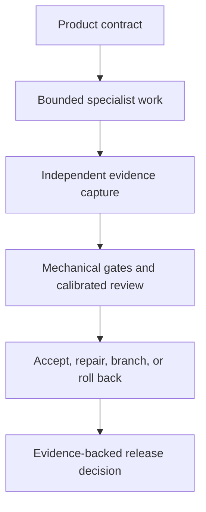

# Three.js Evidence Graph
<!-- source_version: 2026.07.0; translation_status: unreviewed; language: ja -->

ソース生成型の Three.js 垂直スライスを対象とする、エビデンス駆動のマルチエージェント制作手法です。適用例として RPG 仕様書 *The Hollow Meridian* を収録しています。

[English](README.md) | [简体中文](README.zh-CN.md) | [日本語](README.ja.md) | [한국어](README.ko.md)


> **公開状況**
>
> このリポジトリには、2冊の設計仕様書および制作プロンプトが含まれています。プレイ可能なゲーム、完成済みのリファレンス実装、ベンチマーク結果、完全なエビデンス実行は含まれていません。出版物内のパフォーマンス図表と予算値は、測定データであることが明示されていない限り、すべて目標値です。

## 出版物

| 出版物 | 役割 | 版 | ダウンロード |
|---|---|---:|---|
| **Three.js Evidence Graph** | エージェントが構築するブラウザ向け垂直スライスを統制、テスト、修復、リリースするための汎用的な運用手法 | v2.0、64ページ | [PDF を読む](publications/threejs-evidence-graph-operational-manual-v2.0-en.pdf) |
| **The Hollow Meridian** | プロシージャルな三人称視点アクション RPG のための、ゲーム固有のプロダクト契約およびマルチエージェント制作プロンプト | v1.0、81ページ | [PDF を読む](publications/the-hollow-meridian-rpg-full-prompt-v1.0-en.pdf) |


第1文書は、制作上の判断をエビデンスに裏付けられた遷移へ変換する方法を定義します。第2文書は、野心的な RPG 垂直スライスに含めるべき内容を定義します。両文書は同じ Evidence Graph の系譜に属しますが、バージョン間で完全に整合しているわけではありません。*The Hollow Meridian* はフレームワークの中核的な考え方を数多く実装していますが、v2 で追加された複数の安全策より前に作成されています。

## この取り組みが必要な理由

大規模なゲーム生成プロンプトでは、プロダクト方針、アーキテクチャ、実装、品質判断、修復、リリース権限を1つの会話にまとめてしまうことが少なくありません。その結果、よくある失敗が生じます。システムは大量のコードを生成しながら、独立した証拠を提示しないまま、自らの作業が成功したと説明できてしまいます。

本出版物は、これとは異なる制御モデルを提案します。



プロンプトはコントロールプレーンへのインターフェースであり、それ自体がコントロールプレーンなのではありません。リポジトリの状態、型付き task packets、決定論的チェック、evidence manifests、budgets、release predicates が、会話だけでは安全に保持できない権限を担います。

## Three.js Evidence Graph の概要

*Three.js Evidence Graph v2.0* は、範囲を限定したブラウザゲームの垂直スライスを対象とする、リポジトリ内完結型の制作システムを説明します。主な貢献は次のとおりです。

1. **正準な制作グラフ。** 作業は、楽観的な進捗報告ではなく、型付きノードと明示的な transition predicates に従って進行します。
2. **リポジトリの権威。** プロダクト、アート、アーキテクチャ、品質に関する契約は、会話の記憶や個々のエージェントの判断よりも上位に置かれます。
3. **範囲を限定した委任。** 各スペシャリストには、単一の目的、変更を許可または禁止するファイル、invariants、acceptance commands、evidence requirements、retries、resource budget が与えられます。
4. **権限の分離。** Builder は実装を担当します。読み取り専用の critic は取得済み artifact を評価します。provenance auditor はリリースを阻止できます。指名された human director は constitution を変更できますが、失敗した gate を免除することはできません。
5. **2つのエビデンス制度。** シミュレーション状態やその他の制御対象データには、ビット単位の完全一致を使用できます。GPU でラスタライズされた出力やプロファイル横断の視覚的エビデンスには、宣言済みの許容範囲を使用します。
6. **実証に基づくレンダラー選択。** WebGPU/TSL と WebGL 2 は、代表的なマテリアル、エフェクト、デバイス、ブラウザ、トレースに照らして検証する候補として扱われます。
7. **コンパイルとしてのプロシージャル生成。** generator には grammar、範囲を制限した parameters、seeds、rejection tests、collision and LOD policy、provenance、diagnostic output が必要です。ランダム性は構成設計の代替にはなりません。
8. **サプライチェーンを考慮した provenance。** asset policy は、ソースファイル、依存関係、ビルド済みバンドル、フォント、不透明な blob、エンコード済みメディア、ランタイム要求、生成済み出力を検査します。
9. **校正された評価。** critic は既知の欠陥を検出し、提示順を反転した評価にも耐え、エビデンスを引用し、一般的な好みではなく観測可能な失敗を報告しなければなりません。
10. **根本原因の修復。** 各修復では、defect、evidence、hypothesis、intervention、expected change、protected metrics、acceptance test、cost、rollback condition を記録します。
11. **パフォーマンス分布。** 本手法は、平均 FPS だけに依存せず、フレーム時間のパーセンタイル、長時間フレーム、CPU および GPU コスト、メモリ増加、コンパイル停止、レンダラー統計を評価します。
12. **計算資源の経済性。** 機械的チェックではモデルを使用しません。モデル呼び出しはタスク価値に応じて振り分けられ、実行単位の cost ledger に記録されます。

マニュアルには、v1-to-v2 defect ledger、15-node control graph、4部構成の orchestrator prompt、および task packets、defect records、run manifests 用の draft-07 schemas が含まれます。

## The Hollow Meridian の概要

*The Hollow Meridian v1.0* は、Three.js で構築するデスクトップブラウザ向け三人称視点ダークファンタジー・アクション RPG の、81ページに及ぶプロダクト契約兼オーケストレーションプロンプトです。ダウンロードした完成版のアート、音声、モデル、テクスチャ、フォント、アセットパックは使用しません。

プレイヤーは Cartographer となり、消滅した都市の真の名前を保存する廃墟の天文台を探索します。Cartographer は顔を持たない成人の守護者です。想定される初回プレイ時間は10～14分で、次の要素を含みます。

- 安全な hub 1か所と、設計済み route 1本
- 主要な空間5か所
- quest giver 1人と、3つの ring で構成される spatial puzzle 1つ
- enemy archetype 3種
- 3択の relic decision 1つ
- 2段階の boss、*The Bell Without a Name*
- ending outcome 2種
- ローカル checkpoint、save、death、recovery、victory、return-to-hub の各 loop

この仕様では、オープンワールドへの拡張、クラフト、ショップ、ランダム loot、companion、マルチプレイヤー、キャラクター作成を意図的に除外しています。機能量で弱いインタラクションを覆い隠すのではなく、1つのコンパクトな体験を完成させることが目的です。

制作プロンプトは、architecture、gameplay and combat、procedural world construction、enemy and boss behavior、RPG and UI systems、audio and effects、integration、QA and performance、visual criticism、provenance audit を担当する専門ロールを定義します。また、fixed-tick simulation、replay capture、state hashes、安定した diagnostic URLs、evidence folders、範囲を限定した repair tasks、isolated candidates、rollback、final release gates も定義します。

## 2つの版の関係

*The Hollow Meridian* は、Evidence Graph の系譜に属し、中核原則に整合するリファレンス仕様として理解するのが適切です。v2 のすべての規則に準拠していると認証された実装ではありません。

| 領域 | Evidence Graph v2.0 | Hollow Meridian v1.0 |
|---|---|---|
| Product scope | 45～90秒という非常に狭い baseline slice を推奨 | 10～14分の野心的な RPG route を規定 |
| Evidence regimes | ビット単位の完全一致と許容範囲ベースの制度を明示 | 決定論的エビデンスは存在するが、2つの制度は完全には統合されていない |
| Critic controls | Calibration、both-order review、drift rechecks | 独立した critics は存在するが、calibration は完全には規定されていない |
| Compute economics | Model tiers と必須の cost ledger | 未統合 |
| Human authority | 修正権限を限定された指名 director | 未統合 |
| Cross-engine determinism | 厳密一致を主張する場合、制御された deterministic math kernel を要求 | まだ完全には規定されていない |
| Audio evidence | Offline render、loudness、true-peak、dropout、voice-budget gates | Procedural audio は規定済みだが、同等の measurement gates への更新が必要 |
| Accessibility | エビデンスに裏付けられた release gate | 充実した accessibility requirements を収録 |
| Provenance | Source、dependency、bundle、network、output の監査 | source-generated media と provenance に関する強力な規則を収録 |

この区別は重要です。将来の改訂では、互換性がすでに存在すると装うことなく、RPG 仕様を完全に整合させることができます。

## ここでの「AAA-grade」の意味

この表現は、意図的に範囲を限定した垂直スライスの内部リリース契約として使用しています。これは、完成度の高い表現、game feel、一貫性、パフォーマンス、accessibility、provenance、evidence を指します。コンテンツ量、予算、チーム規模、市場での位置付け、あるいは商用 AAA タイトルとして完成済みの品質を主張するものではありません。

このリポジトリ内の文書は、目標が達成されたことを証明していません。その主張には、実行可能な実装、宣言済み device profiles、完全な evidence manifests、校正済み評価、再現可能な resources、問題のない regression cycles、単一の accepted commit に紐付いた release candidate が必要です。

## 技術的ベースラインと境界

- 出版物は **Three.js r185 baseline** を基準として作成されています。
- WebGPU/TSL と WebGL 2 は renderer decision gate を通じて評価されます。
- 「No downloaded assets」は、最終的に可視または可聴となるメディアに適用されます。バージョンを固定した開発用依存関係、ブラウザ API、ビルドツール、テストツール、プロファイラーは引き続き使用できますが、監査対象です。
- ビット単位の完全一致を主張できるのは、制御されたデータクラスに限られます。ブラウザと GPU の出力は、オペレーティングシステム、ドライバー、ハードウェア、ブラウザ、設定によって変動する可能性があります。
- 文書内の accessibility requirements はエンジニアリング上の目標です。正式な WCAG 適合を確立するものではありません。
- Provenance controls はトレーサビリティを向上させますが、著作権上の独自性やソフトウェアセキュリティを証明するものではありません。
- Host agents には、リポジトリへのアクセス、shell execution、browser automation、capture infrastructure、分離された branches または worktrees、structured task dispatch が必要です。基本的なチャットインターフェースだけでは不十分です。

## 推奨する読み方

### テクニカルディレクターおよび研究者

1. Evidence Graph の defect ledger と document-status page を読みます。
2. control graph、authority hierarchy、evidence regimes、critic calibration、operations、normative schemas を確認します。
3. *The Hollow Meridian* を適用例として扱う前に、上記の compatibility table を読みます。

### ゲームおよびテクニカルアートチーム

1. *The Hollow Meridian* の game contract、route、experience pillars、anti-slop rules を読みます。
2. 続いて game systems、procedural-media policy、QA gates を確認します。
3. repository authority documents と acceptance commands が存在する場合に限り、specialist cards を使用します。

### エージェントシステム構築者

1. Evidence Graph の orchestrator prompt と schemas から始めます。
2. model routing より先に validation と state transitions を実装します。
3. 取得済み artifacts、修復済み defect、rollback、frame-time distributions、cost accounting、accepted commit を含む、実在する end-to-end run を1件追加します。

## リポジトリ構成

```text
.
├── README.md
├── README.zh-CN.md
├── README.ja.md
├── README.ko.md
├── assets/
│   ├── publication-set.jpg
│   ├── readme-hero.jpg
│   ├── readme-hero.prompt.md
│   ├── threejs-evidence-graph-cover.jpg
│   └── the-hollow-meridian-cover.jpg
├── publications/
│   ├── threejs-evidence-graph-operational-manual-v2.0-en.pdf
│   └── the-hollow-meridian-rpg-full-prompt-v1.0-en.pdf
├── docs/
│   ├── GLOSSARY.md
│   ├── PUBLICATION_STATUS.md
│   └── TRANSLATION_POLICY.md
├── CHANGELOG.md
├── CITATION.cff
├── CITATIONS.md
├── CONTRIBUTING.md
├── RELEASE_NOTES.md
├── release-manifest.json
└── SHA256SUMS.txt
```

## 現在のロードマップ

次のリリースで最も価値があるのは、より大規模なプロンプトではありません。既存の契約を検証可能にする、実行可能な companion surface です。

- canonical machine-readable schemas
- graph state と transition predicates
- task-packet と defect validators
- renderer proof harness
- deterministic replay と state hashing
- asset と provenance scanners
- Playwright capture profiles
- critic calibration fixtures
- run manifest と cost ledger
- 完全な `run-0001` evidence package 1件
- accepted repair 1件、rejected candidate 1件、verified rollback 1件

これらが存在するまでは、このリポジトリが主張するのは設計および仕様としての価値であり、実証的な制作結果ではありません。

## 翻訳方針

英語版が規範版です。簡体字中国語版、日本語版、韓国語版は、このリポジトリガイドの完全な説明翻訳です。出版物のタイトル、ゲーム固有名詞、ファイル名、コマンド、schema keys、graph-node identifiers、paths、enum values、code identifiers は、正準な英語表記のまま維持されます。

翻訳版と英語版の内容が異なる場合は、技術的解釈には英語版を使用し、issue を通じて相違を報告してください。[Translation Policy](docs/TRANSLATION_POLICY.md) と[多言語技術用語集](docs/GLOSSARY.md)を参照してください。

## 完全性

[SHA256SUMS.txt](SHA256SUMS.txt) の SHA-256 値は、このリリースに含まれる正確な PDF ファイルを識別します。

## コントリビューション

次のような焦点を絞ったコントリビューションを歓迎します。

- ページ参照を伴う事実上または編集上の欠陥
- 無効になったソースリンク
- 翻訳の修正
- 用語の改善
- accessibility の改善
- 再現可能な実装レポート
- 公開済みの authority model を維持する machine-readable contracts

issue または pull request を開く前に、[CONTRIBUTING.md](CONTRIBUTING.md) をお読みください。

## 引用

[CITATION.cff](CITATION.cff) のメタデータを使用してください。簡潔な引用形式は次のとおりです。

> Emily Paradox. *Three.js Evidence Graph v2.0 and The Hollow Meridian RPG Full Prompt v1.0*. Technical Systems and Game Systems Series, July 2026.

## ライセンス状況

この出版リリースには、再利用ライセンスが選択されていません。ライセンスが存在しないことを、再配布、販売、派生版の公開に対する許可と解釈しないでください。

## 著者

**Emily Paradox**  
AI デジタルアーティスト、プロンプトシステムデザイナー、クリエイティブテクノロジスト  
GitHub: [@Emily2040](https://github.com/Emily2040)
