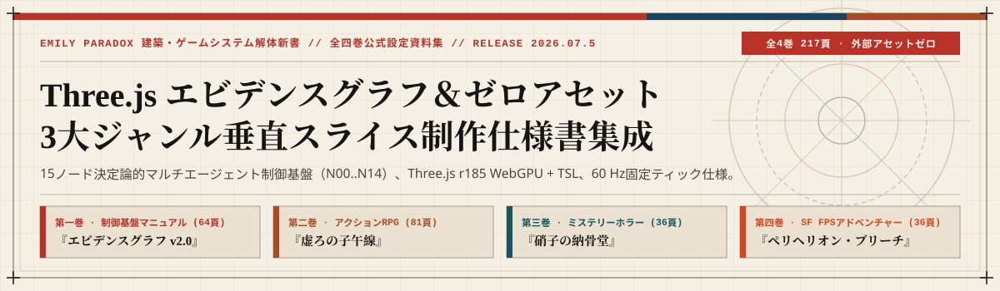
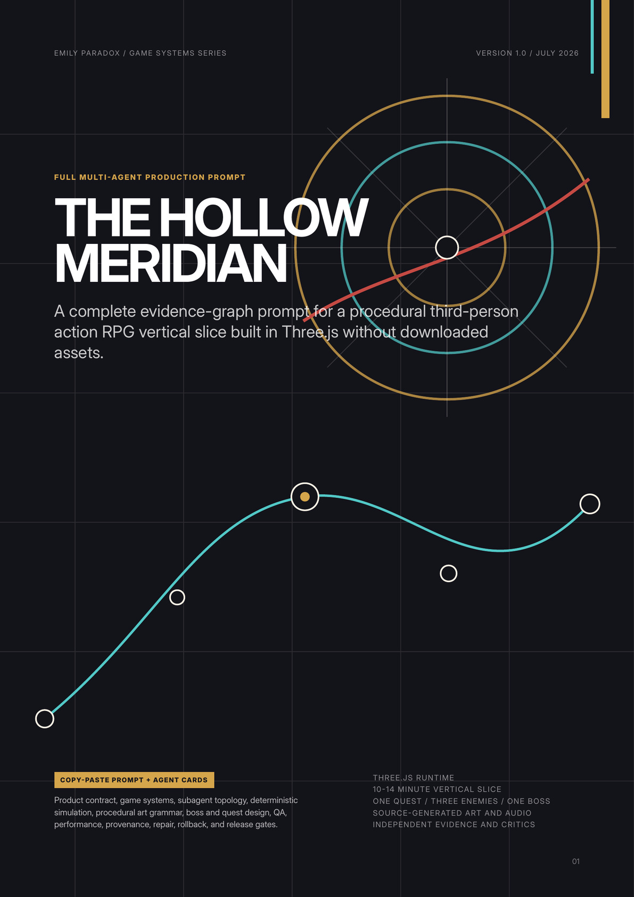
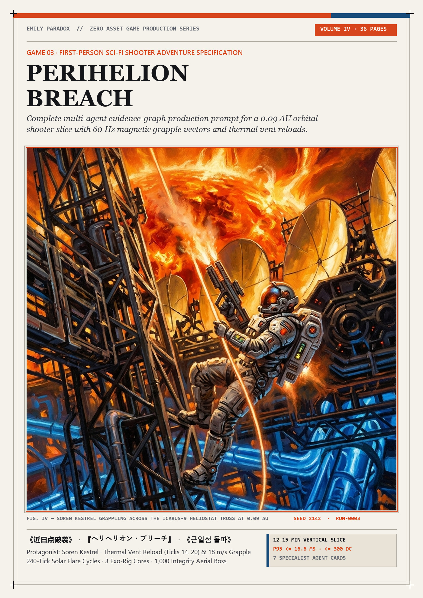
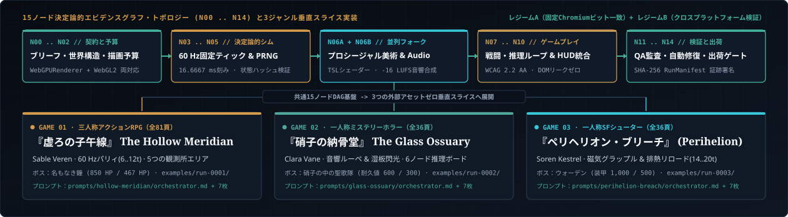
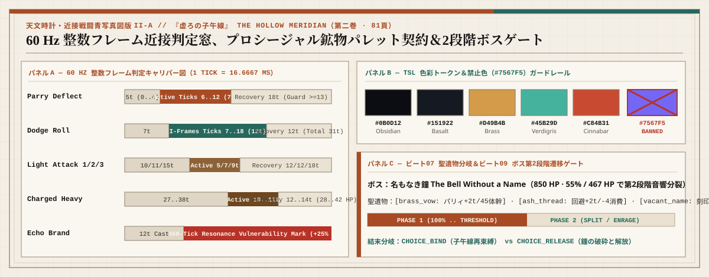
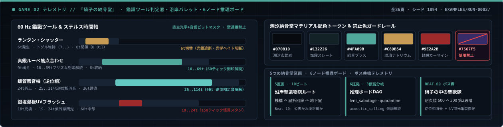
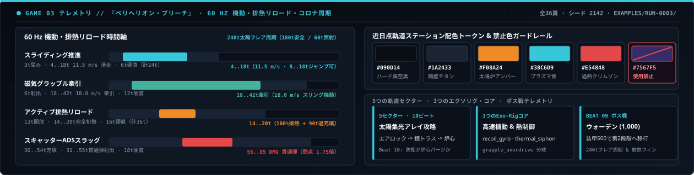

<!-- source_version: 2026.07.5; translation_status: reviewed; language: ja -->

# Three.js エビデンスグラフ & マルチジャンル・ゼロアセット開発仕様スイート

<div align="center">

[](README.md)
[-45B29D?style=for-the-badge)](README.zh-CN.md)
[-38C6D9?style=for-the-badge)](README.ja.md)
[-C89B54?style=for-the-badge)](README.ko.md)

[](RELEASE_NOTES.md)
[-45B29D?style=flat-square)](docs/TECHNICAL_ERRATA_AND_V2_ALIGNMENT.md)
[](docs/PUBLICATION_STATUS.md)
[](schemas/)
[](LICENSE)

</div>



> **本リポジトリの位置づけ**
>
> 本リポジトリは、**Emily Paradox（`@iamemily2050`）** によって設計・執筆された、Three.js `r185`（`0.185.0`）向けの**全4巻・計`217`ページにおよぶエンジニアリング仕様書およびマルチエージェント開発プロンプトスイート**です。外部の3Dモデル（`.glb`）、テクスチャ、フォント、録音済み音声ファイルを一切ダウンロードせず、リポジトリ内のコードとシード値のみから決定論的なブラウザゲームのバーティカルスライスを構築するための基盤アーキテクチャ（『Three.js Evidence Graph: Operational Manual v2.0』、`64`ページ）と、3つの異なるゲームジャンルの完全な制作仕様書を収録しています。
> 1. **Game 01 — 三人称ダークファンタジー・アクションRPG**：**『虚ろの子午線』（*The Hollow Meridian*、81ページ）**
> 2. **Game 02 — 一人称音響鑑識ミステリーホラー**：**『硝子の納骨堂』（*The Glass Ossuary*、36ページ）**
> 3. **Game 03 — 一人称ハイスピードSFシューター・アドベンチャー**：**『ペリヘリオン・ブリーチ』（*Perihelion Breach*、36ページ）**
>
> 全4巻の仕様書には、スタンドアロンの JSON Schema Draft 2020-12 契約ファイル（`schemas/`）、そのままコピー＆ペーストして利用できるマスターオーケストレーターおよび21枚の専門サブエージェントカード（`prompts/`）、スキーマ検証済みのゴールデンフィクスチャ（`examples/run-0001/` 〜 `examples/run-0003/`）、そして**英語・簡体字中国語・日本語・韓国語**の4言語それぞれのネイティブ技術文脈で書き下ろされたコンパニオンガイドが付属しています。

---

## 全4巻仕様書スイート一覧（合計 `217` ページ）


| 第01巻 · 制御プレーンマニュアル | 第02巻 · アクションRPG | 第03巻 · 鑑識ミステリーホラー | 第04巻 · SFシューター・アドベンチャー |
| :---: | :---: | :---: | :---: |
| [](publications/threejs-evidence-graph-operational-manual-v2.0-en.pdf)<br/>**Evidence Graph v2.0**<br/>`64頁` · [日本語ガイド](docs/EVIDENCE_GRAPH_GUIDE.ja.md) | [](publications/the-hollow-meridian-rpg-full-prompt-v1.0-en.pdf)<br/>**『虚ろの子午線』**<br/>`81頁` · [日本語ガイド](docs/THE_HOLLOW_MERIDIAN_GUIDE.ja.md) | [](publications/the-glass-ossuary-mystery-horror-full-prompt-v1.0-en.pdf)<br/>**『硝子の納骨堂』**<br/>`36頁` · [日本語ガイド](docs/THE_GLASS_OSSUARY_GUIDE.ja.md) | [](publications/perihelion-breach-fps-adventure-full-prompt-v1.0-en.pdf)<br/>**『ペリヘリオン・ブリーチ』**<br/>`36頁` · [日本語ガイド](docs/PERIHELION_BREACH_GUIDE.ja.md) |

*本画像は本リポジトリに収録された4冊のPDF仕様書のコンポジット図版およびカバーギャラリーです。すべてのカバーアートおよびセクションヒーロー画像は仕様書向けのコンセプトアートであり、完成した実機ビルドのスクリーンショットやベンチマーク証跡ではありません。*

| 巻 | 仕様書タイトル・ジャンル | PDFアーティファクト（`publications/`） | ページ数 | サイズ | 4言語ネイティブガイド（`docs/`） | プロンプト・検証フィクスチャ |
| :-: | :--- | :--- | ---: | ---: | :--- | :--- |
| **01** | **Three.js Evidence Graph v2.0**<br/>*マルチエージェント制御プレーン＆決定論運用マニュアル* | [`threejs-evidence-graph-operational-manual-v2.0-en.pdf`](publications/threejs-evidence-graph-operational-manual-v2.0-en.pdf)<br/>`sha256[0..16]: d3830d411a61c52c` | `64`頁 | `416,827` B | [EN](docs/EVIDENCE_GRAPH_GUIDE.md) · [中文](docs/EVIDENCE_GRAPH_GUIDE.zh-CN.md) · [日本語](docs/EVIDENCE_GRAPH_GUIDE.ja.md) · [한국어](docs/EVIDENCE_GRAPH_GUIDE.ko.md) | [`prompts/evidence-graph/`](prompts/evidence-graph/)<br/>[`schemas/`](schemas/) |
| **02** | **『虚ろの子午線』The Hollow Meridian v1.0**<br/>*Game 01 · 三人称ダークファンタジー・アクションRPG* | [`the-hollow-meridian-rpg-full-prompt-v1.0-en.pdf`](publications/the-hollow-meridian-rpg-full-prompt-v1.0-en.pdf)<br/>`sha256[0..16]: c4f8fe83995d526b` | `81`頁 | `357,144` B | [EN](docs/THE_HOLLOW_MERIDIAN_GUIDE.md) · [中文](docs/THE_HOLLOW_MERIDIAN_GUIDE.zh-CN.md) · [日本語](docs/THE_HOLLOW_MERIDIAN_GUIDE.ja.md) · [한국어](docs/THE_HOLLOW_MERIDIAN_GUIDE.ko.md) | [`prompts/hollow-meridian/`](prompts/hollow-meridian/)<br/>[`examples/run-0001/`](examples/run-0001/) |
| **03** | **『硝子の納骨堂』The Glass Ossuary v1.0**<br/>*Game 02 · 一人称調査型ミステリーホラー* | [`the-glass-ossuary-mystery-horror-full-prompt-v1.0-en.pdf`](publications/the-glass-ossuary-mystery-horror-full-prompt-v1.0-en.pdf)<br/>`sha256[0..16]: efead090be003782` | `36`頁 | `98,649` B | [EN](docs/THE_GLASS_OSSUARY_GUIDE.md) · [中文](docs/THE_GLASS_OSSUARY_GUIDE.zh-CN.md) · [日本語](docs/THE_GLASS_OSSUARY_GUIDE.ja.md) · [한국어](docs/THE_GLASS_OSSUARY_GUIDE.ko.md) | [`prompts/glass-ossuary/`](prompts/glass-ossuary/)<br/>[`examples/run-0002/`](examples/run-0002/) |
| **04** | **『ペリヘリオン・ブリーチ』Perihelion Breach v1.0**<br/>*Game 03 · 一人称SFシューター・アドベンチャー* | [`perihelion-breach-fps-adventure-full-prompt-v1.0-en.pdf`](publications/perihelion-breach-fps-adventure-full-prompt-v1.0-en.pdf)<br/>`sha256[0..16]: 75bdfff21c905122` | `36`頁 | `95,265` B | [EN](docs/PERIHELION_BREACH_GUIDE.md) · [中文](docs/PERIHELION_BREACH_GUIDE.zh-CN.md) · [日本語](docs/PERIHELION_BREACH_GUIDE.ja.md) · [한국어](docs/PERIHELION_BREACH_GUIDE.ko.md) | [`prompts/perihelion-breach/`](prompts/perihelion-breach/)<br/>[`examples/run-0003/`](examples/run-0003/) |

---

## コアアーキテクチャ：15ノード・エビデンスグラフ（`N00` .. `N14`）



単一のチャットスレッドに企画・実装・シェーダー記述・品質判定をすべて委ねる従来のLLMゲーム生成では、コンテキストの肥大化に伴う仕様ドリフトやシェーダーコンパイルスパイク、根拠のない自己合格宣言が頻発します。**Three.js Evidence Graph v2.0** は、権限と検証を以下の4層に分離することでこの構造的欠陥を解決します。

1. **決定論的オーケストレーター（`orchestrator`）**：[`schemas/graph-state.d.ts`](schemas/graph-state.d.ts) に基づき、`N00_BRIEF` から `N14_RELEASE_CANDIDATE` までの15ノードDAGを制御します。[`task-packet.schema.json`](schemas/task-packet.schema.json) に準拠したタスク定義と受け入れコマンドの通過なしに次ノードへ進むことはできません。
2. **ファイル書き込み権限を分離した専門サブエージェント（各ゲーム7枚）**：`combat_gameplay`、`world_quest`、`procedural_art_vfx`、`procedural_audio`、`ui_hud_accessibility`、`qa_perf_playwright`、および読み取り専用の `independent_critic` で構成。各エージェントは割り当てられた `allowed_paths` 以外のファイルを変更できません。
3. **二重決定論レジーム（`A-PinnedBrowser` & `B-CrossPlatform`）**：
   - **レジームA（`A-PinnedBrowser`・固定環境ビット完全一致）**：固定バージョンのChromiumコンテナ内で、60 Hz整数ティック状態ハッシュ（`state_hash`）、16-bit PCM量子化済み `OfflineAudioContext` 音声ハッシュ（`audio_hash`）、および `1e-5` 量子化済み手続き型ジオメトリハッシュ（`geometry_hash`）のSHA-256一致を検証します。
   - **レジームB（`B-CrossPlatform`・マルチ環境許容差検証）**：`THREE.WebGPURenderer`（優先）と `{ forceWebGL: true }`（フォールバック）の両環境において、フレーム時間パーセンタイル（`P50 <= 8.3 ms`、`P95 <= 16.6 ms`、`P99 <= 22.0 ms`）および EBU R128 ラウドネス基準（`-16 LUFS +- 1.0 LU`、トゥルーピーク `<= -1.0 dBTP`）を検証します。
4. **外部アセットゼロ原則（`provenance_critic`）**：すべての3Dメッシュ、TSL（`Three.js Shading Language`）ノードマテリアル、リグ、UIグリフ、Web Audio音響はソースコードから手続き的にコンパイルされ、`external_network_requests` と `downloaded_assets_count` は厳密に `0` に固定されます。

---

## フラッグシップ3作品（3ジャンル）横断比較マトリクス

| 比較軸 | Game 01：『虚ろの子午線』(*The Hollow Meridian*) | Game 02：『硝子の納骨堂』(*The Glass Ossuary*) | Game 03：『ペリヘリオン・ブリーチ』(*Perihelion Breach*) |
| :--- | :--- | :--- | :--- |
| **ジャンル・視点** | 三人称ダークファンタジー・アクションRPG | 一人称調査型ミステリーホラー（Mystery on Horror） | 一人称SFシューター・アドベンチャー（FPS Adventure） |
| **想定プレイ時間** | 10〜14分 | 12〜16分 | 12〜15分 |
| **主人公** | `The Cartographer`（測量師 `Sable Veren`） | `Clara Vane`（音響記録保管官 `The Acoustic Archivist`） | `Soren Kestrel`（リレー先遣隊員＋戦術AI `Vesper`） |
| **主要リソース** | `100 Health` · `100 Stamina` · `0–100 Resonance` | `100 Composure` · `100 Lantern Oil` · `0–100 Exposure` | `100 Shield` · `100 Hull Integrity` · `0–100 Core Heat` |
| **60 Hz コアメカニクス** | ボタン押下時の `Parry`（`ticks 6..12`）と長押し `Guard`（`tick >= 13`）の優先度分離 | 直交ビットマスクによる `Lantern Shutter`（`6t`）＋`Phonograph Cancel`（`25..114t`）＋`Ferrotype Flash`（`19..24t`） | `Thermal Vent Reload`（`14..20t` で熱量100%パージ＆火力強化）＋`Magnetic Grapple`（`18.0 m/s`）＋`Slide-Boost`（`11.5 m/s`） |
| **5つの連結エリア** | `Ash Court` -> `Orrery Bridge` -> `Archive Nave` -> `Bell Foundry` -> `Meridian Chamber` | `Tidewater Causeway` -> `Caretaker's Stripping Room` -> `Refraction Gallery` -> `Submerged Crypt` -> `The Glass Ossuary` | `Umbilical Airlock` -> `Heliostat Truss` -> `Cryo-Coolant Manifold` -> `Ballistic Foundry` -> `Perihelion Core Chamber` |
| **ビート05 空間パズル** | `Meridian Alignment`（3連真鍮リング整列 -> `North Seal`） | `Prism Triangulation`（`45/135/270 deg` フレネル環 -> 『潮汐台帳の断片』）＋`110/220/330 Hz` 水門共振 | `Conduit Phase Routing`（`180 ticks` 以内に3つのプラズマアンカーを接続 -> 『冷却バイパスコア』） |
| **3種の敵・怪異** | `Ashbound Skirmisher`、`Lantern Wraith`、`Bell Sentinel` | `Mire Listener`（音響索敵）、`Glass Septum Watcher`（視線屈折）、`Drowned Chorister`（低周波オーラ） | `Volt Skitter`（壁面疾走）、`Aegis Drone`（盾持ち狙撃）、`Slag Enforcer`（重装迫撃砲） |
| **ビート07 ビルド分岐** | **聖堂の遺物**：`brass_vow` · `ash_thread` · `vacant_name` | **推理ボード仮説**：`lens_sabotage` · `tidal_quarantine` · `acoustic_calling` | **Exo-Rigコア**：`recoil_gyro` · `thermal_siphon` · `grapple_overdrive` |
| **ビート09 二段階ボス** | **名もなき鐘**（`The Bell Without a Name`、`850 HP`、残り`55%`で第2段階） | **硝子の中の聖歌隊**（`The Choir in the Glass`、`600 Integrity`、`300`で第2段階） | **ヘリアーク・ウォーデン**（`The Heliarch Warden`、`1,000 Integrity`、`500`で第2段階） |
| **ビート10 マルチエンディング** | `CHOICE_BIND`（封縛）または `CHOICE_RELEASE`（解放） | `VERDICT_PUBLISH`（公表）または `VERDICT_SUBMERGE`（水没封鎖） | `DIRECTIVE_DIVERT`（防衛）または `DIRECTIVE_VENT`（炉心パージ） |
| **描画予算上限** | `<= 300` Draw Calls · `<= 500,000` Tris | `<= 280` Draw Calls · `<= 460,000` Tris | `<= 300` Draw Calls · `<= 500,000` Tris |
| **ゴールデンフィクスチャ** | [`examples/run-0001/`](examples/run-0001/)（`seed=1337`） | [`examples/run-0002/`](examples/run-0002/)（`seed=1894`） | [`examples/run-0003/`](examples/run-0003/)（`seed=2142`） |

---

## フラッグシップ3作品の詳細ガイド

### 1. Game 01 — 『虚ろの子午線』（*The Hollow Meridian* · 三人称アクションRPG · 81ページ）

| 廃墟観測所ルート コンセプトプレート | 二段階ボス「名もなき鐘」コンセプトプレート |
| :---: | :---: |
|  |  |



失われた都市の「真名」を保管していた巨大な廃墟観測所を舞台に、プレイヤーは **The Cartographer（測量師）** として5つの空間を踏破します。60 Hz固定ティックによる7フレームのジャストパリィ判定、スタミナ管理、3連リングの空間パズル、聖堂での遺物（Relic）選択を経て、二段階ボス **The Bell Without a Name（名もなき鐘）** に挑みます。

<details>
<summary><strong>『虚ろの子午線』10ビート進行ルート・60 Hz戦闘フレーム表・遺物分岐を展開</strong></summary>

- **設計済み10ビート進行ルート（`recover_orientation`）**：`01 Ash Court Arrival`（拠点・`Mnemonic Keeper`）-> `02 Quest Acceptance`（2つの方位印クエスト）-> `03 Orrery Bridge Tutorial`（`Ashbound Skirmisher` 戦）-> `04 Archive Nave`（`Lantern Wraith` 戦）-> `05 Meridian Alignment`（3連リングパズル -> `North Seal`）-> `06 Bell Foundry`（`Bell Sentinel` 撃破 -> `Depth Seal`）-> `07 Shrine Choice`（3種の遺物：`brass_vow` / `ash_thread` / `vacant_name`）-> `08 Chamber Opening` -> `09 The Unnamed Bell`（`850 HP` 二段階ボス戦）-> `10 Bind or Release`（`CHOICE_BIND` / `CHOICE_RELEASE`）。

| アクション | 発生 | 持続 / 無敵 | 硬直 | 全体フレーム | 消費・効果 |
| :--- | :--- | :--- | :--- | :--- | :--- |
| `Light Attack 1 / 2 / 3` | `10 / 11 / 15t` | `5 / 7 / 9t` | `12 / 12 / 18t` | `27 / 30 / 42t` | `10 / 11 / 14 Stamina`；`16 / 18 / 25 HP` |
| `Charged Heavy` | `27..38t` | `10..11t` | `12..14t` | `49..63t` | `28 Stamina`；`28..42 HP`＋強靭削り |
| `Dodge Roll` | `7t` | `Ticks 7..18`（`12t`） | `12t` | `31t` | `22 Stamina`；`ticks 7..18` 完全無敵 |
| `Parry Deflect` | `5t`（`0..4`） | `Ticks 6..12`（`7t`） | `18t` | `31t` | `12 Stamina`；長押しで `tick 13` から `Guard` 移行 |
| `Echo Brand` | `12t` | `360t 刻印` | `0t` | `12t 詠唱` | `50 Resonance`；被ダメージ `+25%`＋ボス弱点露出 |

- **PDF仕様書**：[`publications/the-hollow-meridian-rpg-full-prompt-v1.0-en.pdf`](publications/the-hollow-meridian-rpg-full-prompt-v1.0-en.pdf)
- **日本語詳細ガイド**：[`docs/THE_HOLLOW_MERIDIAN_GUIDE.ja.md`](docs/THE_HOLLOW_MERIDIAN_GUIDE.ja.md)
- **プロンプト＆検証フィクスチャ**：[`prompts/hollow-meridian/`](prompts/hollow-meridian/) · [`examples/run-0001/`](examples/run-0001/)

</details>

---

### 2. Game 02 — 『硝子の納骨堂』（*The Glass Ossuary* · 一人称ミステリーホラー · 36ページ）

| 屈折回廊での光学鑑識 コンセプトプレート | 二段階ボス「硝子の中の聖歌隊」コンセプトプレート |
| :---: | :---: |
|  |  |



1894年秋の暴風雨の夜、音響記録保管官 **Clara Vane** は、フレネル灯台と地下の「骨硝子（ボーン・ガラス）」納骨堂が融合したサン＝ヴァーヌ沿岸観測所へ足を踏み入れます。銃器やスクリプト演出のジャンプスケアに頼らず、`二焦点真鍮ルーペ`、`蝋管蓄音機`、`銀塩フェロタイプ乾板カメラ` の3つの鑑識器具と `6ノード推理ボード` を駆使して海難事件の真相を解明し、最深部で **The Choir in the Glass（硝子の中の聖歌隊）** と対峙します。

<details>
<summary><strong>『硝子の納骨堂』10ビート調査ルート・60 Hz鑑識器具フレーム表・推理ボード分岐を展開</strong></summary>

- **10ビート調査ルート（`case_saint_vane`）**：`01 Causeway Landfall`（桟橋上陸・`Lantern Shutter`）-> `02 The Sealed Inquest`（剥離室拠点・6ノード推理ボード・Moreau蝋管）-> `03 Ferrotype Calibration`（`Ferrotype Plate` UVフラッシュ較正）-> `04 Refraction Gallery`（`Glass Septum Watcher` 視線回避・`Brass Loupe`）-> `05 Prism Triangulation`（`45/135/270 deg` フレネル環 -> 『潮汐台帳の断片』）-> `06 Submerged Crypt`（`Mire Listener` 音響潜行・`110/220/330 Hz` 水門 -> 『水中聴音蝋管』）-> `07 Inquest Board Deduction`（3つの仮説分岐：`lens_sabotage` / `tidal_quarantine` / `acoustic_calling`）-> `08 Ossuary Unsealing` -> `09 The Choir in the Glass`（`600 Integrity` 二段階ボス戦）-> `10 Publish or Submerge`（`VERDICT_PUBLISH` / `VERDICT_SUBMERGE`）。

| 器具・アクション | 発生 | 有効ウィンドウ | 硬直 | 全体フレーム | コスト・鑑識メカニクス効果 |
| :--- | :--- | :--- | :--- | :--- | :--- |
| `Lantern Shutter` | `6 ticks` | トグル維持（`7..`） | `6 ticks` | `12 ticks` | `0 Oil`；光錐を遮断し光学索敵ヘイトを切る |
| `Brass Loupe Focus` | `9 ticks` | ホールド（`10..69`） | `6 ticks` | `75 ticks` | `0 Oil`；微細プリズム刻印および骨硝子文字を解読 |
| `Phonograph Cancel` | `24 ticks` | `Ticks 25..114` | `36 ticks` | `150 ticks` | 空間倍音を逆位相消去し `Mire Listener` から足音を隠蔽 |
| `Ferrotype Flash` | `18 ticks` | `Ticks 19..24` | `66 ticks` | `90 ticks` | 距離 `6.5 m` 内の怪異を `150 ticks` スタン＋亀裂露光 |
| `Crouch Sidestep` | `5 ticks` | `Ticks 6..16` | `12 ticks` | `28 ticks` | 濡れた石床での足音ノイズを `<= -38 dBFS` に抑制 |
| `Smelling Salts` | `15 ticks` | `Ticks 16..45` | `10 ticks` | `55 ticks` | `Composure +40` 回復・`Exposure -25` 浄化 |

- **PDF仕様書**：[`publications/the-glass-ossuary-mystery-horror-full-prompt-v1.0-en.pdf`](publications/the-glass-ossuary-mystery-horror-full-prompt-v1.0-en.pdf)
- **日本語詳細ガイド**：[`docs/THE_GLASS_OSSUARY_GUIDE.ja.md`](docs/THE_GLASS_OSSUARY_GUIDE.ja.md)
- **プロンプト＆検証フィクスチャ**：[`prompts/glass-ossuary/`](prompts/glass-ossuary/) · [`examples/run-0002/`](examples/run-0002/)

</details>

---

### 3. Game 03 — 『ペリヘリオン・ブリーチ』（*Perihelion Breach* · 一人称SFシューター・アドベンチャー · 36ページ）

| 太陽中継ステーション「イカロス9号」コンセプトプレート | 二段階ボス「ヘリアーク・ウォーデン」コンセプトプレート |
| :---: | :---: |
|  |  |



太陽からわずか `0.09 AU` の近日点軌道を周回する巨大太陽中継ステーション「イカロス9号」を舞台に、先遣隊員 **Soren Kestrel** が戦術AI **Vesper** と共に熱暴走した防衛グリッドを突破します。`Kestrel-9 ツインコイル・カービン` や貫通電磁スラッグを撃ち出す `Helios Scatter-Rail`、`ticks 14..20` の受付ウィンドウで熱量を一掃する `Thermal Vent Reload`、`18.0 m/s` の `Magnetic Grapple` スリング機動を駆使し、二段階ボス **The Heliarch Warden（ヘリアーク・ウォーデン）** を撃破します。

<details>
<summary><strong>『ペリヘリオン・ブリーチ』10ビート作戦ルート・60 Hz銃器/グラップルフレーム表を展開</strong></summary>

- **10ビート軌道作戦ルート（`restore_perihelion_attitude`）**：`01 Airlock Breach`（`Umbilical Airlock`・AI `Vesper`・`Kestrel-9 Carbine`）-> `02 Lockdown Override`（`Slide-Boost` & `Thermal Vent Reload` 較正）-> `03 Heliostat Skirmish`（`240-tick` 太陽フレア周期・`Volt Skitter` 迎撃・`Magnetic Grapple` 解放）-> `04 Cryo-Coolant Ascent`（`Aegis Drone` 垂直シャフト突破・`Breach Launcher` 取得）-> `05 Conduit Phase Routing`（`180 ticks` 内に3つのプラズマアンカー接続 -> 『冷却バイパスコア』）-> `06 Ballistic Foundry Siege`（`Slag Enforcer` 撃破 -> `Helios Scatter-Rail`）-> `07 Suit Rig Calibration`（3種のExo-Rigコア：`recoil_gyro` / `thermal_siphon` / `grapple_overdrive`）-> `08 Shutter Retraction` -> `09 The Heliarch Warden`（`1,000 Integrity` 二段階ボス戦）-> `10 Divert or Vent`（`DIRECTIVE_DIVERT` / `DIRECTIVE_VENT`）。

| 武装・機動 | 発生 | 判定 / 受付 | 硬直 | 全体フレーム | 熱量・ダメージ・戦術効果 |
| :--- | :--- | :--- | :--- | :--- | :--- |
| `Carbine 3-Burst` | `2 ticks` | `Ticks 3..11`（3発） | `10 ticks` | `21 ticks` | `+12 Heat`；`3 x 14 dmg` ヒットスキャン（弱点 `1.5x`） |
| `Scatter Uncharged` | `3 ticks` | `Tick 4`（`5x12`） | `15 ticks` | `18 ticks` | `+18 Heat`；近距離 `60 dmg` 拡散・エネルギーシールド破砕 |
| `Scatter ADS Slug` | `30..54 ticks` | `Tick 31..55` | `18 ticks` | `48..72 ticks` | `+28 Heat`；`55..85 dmg` 貫通レールスラッグ（弱点 `1.75x`） |
| `Breach Anchor` | `6 ticks` | 弾道飛翔体 | `24 ticks` | `30 ticks` | `+30 Heat`；`60 AoE dmg` 装甲破砕・導管ノード接続 |
| `Thermal Vent Reload` | `13 ticks` | `Ticks 14..20` | `16 ticks` | `36 ticks` | `14..20t` 入力成功で `Heat 100%` 排出＋`90t` オーバーチャージ |
| `Slide-Boost` | `3 ticks` | `Ticks 4..18` | `6 ticks` | `24 ticks` | `11.5 m/s` 高速スライディング（`ticks 8..18` ジャンプキャンセル可） |
| `Magnetic Grapple` | `6 ticks` | `18..42 ticks` 牽引 | `12 ticks` | `36..60 ticks` | `18.0 m/s` アンカー牽引・離脱時に接線スリング速度を保持 |

- **PDF仕様書**：[`publications/perihelion-breach-fps-adventure-full-prompt-v1.0-en.pdf`](publications/perihelion-breach-fps-adventure-full-prompt-v1.0-en.pdf)
- **日本語詳細ガイド**：[`docs/PERIHELION_BREACH_GUIDE.ja.md`](docs/PERIHELION_BREACH_GUIDE.ja.md)
- **プロンプト＆検証フィクスチャ**：[`prompts/perihelion-breach/`](prompts/perihelion-breach/) · [`examples/run-0003/`](examples/run-0003/)

</details>

---

## 4言語ネイティブ技術ドキュメント一覧

本リポジトリのすべてのREADMEおよびコンパニオンガイドは、機械的な直訳調を避け、**英語・簡体字中国語・日本語・韓国語**それぞれのゲーム開発・グラフィックス工学の専門用語体系に沿ってネイティブ執筆されています（コード識別子・CLIコマンド・スキーマキーは追跡可能性のため英語のまま保持）。

| ドキュメント種別 | 英語版 (`en`) | 簡体字中国語版 (`zh-CN`) | 日本語ネイティブ版 (`ja`) | 韓国語ネイティブ版 (`ko`) |
| :--- | :--- | :--- | :--- | :--- |
| **リポジトリ総合ガイド** | [`README.md`](README.md) | [`README.zh-CN.md`](README.zh-CN.md) | [`README.ja.md`](README.ja.md) | [`README.ko.md`](README.ko.md) |
| **第1巻：Evidence Graph v2.0 運用マニュアル（64頁）** | [`EVIDENCE_GRAPH_GUIDE.md`](docs/EVIDENCE_GRAPH_GUIDE.md) | [`EVIDENCE_GRAPH_GUIDE.zh-CN.md`](docs/EVIDENCE_GRAPH_GUIDE.zh-CN.md) | [`EVIDENCE_GRAPH_GUIDE.ja.md`](docs/EVIDENCE_GRAPH_GUIDE.ja.md) | [`EVIDENCE_GRAPH_GUIDE.ko.md`](docs/EVIDENCE_GRAPH_GUIDE.ko.md) |
| **第2巻：『虚ろの子午線』アクションRPG（81頁）** | [`THE_HOLLOW_MERIDIAN_GUIDE.md`](docs/THE_HOLLOW_MERIDIAN_GUIDE.md) | [`THE_HOLLOW_MERIDIAN_GUIDE.zh-CN.md`](docs/THE_HOLLOW_MERIDIAN_GUIDE.zh-CN.md) | [`THE_HOLLOW_MERIDIAN_GUIDE.ja.md`](docs/THE_HOLLOW_MERIDIAN_GUIDE.ja.md) | [`THE_HOLLOW_MERIDIAN_GUIDE.ko.md`](docs/THE_HOLLOW_MERIDIAN_GUIDE.ko.md) |
| **第3巻：『硝子の納骨堂』ミステリーホラー（36頁）** | [`THE_GLASS_OSSUARY_GUIDE.md`](docs/THE_GLASS_OSSUARY_GUIDE.md) | [`THE_GLASS_OSSUARY_GUIDE.zh-CN.md`](docs/THE_GLASS_OSSUARY_GUIDE.zh-CN.md) | [`THE_GLASS_OSSUARY_GUIDE.ja.md`](docs/THE_GLASS_OSSUARY_GUIDE.ja.md) | [`THE_GLASS_OSSUARY_GUIDE.ko.md`](docs/THE_GLASS_OSSUARY_GUIDE.ko.md) |
| **第4巻：『ペリヘリオン・ブリーチ』FPSアドベンチャー（36頁）** | [`PERIHELION_BREACH_GUIDE.md`](docs/PERIHELION_BREACH_GUIDE.md) | [`PERIHELION_BREACH_GUIDE.zh-CN.md`](docs/PERIHELION_BREACH_GUIDE.zh-CN.md) | [`PERIHELION_BREACH_GUIDE.ja.md`](docs/PERIHELION_BREACH_GUIDE.ja.md) | [`PERIHELION_BREACH_GUIDE.ko.md`](docs/PERIHELION_BREACH_GUIDE.ko.md) |
| **多言語用語集・翻訳ポリシー** | [`docs/GLOSSARY.md`](docs/GLOSSARY.md) · [`docs/TRANSLATION_POLICY.md`](docs/TRANSLATION_POLICY.md) | [`docs/GLOSSARY.md`](docs/GLOSSARY.md) | [`docs/GLOSSARY.md`](docs/GLOSSARY.md) | [`docs/GLOSSARY.md`](docs/GLOSSARY.md) |

---

## リポジトリ構成・ファイルマップ

```text
threejs-evidence-graph/
├── publications/                                                     # 規範的英語PDF仕様書 全4巻（計217ページ）
│   ├── threejs-evidence-graph-operational-manual-v2.0-en.pdf         # 64頁 · 制御プレーン＆決定論マニュアル
│   ├── the-hollow-meridian-rpg-full-prompt-v1.0-en.pdf               # 81頁 · Game 01：『虚ろの子午線』アクションRPG
│   ├── the-glass-ossuary-mystery-horror-full-prompt-v1.0-en.pdf      # 36頁 · Game 02：『硝子の納骨堂』ミステリーホラー
│   └── perihelion-breach-fps-adventure-full-prompt-v1.0-en.pdf       # 36頁 · Game 03：『ペリヘリオン・ブリーチ』SF FPS
├── schemas/                                                          # Draft 2020-12 JSON Schema 契約＆TypeScript型定義
├── orchestration/                                                    # エージェント実行環境向けドロップインミラー
├── prompts/                                                          # オーケストレーター4種＋専門サブエージェントカード21枚
├── examples/                                                         # スキーマ検証済みゴールデンフィクスチャ（run-0001..0003）
├── docs/                                                             # 4言語ネイティブガイド16冊＋エラッタ＋ガバナンス文書
├── assets/                                                           # EXIFゼロJPEG 13枚＋カスタムネイティブSVG 21枚
├── scripts/verify_release.py                                         # 自動ハッシュ・スキーマ・PDF・EXIF・リンク検証スクリプト
├── SHA256SUMS.txt                                                    # 全リリース資産のSHA-256チェックサム（LF改行）
└── release-manifest.json                                             # 機械可読リリースマニフェスト
```

---

## 整合性検証コマンド

リポジトリのルートディレクトリで以下のコマンドを実行すると、全ファイルのSHA-256ダイジェスト、JSON Schema Draft 2020-12 契約、3組のゴールデンフィクスチャ（`run-0001`〜`run-0003`）、全4冊のPDFアクセシビリティタグとURIリンク、13枚のEXIFゼロJPEG画像、および全Markdownリンクを一括検証できます。

```bash
sha256sum -c SHA256SUMS.txt
python scripts/verify_release.py
```

---

## スコープと非主張事項（Epistemic Honesty）

本リポジトリは**設計仕様書、マルチエージェント用プロンプト、JSON Schema契約、および検証用ゴールデンフィクスチャ**を公開するものであり、以下の成果物は**含まれていません**：

- プレイ可能な Three.js ゲームのランタイム実装；
- 実機ビルドから計測されたGPUフレーム時間やベンチマーク結果；
- ライブPlaywrightキャプチャパッケージ；
- 実装済みUIに対する公式なWCAG適合証明。

本仕様書群に記載されたフレーム時間パーセンタイル（`P50 <= 8.3 ms`、`P95 <= 16.6 ms`、`P99 <= 22.0 ms`）、Draw Call上限、およびラウドネス目標（`-16 LUFS +- 1.0 LU`、`<= -1.0 dBTP`）はすべて、`N14_RELEASE_CANDIDATE` 承認前に実装が通過すべき**規範的受け入れゲート（Normative Acceptance Gates）**です。

---

## 著者・引用・ライセンス

- **出版物著者名**：Emily Paradox
- **クリエイターおよび著作権者**：**Iamemily2050（`@iamemily2050`）**
- **GitHub**：[Emily2040](https://github.com/Emily2040) · **Web**：[iamemily2050.com](https://iamemily2050.com) · **X**：[`@iamemily2050`](https://x.com/iamemily2050) · **Instagram**：[`@iamemily2050`](https://instagram.com/iamemily2050)
- **引用メタデータ**：[`CITATION.cff`](CITATION.cff) および [`CITATIONS.md`](CITATIONS.md)
- **ライセンス**：個別の記載がない限り [MIT License](LICENSE) の下で公開されています。詳細は [`AUTHORS.md`](AUTHORS.md) を参照してください。
