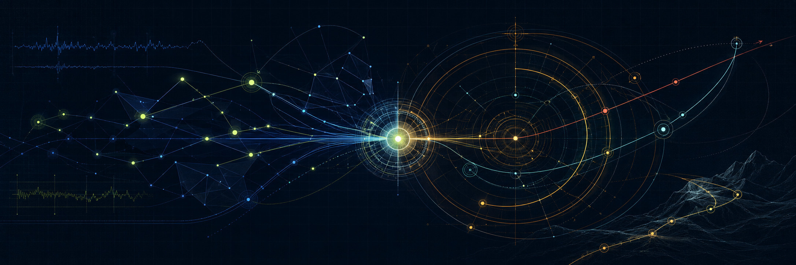
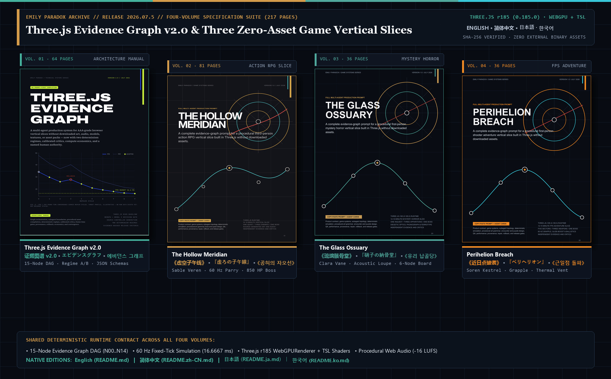
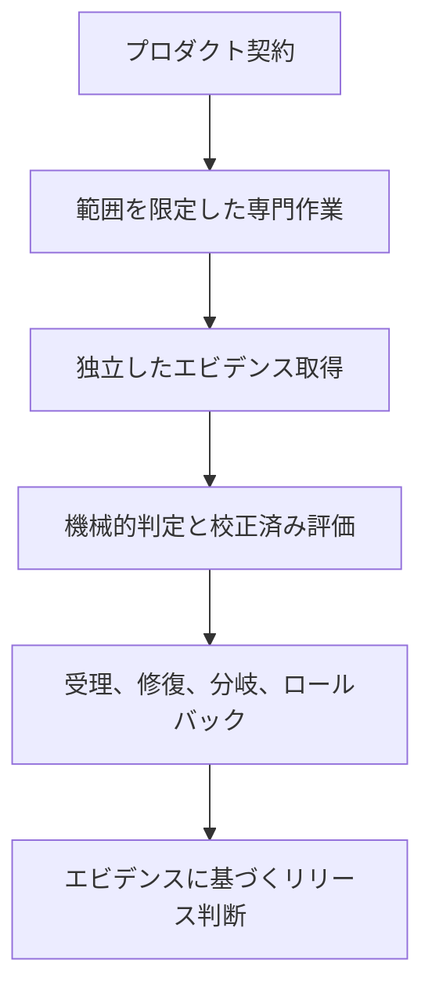
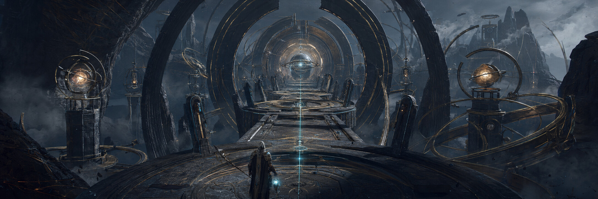

# Three.js Evidence Graph
<!-- source_version: 2026.07.4; translation_status: reviewed; language: ja -->

ソース生成型の Three.js 垂直スライスを対象とする、エビデンス駆動のマルチエージェント制作手法です。適用例として RPG 仕様書 *The Hollow Meridian* を収録しています。

[English](README.md) | [简体中文](README.zh-CN.md) | [日本語](README.ja.md) | [한국어](README.ko.md)



> **公開状況**
>
> このリポジトリには、2冊の設計仕様書および制作プロンプトが含まれています。プレイ可能なゲーム、完成済みのリファレンス実装、ベンチマーク結果、完全なエビデンス実行は含まれていません。出版物内のパフォーマンス図表と予算値は、測定データであることが明示されていない限り、すべて目標値です。

## 出版物

| 出版物 | 役割 | 版 | ダウンロード |
|---|---|---:|---|
| **Three.js Evidence Graph** | エージェントが構築するブラウザ向け垂直スライスを統制、テスト、修復、リリースするための汎用的な運用手法 | v2.0、64ページ | [PDF を読む](publications/threejs-evidence-graph-operational-manual-v2.0-en.pdf) |
| **The Hollow Meridian** | プロシージャルな三人称視点アクション RPG のための、ゲーム固有のプロダクト契約およびマルチエージェント制作プロンプト | v1.0、81ページ | [PDF を読む](publications/the-hollow-meridian-rpg-full-prompt-v1.0-en.pdf) |



第1文書は、制作上の判断をエビデンスに裏付けられた遷移へ変換する方法を定義します。第2文書は、野心的な RPG 垂直スライスに含めるべき内容を定義します。両文書は同じ Evidence Graph の系譜に属しますが、バージョン間で完全に整合しているわけではありません。*The Hollow Meridian* はフレームワークの中核的な考え方を設計仕様へ数多く取り入れていますが、v2 で追加された複数の安全策より前に作成されています。

## この取り組みが必要な理由

大規模なゲーム生成プロンプトでは、プロダクト方針、アーキテクチャ、実装、品質判断、修復、リリース権限を1つの会話にまとめてしまうことが少なくありません。その結果、よくある失敗が生じます。システムは大量のコードを生成しながら、独立した証拠を提示しないまま、自らの作業が成功したと説明できてしまいます。

本出版物は、これとは異なる制御モデルを提案します。


```mermaid
flowchart TD
    A["プロダクト契約"] --> B["範囲を限定した専門作業"]
    B --> C["独立したエビデンス取得"]
    C --> D["機械的判定と校正済み評価"]
    D --> E["受理、修復、分岐、ロールバック"]
    E --> F["エビデンスに基づくリリース判断"]
```

プロンプトはコントロールプレーンへのインターフェースであり、それ自体がコントロールプレーンなのではありません。リポジトリの状態、型付きタスク・パケット（task packets）、決定論的チェック、エビデンス・マニフェスト（evidence manifests）、予算、リリース条件（release predicates）が、会話だけでは安全に保持できない権限を担います。

## Three.js Evidence Graph の概要


*Three.js Evidence Graph v2.0* は、範囲を限定したブラウザゲームの垂直スライスを対象とする、リポジトリ内完結型の制作システムを説明します。主な貢献は次のとおりです。

1. **正準な制作グラフ。** 作業は、楽観的な進捗報告ではなく、型付きノードと明示的な遷移条件（transition predicates）に従って進行します。
2. **リポジトリの権威。** プロダクト、アート、アーキテクチャ、品質に関する契約は、会話の記憶や個々のエージェントの判断よりも上位に置かれます。
3. **範囲を限定した委任。** 各スペシャリストには、単一の目的、変更を許可または禁止するファイル、不変条件、合格判定コマンド、必要なエビデンス、再試行上限、計算資源の予算が与えられます。
4. **権限の分離。** 構築担当者（Builder）は実装を担当します。読み取り専用の評価担当者（critic）は取得済み成果物を評価します。来歴監査担当者（provenance auditor）はリリースを阻止できます。指名された人間のディレクターは基本規約（constitution）を変更できますが、失敗した判定を免除することはできません。
5. **2つのエビデンス制度。** シミュレーション状態やその他の制御対象データには、ビット単位の完全一致を使用できます。GPU でラスタライズされた出力やプロファイル横断の視覚的エビデンスには、宣言済みの許容範囲を使用します。
6. **実証に基づくレンダラー選択。** WebGPU/TSL と WebGL 2 は、代表的なマテリアル、エフェクト、デバイス、ブラウザ、トレースに照らして検証する候補として扱われます。
7. **コンパイルとしてのプロシージャル生成。** 生成器には、文法、範囲を制限したパラメーター、シード、排除テスト、衝突判定と LOD の方針、来歴、診断出力が必要です。ランダム性は構成設計の代替にはなりません。
8. **サプライチェーンを考慮した来歴管理。** アセット方針は、ソースファイル、依存関係、ビルド済みバンドル、フォント、不透明なバイナリ、エンコード済みメディア、実行時要求、生成済み出力を検査します。
9. **校正された評価。** 評価担当者は既知の欠陥を検出し、提示順を反転した評価にも耐え、エビデンスを引用し、一般的な好みではなく観測可能な失敗を報告しなければなりません。
10. **根本原因の修復。** 各修復では、欠陥、エビデンス、仮説、介入、予想される変化、保護対象の指標、合格試験、コスト、ロールバック条件を記録します。
11. **パフォーマンス分布。** 本手法は、平均 FPS だけに依存せず、フレーム時間のパーセンタイル、長時間フレーム、CPU および GPU コスト、メモリ増加、コンパイル停止、レンダラー統計を評価します。
12. **計算資源の経済性。** 機械的チェックではモデルを使用しません。モデル呼び出しはタスク価値に応じて振り分けられ、実行単位のコスト台帳（cost ledger）に記録されます。

マニュアルには、v1 から v2 への欠陥台帳、15ノードの制御グラフ、4部構成のオーケストレーター・プロンプト（orchestrator prompt）、およびタスク・パケット、欠陥記録、実行マニフェスト用の JSON Schema（[`schemas/`](schemas/) では Draft 2020-12 にアップグレード済み）が含まれます。

> **アーキテクチャの詳細ガイド：** [Evidence Graph v2.0 日本語ガイド](docs/EVIDENCE_GRAPH_GUIDE.ja.md) および [技術正誤表と v2.0 整合仕様](docs/TECHNICAL_ERRATA_AND_V2_ALIGNMENT.md)では、15ノードの制御トポロジー（`N00_BRIEF` から `N14_RELEASE_CANDIDATE`）、2つの決定論制度、スタンドアロン Draft 2020-12 JSON Schema（[`schemas/`](schemas/)）、ゴールデン検証フィクスチャ（[`examples/run-0001/`](examples/run-0001/)）、およびコピー＆ペースト可能なプロンプト（[`prompts/`](prompts/)）を解説しています。
>
> Evidence Graph ガイド言語：[English](docs/EVIDENCE_GRAPH_GUIDE.md) | [简体中文](docs/EVIDENCE_GRAPH_GUIDE.zh-CN.md) | [日本語](docs/EVIDENCE_GRAPH_GUIDE.ja.md) | [한국어](docs/EVIDENCE_GRAPH_GUIDE.ko.md)

## The Hollow Meridian の概要



*出版物の説明用コンセプトアートです。ゲームプレイのキャプチャや実装済みであることを示す証拠ではありません。*

*The Hollow Meridian v1.0* は、Three.js で構築するデスクトップブラウザ向け三人称視点ダークファンタジー・アクション RPG の、81ページに及ぶプロダクト契約兼オーケストレーションプロンプトです。ダウンロードした完成版のアート、音声、モデル、テクスチャ、フォント、アセットパックは使用しません。

> **日本語の詳細ガイド：** [The Hollow Meridian ゲーム解説ガイド](docs/THE_HOLLOW_MERIDIAN_GUIDE.ja.md) | [Evidence Graph v2.0 ガイド](docs/EVIDENCE_GRAPH_GUIDE.ja.md) | [技術正誤表](docs/TECHNICAL_ERRATA_AND_V2_ALIGNMENT.md)では、世界観、10ビートのルート、戦闘、パズル、遺物、セーブ、ボス、アクセシビリティ、制作グラフを詳しく解説しています。このガイドは81ページの英語版 PDF の完全翻訳ではありません。
>
> ゲーム解説ガイド言語：[English](docs/THE_HOLLOW_MERIDIAN_GUIDE.md) | [简体中文](docs/THE_HOLLOW_MERIDIAN_GUIDE.zh-CN.md) | [日本語](docs/THE_HOLLOW_MERIDIAN_GUIDE.ja.md) | [한국어](docs/THE_HOLLOW_MERIDIAN_GUIDE.ko.md)

プレイヤーは Cartographer となり、消滅した都市の真の名前を保存する廃墟の天文台を探索します。Cartographer は顔を持たない成人の守護者です。想定される初回プレイ時間は10～14分で、次の要素を含みます。

- 安全な拠点（hub）1か所と、設計済みルート1本
- 主要な空間5か所
- クエスト提供者1人と、3つの環で構成される空間パズル1つ
- 敵の基本型（enemy archetype）3種
- 3択の遺物（relic）1つ
- 2段階のボス *The Bell Without a Name*
- 2種類のエンディング
- チェックポイント、セーブ、死亡、復帰、勝利、拠点への帰還を扱うローカル進行管理

この仕様では、オープンワールドへの拡張、クラフト、ショップ、ランダム戦利品、仲間、マルチプレイヤー、キャラクター作成を意図的に除外しています。機能量で弱いインタラクションを覆い隠すのではなく、1つのコンパクトな体験を完成させることが目的です。

制作プロンプトは、建築、ゲームプレイと戦闘、プロシージャルな世界構築、敵とボスの挙動、RPG と UI のシステム、音声と効果、統合、QA と性能、視覚評価、来歴監査を担当する専門的な役割を定義します。また、固定刻みシミュレーション、リプレイ取得、状態ハッシュ、安定した診断 URL、エビデンス保存先、範囲を限定した修復タスク、分離した候補、ロールバック、最終リリース判定も定義します。

### 設計されたプレイ構造

10ビートのルートは、Ash Court での導入とクエスト受注から始まり、Orrery Bridge の戦闘チュートリアル、Archive Nave の探索、決定論的な3環式子午線パズル、Bell Foundry のガード崩し戦へ進みます。続いて3つの遺物から1つを選び、Meridian Chamber を開き、2段階のボス **The Bell Without a Name** と戦い、最後に束縛（bind）か解放（release）を選んで拠点へ戻ります。プロシージャル・システムが形状や素材を生成しても、この劇的な順序と各空間の目的は設計済みのまま維持されます。

瞬間ごとのループでは、建築と光から方向を把握し、戦闘を読み、移動、ガード、パリィ、回避、攻撃を選び、スタミナと Resonance を管理し、印章またはクエスト状態を進め、チェックポイントで意味のある状態を保存します。戦闘は弱攻撃と強攻撃、ガード、選択されたパリィ受付時間、Echo Brand で構成されます。3種の敵は、それぞれ間合い、遠距離からの圧力、ガード崩しを教えます。3環式パズルは決定論的に解ける空間課題であり、3択の遺物は実際の戦闘判断を変えます。

セーブ・スキーマ（save schema）は、クエスト状態、2つの印章、選択した遺物、消耗品、チェックポイント、完了状態、エンディングの選択、設定、再割り当てした操作を保持します。ボスは標準の敵の大型版ではなく、固有の攻撃一式、体勢耐久（poise）、体力55パーセントでの保護された段階移行、視認可能な安全区画を持つ独立システムです。これらはすべて、想定されるゲームの**仕様および合格契約**を定義するものです。本リポジトリはスタンドアロンのスキーマ、プロンプト、および `examples/run-0001/` のゴールデン検証フィクスチャを提供しており、プレイ可能な実行時ビルドは含んでいません。

## 2つの版の関係

*The Hollow Meridian* は、Evidence Graph の系譜に属し、中核原則に整合するリファレンス仕様として理解するのが適切です。v2 のすべての規則に準拠していると認証された実装ではありません。出版物間の v2.0 契約の統合は [`docs/TECHNICAL_ERRATA_AND_V2_ALIGNMENT.md`](docs/TECHNICAL_ERRATA_AND_V2_ALIGNMENT.md) および [`schemas/`](schemas/) で提供されています。

| 領域 | Evidence Graph v2.0 | Hollow Meridian v1.0 |
|---|---|---|
| プロダクト範囲 | 45～90秒という非常に狭い基準スライスを推奨 | 10～14分の野心的な RPG ルートを規定 |
| エビデンス制度 | ビット単位の完全一致と許容範囲ベースの制度を明示 | 決定論的エビデンスは存在し、[`schemas/`](schemas/) で2つの制度に統合済み |
| 評価担当者の統制 | 校正、提示順を入れ替えた評価、評価傾向の再点検 | 独立した評価担当者は存在するが、校正は完全には規定されていない |
| 計算資源の経済性 | モデル階層と必須のコスト台帳 | [`schemas/run-manifest.schema.json`](schemas/run-manifest.schema.json) で統合済み |
| 人間の権限 | 修正権限を限定された指名ディレクター | [`schemas/run-manifest.schema.json`](schemas/run-manifest.schema.json) で統合済み |
| エンジン横断の決定論 | 厳密一致を主張する場合、制御された決定論的数学カーネルを要求 | [`docs/TECHNICAL_ERRATA_AND_V2_ALIGNMENT.md`](docs/TECHNICAL_ERRATA_AND_V2_ALIGNMENT.md) で規定済み |
| 音声エビデンス | オフライン書き出し、ラウドネス、トゥルーピーク、音切れ、音声予算の判定 | プロシージャル音声は規定済み。16ビット PCM 量子化規則を [`docs/TECHNICAL_ERRATA_AND_V2_ALIGNMENT.md`](docs/TECHNICAL_ERRATA_AND_V2_ALIGNMENT.md) に記載 |
| アクセシビリティ | エビデンスに裏付けられたリリース判定 | 充実したアクセシビリティ要件を収録 |
| 来歴 | ソース、依存関係、バンドル、ネットワーク、出力の監査 | ソース生成型メディアと来歴に関する強力な規則を収録 |

この区別は重要です。付属の正誤表とスタンドアロン・スキーマにより、印刷時点での歴史的 PDF 版の差異を隠すことなく、2つの出版物の契約を整合させています。

## ここでの「AAA-grade」の意味

この表現は、意図的に範囲を限定した垂直スライスの内部リリース契約として使用しています。これは、完成度の高い表現、操作感（game feel）、一貫性、パフォーマンス、アクセシビリティ、来歴、エビデンスを指します。コンテンツ量、予算、チーム規模、市場での位置付け、あるいは商用 AAA タイトルとして完成済みの品質を主張するものではありません。

このリポジトリ内の文書は、目標が達成されたことを証明していません。その主張には、実行可能な実装、宣言済みデバイス・プロファイル、完全なエビデンス・マニフェスト、校正済み評価、再現可能な計算資源、問題のない回帰試験サイクル、単一の受理済みコミットに紐付いたリリース候補が必要です。

## 技術的ベースラインと境界

- 出版物は **Three.js r185**（`0.185.0`）を技術基準として作成されています。
- WebGPU/TSL と WebGL 2 は、レンダラー選択判定を通じて評価されます（`THREE.WebGPURenderer` と `{ forceWebGL: true }` フォールバック。詳細は [`docs/TECHNICAL_ERRATA_AND_V2_ALIGNMENT.md`](docs/TECHNICAL_ERRATA_AND_V2_ALIGNMENT.md) を参照）。
- 「No downloaded assets」は、最終的に可視または可聴となるメディアに適用されます。バージョンを固定した開発用依存関係、ブラウザ API、ビルドツール、テストツール、プロファイラーは引き続き使用できますが、監査対象です。
- ビット単位の完全一致を主張できるのは、制御されたデータクラスに限られます。ブラウザと GPU の出力は、オペレーティングシステム、ドライバー、ハードウェア、ブラウザ、設定によって変動する可能性があります。
- 文書内のアクセシビリティ要件はエンジニアリング上の目標です。正式な WCAG 適合を確立するものではありません。
- 来歴管理はトレーサビリティを向上させますが、著作権上の独自性やソフトウェアセキュリティを証明するものではありません。
- ホスト・エージェントには、リポジトリへのアクセス、シェル実行、ブラウザ自動化、取得基盤、分離されたブランチまたは worktree、構造化されたタスク割り当てが必要です。基本的なチャットインターフェースだけでは不十分です。

## 推奨する読み方

### テクニカルディレクターおよび研究者

1. Evidence Graph の欠陥台帳、[技術正誤表と v2.0 整合仕様](docs/TECHNICAL_ERRATA_AND_V2_ALIGNMENT.md)、および[公開状況ページ](docs/PUBLICATION_STATUS.md)を読みます。
2. 制御グラフ、権限階層、エビデンス制度、評価担当者の校正、運用、および [`schemas/`](schemas/) の規範スキーマを確認します。
3. *The Hollow Meridian* を適用例として扱う前に、上記の互換性表を読みます。

### ゲームおよびテクニカルアートチーム

1. *The Hollow Meridian* のゲーム契約、ルート、体験の柱、反スロップ規則（anti-slop rules）を読みます。
2. 続いてゲームシステム、プロシージャル・メディア方針、QA 判定を確認します。
3. リポジトリの権限文書と合格判定コマンドが存在する場合に限り、[`prompts/hollow-meridian/agents/`](prompts/hollow-meridian/agents/) の専門エージェント・カード（specialist cards）を使用します。

### エージェントシステム構築者

1. [`prompts/`](prompts/) のスタンドアロン・オーケストレーター・プロンプトと [`schemas/`](schemas/) の Draft 2020-12 スキーマから始めます。
2. [`examples/run-0001/`](examples/run-0001/) のゴールデン検証フィクスチャを確認し、`python scripts/verify_release.py` を実行します。
3. 取得済み成果物、修復済みの欠陥、ロールバック、フレーム時間分布、コスト計上、受理済みコミットを含む、実在するエンドツーエンド実行を1件追加します。

## リポジトリ構成

```text
.
├── .gitattributes
├── .github/
│   └── workflows/
│       └── verify-release.yml
├── AUTHORS.md
├── LICENSE
├── README.md
├── README.zh-CN.md
├── README.ja.md
├── README.ko.md
├── agents/
├── assets/
│   ├── publication-set.jpg
│   ├── readme-hero.jpg
│   ├── readme-hero.prompt.md
│   ├── section-heroes.prompt.md
│   ├── evidence-graph-control-hero.jpg
│   ├── hollow-meridian-world-hero.jpg
│   ├── hollow-meridian-boss-hero.jpg
│   ├── threejs-evidence-graph-cover.jpg
│   └── the-hollow-meridian-cover.jpg
├── docs/
│   ├── EVIDENCE_GRAPH_GUIDE.md
│   ├── EVIDENCE_GRAPH_GUIDE.zh-CN.md
│   ├── EVIDENCE_GRAPH_GUIDE.ja.md
│   ├── EVIDENCE_GRAPH_GUIDE.ko.md
│   ├── GLOSSARY.md
│   ├── PUBLICATION_STATUS.md
│   ├── TECHNICAL_ERRATA_AND_V2_ALIGNMENT.md
│   ├── THE_HOLLOW_MERIDIAN_GUIDE.md
│   ├── THE_HOLLOW_MERIDIAN_GUIDE.zh-CN.md
│   ├── THE_HOLLOW_MERIDIAN_GUIDE.ja.md
│   ├── THE_HOLLOW_MERIDIAN_GUIDE.ko.md
│   └── TRANSLATION_POLICY.md
├── examples/
│   └── run-0001/
│       ├── defect-record.json
│       ├── run-manifest.json
│       └── task-packet.json
├── orchestration/
├── prompts/
│   ├── evidence-graph/
│   │   └── orchestrator.md
│   └── hollow-meridian/
│       ├── orchestrator.md
│       └── agents/
├── publications/
│   ├── threejs-evidence-graph-operational-manual-v2.0-en.pdf
│   └── the-hollow-meridian-rpg-full-prompt-v1.0-en.pdf
├── schemas/
│   ├── defect-record.schema.json
│   ├── graph-state.d.ts
│   ├── run-manifest.schema.json
│   └── task-packet.schema.json
├── scripts/
│   └── verify_release.py
├── CHANGELOG.md
├── CITATION.cff
├── CITATIONS.md
├── CONTRIBUTING.md
├── RELEASE_NOTES.md
├── release-manifest.json
└── SHA256SUMS.txt
```

## 現在のロードマップ

リリース `2026.07.4` では、スタンドアロンの Draft 2020-12 JSON Schema（`schemas/*.schema.json`）、`schemas/graph-state.d.ts`、コピー＆ペースト可能なオーケストレーターおよび専門エージェント・プロンプト（`prompts/`）、ゴールデン契約フィクスチャ（`examples/run-0001/`）、および自動リリース検証スクリプト（`scripts/verify_release.py`）を提供しています。ライブ実行時ハーネスの次のマイルストーンは次のとおりです。

- レンダラー実証基盤
- 決定論的リプレイと状態ハッシュ実行系
- アセットと来歴のスキャナー
- Playwright の取得プロファイル
- 評価担当者を校正する固定テスト
- 受理済みの実行時修復1件、却下済みの候補1件、検証済みのロールバック1件

ライブ実行時ビルドが存在するまでは、このリポジトリが主張するのは設計、仕様、および契約スキーマとしての価値であり、実証的なゲーム実行時ベンチマーク結果ではありません。

## 翻訳方針

英語版が規範版です。簡体字中国語版、日本語版、韓国語版は、このリポジトリガイド、*Three.js Evidence Graph v2.0* コンパニオンガイド、および拡張版 *The Hollow Meridian* コンパニオンガイドのすべてに提供されています。これらのガイドは制作手法とゲーム仕様を各言語で詳しく説明する資料であり、全 `145` ページ（`64 + 81` ページ）の英語版 PDF の逐語翻訳ではありません。出版物のタイトル、ゲーム固有名詞、ファイル名、コマンド、スキーマのキー、グラフノード識別子、パス、列挙値、コード識別子は、正準な英語表記のまま維持されます。


翻訳版と英語版の内容が異なる場合は、技術的解釈には英語版を使用し、issue を通じて相違を報告してください。[Translation Policy](docs/TRANSLATION_POLICY.md) と[多言語技術用語集](docs/GLOSSARY.md)を参照してください。

## 完全性

[SHA256SUMS.txt](SHA256SUMS.txt) の SHA-256 値は、このリリースで公開されるすべての PDF、JPEG アセット、スタンドアロン JSON Schema、ゴールデン検証フィクスチャ、プロンプト、およびドキュメントファイル（計 `39` ファイル）を対象としています。リポジトリのルートで `sha256sum -c SHA256SUMS.txt` および `python scripts/verify_release.py` を実行すると、すべてのパッケージ成果物を検証できます。

## コントリビューション

次のような焦点を絞ったコントリビューションを歓迎します。

- ページ参照を伴う事実上または編集上の欠陥
- 無効になったソースリンク
- 翻訳の修正
- 用語の改善
- アクセシビリティの改善
- 再現可能な実装レポート
- 公開済みの権限モデルを維持する機械可読な契約

issue または pull request を開く前に、[CONTRIBUTING.md](CONTRIBUTING.md) をお読みください。

## 引用

[CITATION.cff](CITATION.cff) のメタデータを使用してください。簡潔な引用形式は次のとおりです。

> Emily Paradox. *Three.js Evidence Graph v2.0 and The Hollow Meridian RPG Full Prompt v1.0*. Technical Systems and Game Systems Series, July 2026.

## ライセンス

Copyright (c) 2026 Iamemily2050 (@iamemily2050).

個別のファイルに別段の記載がない限り、本リポジトリの文書、PDF、およびオリジナルのコンセプトアートには [MIT License](LICENSE) が適用されます。

利用または再配布する場合は、該当する著作権表示および許諾表示を保持してください。学術、編集、技術上の議論では出典の明記をお願いしますが、これは MIT License に追加される条件ではありません。

## 著者および権利者

- 出版物の著者表記：**Emily Paradox**
- クリエイターおよび権利者：**Iamemily2050**（`@iamemily2050`）
- 職種：**AI Digital Artist（AIデジタルアーティスト）**
- GitHub：[https://github.com/Emily2040](https://github.com/Emily2040)
- ウェブサイト：[https://iamemily2050.com](https://iamemily2050.com)
- X：[@iamemily2050](https://x.com/iamemily2050)
- Instagram：[@iamemily2050](https://instagram.com/iamemily2050)
- 著者および権利情報：[AUTHORS.md](AUTHORS.md)
