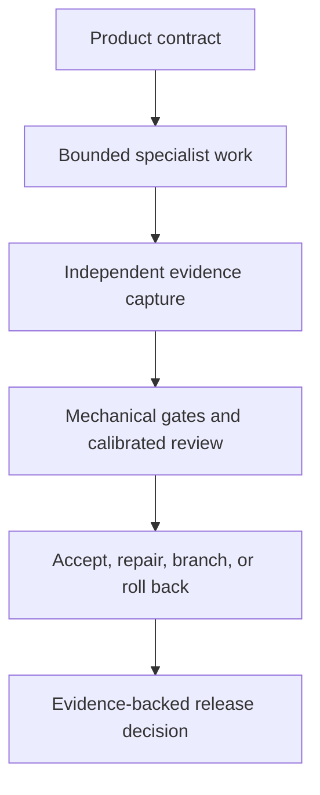

# Three.js Evidence Graph
<!-- source_version: 2026.07.0; translation_status: unreviewed; language: ko -->

소스만으로 생성되는 Three.js 버티컬 슬라이스를 위한 증거 기반 멀티 에이전트 제작 체계이며, *The Hollow Meridian*을 RPG 적용 명세로 제시합니다.

[English](README.md) | [简体中文](README.zh-CN.md) | [日本語](README.ja.md) | [한국어](README.ko.md)


> **출판 상태**
>
> 이 저장소에는 두 개의 설계 명세와 제작 프롬프트가 들어 있습니다. 플레이 가능한 게임 빌드, 완성된 참조 구현, 벤치마크 결과, 전체 증거 실행 결과는 포함되어 있지 않습니다. 출판물의 성능 차트와 예산은 측정 데이터라고 명시된 경우를 제외하면 목표치입니다.

## 출판물 구성

| 출판물 | 역할 | 판 | 다운로드 |
|---|---|---:|---|
| **Three.js Evidence Graph** | 에이전트가 구축하는 브라우저 버티컬 슬라이스를 통제, 테스트, 수정, 릴리스하기 위한 범용 운영 방법 | v2.0, 64페이지 | [PDF 읽기](publications/threejs-evidence-graph-operational-manual-v2.0-en.pdf) |
| **The Hollow Meridian** | 절차적으로 생성되는 3인칭 액션 RPG를 위한 게임별 제품 계약 및 멀티 에이전트 제작 프롬프트 | v1.0, 81페이지 | [PDF 읽기](publications/the-hollow-meridian-rpg-full-prompt-v1.0-en.pdf) |


첫 번째 문서는 제작상의 결정이 증거로 뒷받침되는 상태 전이로 바뀌는 방식을 정의합니다. 두 번째 문서는 하나의 야심 찬 RPG 슬라이스에 무엇이 포함되어야 하는지를 정의합니다. 두 문서는 동일한 Evidence Graph 계보를 공유하지만 버전이 완전히 일치하지는 않습니다. *The Hollow Meridian*은 프레임워크의 핵심 개념을 다수 구현하지만, 몇몇 v2 보호 장치보다 먼저 작성되었습니다.

## 이 작업이 존재하는 이유

대규모 게임 생성 프롬프트는 흔히 제품 방향, 아키텍처, 구현, 품질 판단, 수정, 릴리스 권한을 하나의 대화 안에 결합합니다. 그 결과 익숙한 실패 양상이 나타납니다. 시스템이 방대한 코드를 작성한 뒤, 독립적인 증거를 만들지 않은 채 자기 작업이 성공했다고 설명할 수 있습니다.

이 출판물은 다른 제어 모델을 제안합니다.



프롬프트는 제어 계층(control plane)을 위한 인터페이스이지, 제어 계층 자체가 아닙니다. 저장소 상태, 형식화된 작업 패킷(task packet), 결정론적 검사, 증거 매니페스트(evidence manifest), 예산, 릴리스 조건(release predicate)이 대화만으로는 안전하게 유지할 수 없는 권한을 담당합니다.

## Three.js Evidence Graph 개요

*Three.js Evidence Graph v2.0*은 범위가 좁은 브라우저 게임 버티컬 슬라이스를 위한 저장소 로컬 제작 시스템을 설명합니다. 핵심 기여는 다음과 같습니다.

1. **표준 제작 그래프.** 작업은 낙관적인 상태 메시지가 아니라 타입이 정의된 노드와 명시적인 전이 조건을 따라 진행됩니다.
2. **저장소 권한.** 제품, 아트, 아키텍처, 품질 계약은 대화 메모리와 개별 에이전트의 판단보다 우선합니다.
3. **경계가 명확한 위임.** 각 전문 에이전트는 하나의 목표, 허용 및 금지 파일, 불변 조건, 인수 명령, 증거 요구사항, 재시도 횟수, 리소스 예산을 전달받습니다.
4. **분리된 권한.** 빌더(builder)는 구현합니다. 읽기 전용 비평가(critic)는 캡처된 산출물을 평가합니다. 출처 감사자(provenance auditor)는 릴리스를 차단할 수 있습니다. 지정된 인간 디렉터(human director)는 운영 헌법을 변경할 수 있지만 실패한 게이트를 면제할 수는 없습니다.
5. **두 가지 증거 체계.** 시뮬레이션 상태와 그 밖의 제어된 데이터에는 bit-exact 비교를 사용할 수 있습니다. GPU로 래스터화한 출력과 프로필 간 시각 증거에는 사전에 선언된 허용 오차를 사용합니다.
6. **증명에 기반한 렌더러 선택.** WebGPU/TSL과 WebGL 2를 대표적인 머티리얼, 효과, 기기, 브라우저, 트레이스에 대해 검증할 후보로 취급합니다.
7. **컴파일로서의 절차적 생성.** 생성기에는 문법, 범위가 제한된 매개변수, 시드, 거부 테스트, 충돌 및 LOD 정책, 출처 정보, 진단 출력이 필요합니다. 무작위성은 구성을 대신하지 못합니다.
8. **공급망을 고려한 출처 관리.** 에셋 정책은 소스 파일, 의존성, 빌드 번들, 글꼴, 불투명 바이너리 데이터, 인코딩된 미디어, 런타임 요청, 생성 출력을 검사합니다.
9. **보정된 평가.** 비평가는 알려진 결함을 탐지하고, 제시 순서를 뒤집어도 판단을 유지하며, 증거를 인용하고, 막연한 취향이 아니라 관찰 가능한 실패를 보고해야 합니다.
10. **근본 원인 수정.** 모든 수정은 defect, evidence, hypothesis, intervention, expected change, protected metric, acceptance test, cost, rollback condition을 기록합니다.
11. **성능 분포.** 이 방법은 평균 FPS에 의존하지 않고 프레임 시간 백분위수, 장시간 프레임, CPU 및 GPU 비용, 메모리 증가, 컴파일 지연, 렌더러 통계를 평가합니다.
12. **컴퓨팅 경제성.** 기계적 검사에는 모델을 사용하지 않습니다. 모델 호출은 작업 가치에 따라 라우팅되며 실행 단위 비용 원장(cost ledger)에 기록됩니다.

이 운영 매뉴얼에는 v1-to-v2 defect ledger, 15-node control graph, 4부 구성의 orchestrator prompt, 그리고 task packet, defect record, run manifest를 위한 draft-07 schema가 포함되어 있습니다.

## The Hollow Meridian 개요

*The Hollow Meridian v1.0*은 다운로드한 최종 아트, 오디오, 모델, 텍스처, 글꼴, 에셋 팩을 사용하지 않고 Three.js로 구축하는 데스크톱 브라우저용 3인칭 다크 판타지 액션 RPG의 81페이지 제품 계약 및 오케스트레이션 프롬프트입니다.

플레이어는 사라진 도시의 진짜 이름을 보관하는 폐허가 된 천문대를 탐험하는, 얼굴 없는 성인 감시자 Cartographer입니다. 목표로 하는 첫 플레이 시간은 10분에서 14분이며 다음 요소를 포함합니다.

- 안전한 허브 한 곳과 저작자가 설계한 경로 한 개
- 주요 공간 다섯 곳
- 퀘스트 제공자 한 명과 3중 고리 공간 퍼즐 한 개
- 적 유형 세 종류
- 세 가지 선택지가 있는 유물 결정 한 번
- 2단계 보스 *The Bell Without a Name*
- 두 가지 엔딩 결과
- 로컬 체크포인트, 저장, 사망, 회복, 승리, 허브 복귀 루프

이 명세는 오픈 월드 확장, 제작, 상점, 무작위 전리품, 동료, 멀티플레이어, 캐릭터 생성을 의도적으로 제외합니다. 기능의 양으로 취약한 상호작용을 가리는 대신, 하나의 압축된 경험을 완결하는 것이 목적입니다.

제작 프롬프트는 아키텍처, 게임플레이 및 전투, 절차적 세계 구축, 적 및 보스 행동, RPG 및 UI 시스템, 오디오 및 효과, 통합, QA 및 성능, 시각 비평, 출처 감사를 담당하는 전문 역할을 정의합니다. 또한 고정 틱 시뮬레이션, 리플레이 캡처, 상태 해시, 안정적인 진단 URL, 증거 폴더, 범위가 제한된 수정 작업, 격리된 후보안, 롤백, 최종 릴리스 게이트를 정의합니다.

## 두 판본의 관계

*The Hollow Meridian*은 Evidence Graph 계보의 핵심 원칙에는 부합하지만, 모든 v2 규칙을 충족한다고 인증받은 구현은 아닙니다. 핵심에 부합하는 참조 명세로 이해하는 것이 가장 정확합니다.

| 영역 | Evidence Graph v2.0 | Hollow Meridian v1.0 |
|---|---|---|
| 제품 범위 | 매우 좁은 45초에서 90초의 기준 슬라이스 권장 | 야심 찬 10분에서 14분 길이의 RPG 경로 명세 |
| 증거 체계 | bit-exact 체계와 허용 오차 기반 체계를 명시적으로 구분 | 결정론적 증거는 존재하지만 두 체계가 완전히 통합되지는 않음 |
| 비평가 통제 | 보정, 양방향 순서 검토, 판단 편향 재검사 | 독립 비평가는 존재하지만 보정 절차가 완전히 명시되지는 않음 |
| 컴퓨팅 경제성 | 모델 등급과 필수 비용 원장 | 아직 통합되지 않음 |
| 인간 권한 | 제한된 개정 권한을 가진 지정 디렉터 | 아직 통합되지 않음 |
| 엔진 간 결정론 | 완전 일치 주장을 위해 제어된 결정론적 수학 커널 요구 | 아직 완전히 명시되지 않음 |
| 오디오 증거 | 오프라인 렌더링, 음량, true-peak, dropout, 음성 예산 게이트 | 절차적 오디오는 명시되어 있으나 동등한 측정 게이트는 업데이트가 필요함 |
| 접근성 | 증거 기반 릴리스 게이트 | 상당한 접근성 요구사항이 포함됨 |
| 출처 관리 | 소스, 의존성, 번들, 네트워크, 출력 감사 | 소스 생성 미디어와 출처 관리에 대한 강력한 규칙이 포함됨 |

이 구분은 중요합니다. 향후 개정판은 아직 존재하지 않는 호환성을 이미 갖춘 것처럼 주장하지 않으면서 RPG 명세를 완전히 정렬할 수 있습니다.

## 여기서 “AAA-grade”가 의미하는 것

이 표현은 의도적으로 범위를 좁힌 슬라이스의 내부 릴리스 계약으로 사용됩니다. 완결된 표현, 게임 감각, 일관성, 성능, 접근성, 출처 관리, 증거를 뜻합니다. 상업용 AAA 타이틀의 콘텐츠 규모, 예산, 팀 규모, 시장 지위, 완성된 품질을 주장하지 않습니다.

이 저장소의 어떤 문서도 목표가 달성되었음을 증명하지 않습니다. 그런 주장을 하려면 실행 가능한 구현, 명시된 기기 프로필, 완전한 증거 매니페스트, 보정된 평가, 재현 가능한 리소스, 결함 없는 회귀 주기, 하나의 승인된 커밋에 연결된 릴리스 후보가 필요합니다.

## 기술 기준선과 경계

- 출판물은 **Three.js r185 baseline**을 기준으로 작성되었습니다.
- WebGPU/TSL과 WebGL 2는 렌더러 결정 게이트를 통해 평가합니다.
- “No downloaded assets”는 최종적으로 보이거나 들리는 미디어에 적용됩니다. 버전이 고정된 개발 의존성, 브라우저 API, 빌드 도구, 테스트 도구, 프로파일러는 계속 허용되며 반드시 감사 대상에 포함해야 합니다.
- bit-exact 주장은 제어된 데이터 클래스에만 적용합니다. 브라우저 및 GPU 출력은 운영체제, 드라이버, 하드웨어, 브라우저, 설정에 따라 달라질 수 있습니다.
- 문서의 접근성 요구사항은 엔지니어링 목표입니다. 공식적인 WCAG 준수를 확립하지 않습니다.
- 출처 관리 장치는 추적 가능성을 높이지만 저작권상 독창성이나 소프트웨어 보안을 증명하지 않습니다.
- 호스트 에이전트에는 저장소 접근, 셸 실행, 브라우저 자동화, 캡처 인프라, 격리된 브랜치 또는 worktree, 구조화된 작업 배포 기능이 필요합니다. 기본적인 채팅 인터페이스만으로는 충분하지 않습니다.

## 권장 읽기 경로

### Technical director 및 연구자

1. Evidence Graph의 결함 원장과 문서 상태 페이지를 읽습니다.
2. 제어 그래프, 권한 계층, 증거 체계, 비평가 보정, 운영 절차, 규범 스키마를 검토합니다.
3. *The Hollow Meridian*을 적용 사례로 다루기 전에 위의 호환성 표를 읽습니다.

### 게임 및 technical-art 팀

1. *The Hollow Meridian*의 게임 계약, 경로, 경험 원칙, anti-slop 규칙을 읽습니다.
2. 게임 시스템, 절차적 미디어 정책, QA 게이트를 이어서 읽습니다.
3. 저장소 권한 문서와 인수 명령이 마련된 후에만 전문 역할 카드를 사용합니다.

### 에이전트 시스템 구축자

1. Evidence Graph 오케스트레이터 프롬프트와 스키마부터 시작합니다.
2. 모델 라우팅 전에 유효성 검사와 상태 전이를 구현합니다.
3. 캡처된 산출물, 수정된 결함, 롤백, 프레임 시간 분포, 비용 회계, 승인된 커밋을 포함하는 실제 종단 간 실행 한 건을 추가합니다.

## 저장소 구성

```text
.
├── README.md
├── README.zh-CN.md
├── README.ja.md
├── README.ko.md
├── assets/
│   ├── publication-set.jpg
│   ├── readme-hero.jpg
│   ├── readme-hero.prompt.md
│   ├── threejs-evidence-graph-cover.jpg
│   └── the-hollow-meridian-cover.jpg
├── publications/
│   ├── threejs-evidence-graph-operational-manual-v2.0-en.pdf
│   └── the-hollow-meridian-rpg-full-prompt-v1.0-en.pdf
├── docs/
│   ├── GLOSSARY.md
│   ├── PUBLICATION_STATUS.md
│   └── TRANSLATION_POLICY.md
├── CHANGELOG.md
├── CITATION.cff
├── CITATIONS.md
├── CONTRIBUTING.md
├── RELEASE_NOTES.md
├── release-manifest.json
└── SHA256SUMS.txt
```

## 현재 로드맵

가장 가치 있는 다음 릴리스는 더 큰 프롬프트가 아닙니다. 기존 계약을 테스트할 수 있게 만드는 실행 가능한 동반 시스템입니다.

- 표준 기계 판독형 스키마
- 그래프 상태 및 전이 조건
- task packet 및 defect validator
- 렌더러 증명 하네스
- 결정론적 리플레이 및 상태 해싱
- 에셋 및 출처 스캐너
- Playwright 캡처 프로필
- 비평가 보정 픽스처
- run manifest 및 cost ledger
- 완전한 `run-0001` 증거 패키지 한 건
- 승인된 수정 한 건, 거부된 후보안 한 건, 검증된 롤백 한 건

이 시스템이 존재하기 전까지 이 저장소가 주장하는 가치는 설계와 명세에 있으며, 경험적 제작 결과에는 있지 않습니다.

## 번역 정책

영문판이 규범적 판본입니다. 중국어 간체, 일본어, 한국어 파일은 이 저장소 안내서의 완전한 설명형 번역입니다. 출판물 제목, 게임 고유명사, 파일명, 명령어, 스키마 키, 그래프 노드 식별자, 경로, 열거형 값, 코드 식별자는 표준 영문 표기를 유지합니다.

번역본과 영문판이 다를 경우 기술적 해석에는 영문판을 사용하고 이슈를 통해 차이를 보고해 주십시오. [Translation Policy](docs/TRANSLATION_POLICY.md)와 [다국어 기술 용어집](docs/GLOSSARY.md)을 참조하십시오.

## 무결성

[SHA256SUMS.txt](SHA256SUMS.txt)의 SHA-256 값은 이 릴리스의 정확한 PDF 파일을 식별합니다.

## 기여

다음과 같은 범위가 명확한 기여를 환영합니다.

- 페이지 참조가 포함된 사실 또는 편집상 결함
- 끊어진 출처 링크
- 번역 수정
- 용어 개선
- 접근성 개선
- 재현 가능한 구현 보고서
- 공개된 권한 모델을 보존하는 기계 판독형 계약

이슈 또는 pull request를 열기 전에 [CONTRIBUTING.md](CONTRIBUTING.md)를 읽어 주십시오.

## 인용

[CITATION.cff](CITATION.cff)의 메타데이터를 사용하십시오. 간단한 인용 형식은 다음과 같습니다.

> Emily Paradox. *Three.js Evidence Graph v2.0 and The Hollow Meridian RPG Full Prompt v1.0*. Technical Systems and Game Systems Series, July 2026.

## 라이선스 상태

이 출판 릴리스에는 재사용 라이선스가 선택되지 않았습니다. 라이선스가 없다는 사실을 재배포, 판매, 파생 판본 출판에 대한 허가로 해석해서는 안 됩니다.

## 저자

**Emily Paradox**  
AI 디지털 아티스트, 프롬프트 시스템 디자이너, 크리에이티브 테크놀로지스트  
GitHub: [@Emily2040](https://github.com/Emily2040)
