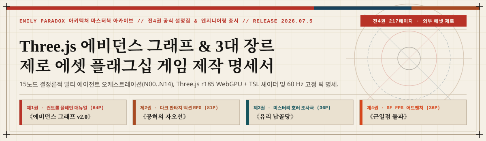
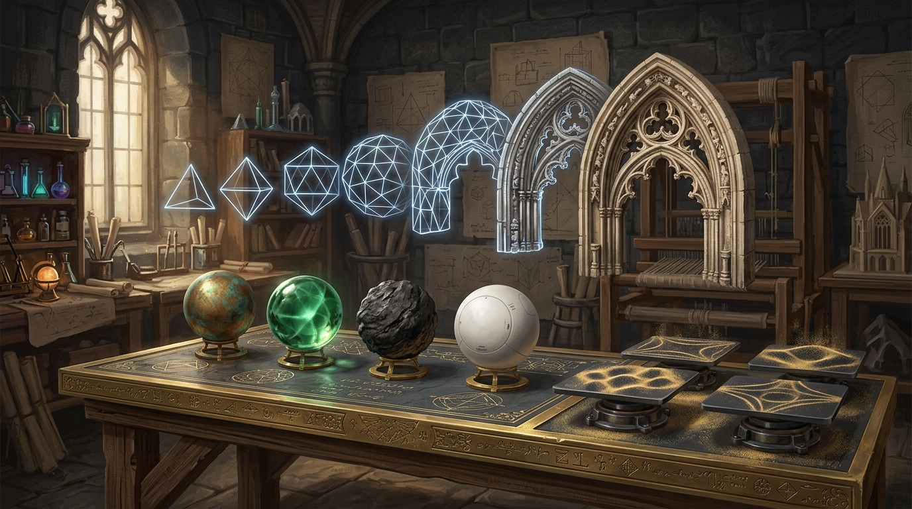
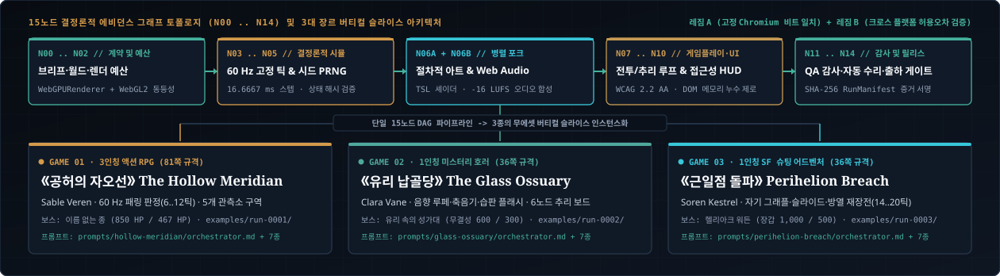
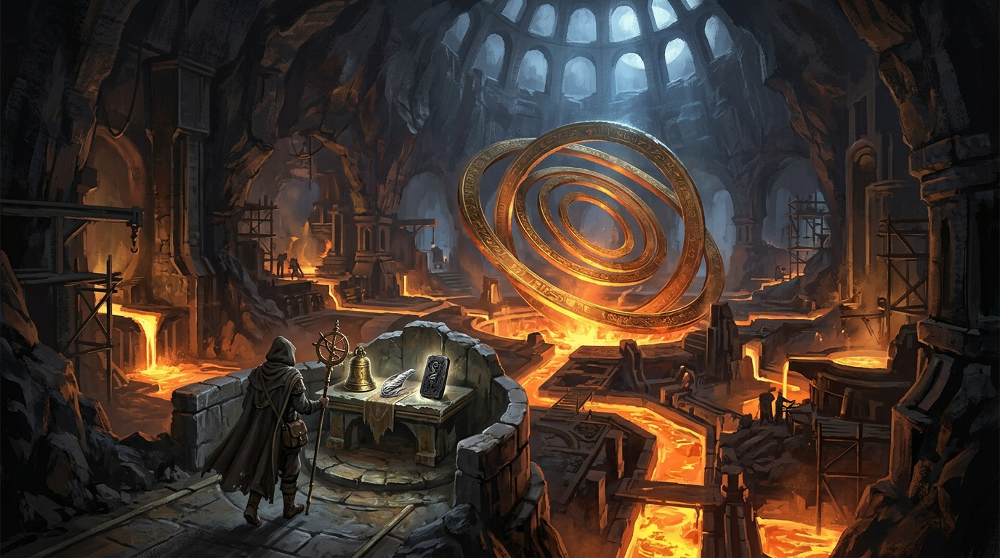
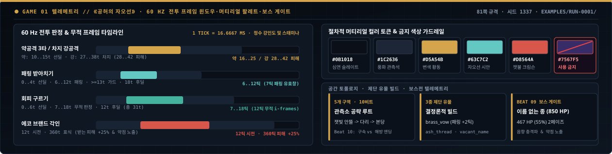
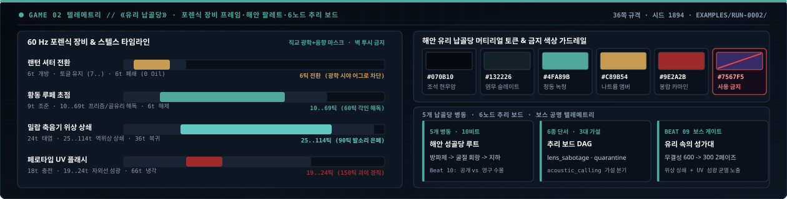
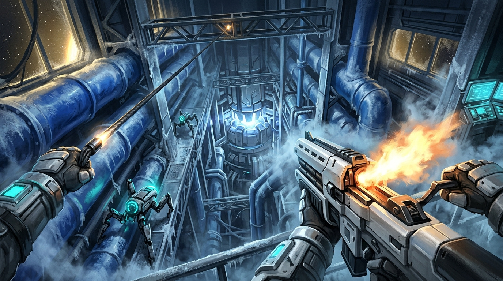
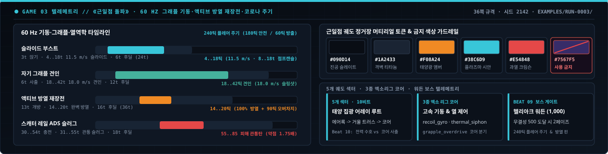

<!-- source_version: 2026.07.5; translation_status: reviewed; language: ko -->

# 《Three.js 에비던스 그래프 & 3대 장르 제로 에셋 플래그십 게임 공식 아트북 & 아키텍처 마스터북》



| **공식 마스터북 에디션** | [**English (Original Folio)**](README.md) | [**简体中文 (典藏设定集版)**](README.zh-CN.md) | [**日本語 (公式設定資料集・解体新書版)**](README.ja.md) | [**한국어 (공식 아트북 & 마스터북판)**](README.ko.md) |
| :--- | :---: | :---: | :---: | :---: |
| **아카이브 콜로폰** | `Release 2026.07.5` | `전4권 · 총 217페이지` | `Three.js r185 (0.185.0) WebGPU + TSL` | `외부 바이너리 에셋 제로 · MIT 라이선스` |


*도판 00: 에비던스 그래프 컨트롤 플레인이 규율하는 세 가지 절차적 세계관의 건축 삼면화(Triptych). 좌측: 현무암 대성당과 황동 자오선 고리, '이름 없는 종'이 솟아오른 다크 판타지 액션 RPG 《공허의 자오선》(제2권). 중앙: 1894년 폭풍우 치는 암초 위 프레넬 등대와 해저 골유리 납골당을 결합한 미스터리 호러 조사극 《유리 납골당》(제3권). 우측: 0.09 AU 태양 극근접 궤도의 헬리오스탯 거울 배열과 작열하는 코로나를 배경으로 한 SF FPS 어드벤처 《근일점 돌파》(제4권).*

---

## 편찬 서문 및 전4권 아키텍처 마스터북 개요

단일 대화창에 의존하는 기존 LLM 게임 생성 방식은 동일한 컨텍스트 윈도우가 스스로 범위를 기획하고, 셰이더와 전투 수식을 작성한 뒤, 자기 결과물을 직접 채점하기 시작하는 순간 무너집니다. **Emily Paradox (`@iamemily2050`)** 가 집필한 **전4권, 총 `217`페이지 분량의 엔지니어링 마스터북 & 멀티 에이전트 프롬프트 총서**는 자기 인증식 채팅 루프를 폐기하고, **Three.js `r185` (`0.185.0`)** 기반의 결정론적 증거 게이트 제작 체계를 수립합니다.

이 총서에 수록된 모든 폴리곤 메시, `TSL`(`Three.js Shading Language`) 절차적 머티리얼 노드, 스켈레탈 리그, 음향 임펄스 응답 및 60 Hz 근접/포렌식/탄도 프레임 테이블은 **다운로드 런타임 에셋 제로**(`external_network_requests = 0`, `downloaded_assets_count = 0`) 원칙 아래 소스 코드에서 결정론적으로 컴파일됩니다.


### 전4권 컬렉터즈 모노그래프 수록 목록 (`publications/`)

| **제1권 · 64페이지** | **제2권 · 81페이지** | **제3권 · 36페이지** | **제4권 · 36페이지** |
| :---: | :---: | :---: | :---: |
| [](publications/threejs-evidence-graph-operational-manual-v2.0-en.pdf) | [](publications/the-hollow-meridian-rpg-full-prompt-v1.0-en.pdf) | [](publications/the-glass-ossuary-mystery-horror-full-prompt-v1.0-en.pdf) | [](publications/perihelion-breach-fps-adventure-full-prompt-v1.0-en.pdf) |
| [**《운용 매뉴얼 v2.0》**](publications/threejs-evidence-graph-operational-manual-v2.0-en.pdf)<br/>`컨트롤 플레인 & 결정론 규약` | [**《공허의 자오선》**](publications/the-hollow-meridian-rpg-full-prompt-v1.0-en.pdf)<br/>`Game 01 · 3인칭 액션 RPG` | [**《유리 납골당》**](publications/the-glass-ossuary-mystery-horror-full-prompt-v1.0-en.pdf)<br/>`Game 02 · 1인칭 미스터리 호러` | [**《근일점 돌파》**](publications/perihelion-breach-fps-adventure-full-prompt-v1.0-en.pdf)<br/>`Game 03 · 0.09 AU SF FPS` |
| `sha256: d3830d411a61c52c`<br/>`416,827 bytes` | `sha256: c4f8fe83995d526b`<br/>`357,144 bytes` | `sha256: efead090be003782`<br/>`98,649 bytes` | `sha256: 75bdfff21c905122`<br/>`95,265 bytes` |
| **네이티브 해설서**:<br/>[EN](docs/EVIDENCE_GRAPH_GUIDE.md) · [中文](docs/EVIDENCE_GRAPH_GUIDE.zh-CN.md) · [日本語](docs/EVIDENCE_GRAPH_GUIDE.ja.md) · [한국어](docs/EVIDENCE_GRAPH_GUIDE.ko.md) | **네이티브 해설서**:<br/>[EN](docs/THE_HOLLOW_MERIDIAN_GUIDE.md) · [中文](docs/THE_HOLLOW_MERIDIAN_GUIDE.zh-CN.md) · [日本語](docs/THE_HOLLOW_MERIDIAN_GUIDE.ja.md) · [한국어](docs/THE_HOLLOW_MERIDIAN_GUIDE.ko.md) | **네이티브 해설서**:<br/>[EN](docs/THE_GLASS_OSSUARY_GUIDE.md) · [中文](docs/THE_GLASS_OSSUARY_GUIDE.zh-CN.md) · [日本語](docs/THE_GLASS_OSSUARY_GUIDE.ja.md) · [한국어](docs/THE_GLASS_OSSUARY_GUIDE.ko.md) | **네이티브 해설서**:<br/>[EN](docs/PERIHELION_BREACH_GUIDE.md) · [中文](docs/PERIHELION_BREACH_GUIDE.zh-CN.md) · [日本語](docs/PERIHELION_BREACH_GUIDE.ja.md) · [한국어](docs/PERIHELION_BREACH_GUIDE.ko.md) |
| **스키마 & 프롬프트**:<br/>[`prompts/evidence-graph/`](prompts/evidence-graph/) · [`schemas/`](schemas/) | **프롬프트 & 골든 런**:<br/>[`prompts/hollow-meridian/`](prompts/hollow-meridian/) · [`run-0001`](examples/run-0001/) | **프롬프트 & 골든 런**:<br/>[`prompts/glass-ossuary/`](prompts/glass-ossuary/) · [`run-0002`](examples/run-0002/) | **프롬프트 & 골든 런**:<br/>[`prompts/perihelion-breach/`](prompts/perihelion-breach/) · [`run-0003`](examples/run-0003/) |

---

## 제1권 · 결정론적 컨트롤 플레인 (《Three.js 에비던스 그래프 v2.0》 · 64페이지)

| 도판 I-A: 천문시계식 검증 오토마톤 & 광학 제어 아틀리에 | 도판 I-B: 제로 에셋 절차적 지오메트리 & TSL 컴파일 스튜디오 |
| :---: | :---: |
|  |  |



제1권은 세 가지 플래그십 게임이 공유하는 4대 아키텍처 불변식을 정의합니다.

1. **15노드 유향 순환 컨트롤 플레인 (`N00_BRIEF` .. `N14_RELEASE_CANDIDATE`)**: [`schemas/graph-state.d.ts`](schemas/graph-state.d.ts)에 의해 엄격히 통제됩니다. 스키마 검증을 통과한 [`TaskPacket`](schemas/task-packet.schema.json)과 CLI 수락 명령 결과가 없으면 오케スト레이터는 다음 노드로 전이할 수 없으며, 실패 시 유한 롤백 루프(`N13_REPAIR_ROUTER -> N05..N08`, 노드당 최대 `3`회, 전역 최대 `8`회)가 작동합니다.
2. **파일 소유권이 물리적으로 격리된 7개 전문 에이전트 역할**: 각 게임 슬라이스는 7장의 전문 에이전트 카드(`combat_gameplay`, `world_quest`, `procedural_art_vfx`, `procedural_audio`, `ui_hud_accessibility`, `qa_perf_playwright`, 읽기 전용 `independent_critic`)로 분할되며, `allowed_paths` 외부 파일 수정이나 검증 기준 완화는 원천 차단됩니다.
3. **이중 결정론 레짐 (`A-PinnedBrowser` & `B-CrossPlatform`)**:
   - **레짐 A (`A-PinnedBrowser`)**: 고정 Chromium + GPU/SwiftShader 환경에서 60 Hz 정수 시뮬레이션 틱(`state_hash`), 16-bit PCM 양자화 오프라인 오디오(`audio_hash`), `1e-5` 양자화 정점 버퍼(`geometry_hash`)의 비트 단위 SHA-256 일치를 검증합니다.
   - **레짐 B (`B-CrossPlatform`)**: `THREE.WebGPURenderer` 및 `{ forceWebGL: true }` 폴백 환경 전반에서 지각적·불변식 허용 오차 게이트(`P50 <= 8.3 ms`, `P95 <= 16.6 ms`, `P99 <= 22.0 ms`, `-16 LUFS +- 1.0 LU`, `<= -1.0 dBTP`)를 검증합니다.
4. **안티 슬롭(Anti-Slop) & 제로 에셋 출처 검증 게이트 (`provenance_critic`)**: 외부 `.glb/.gltf/.fbx/.obj/.png/.jpg/.wav/.mp3/.ogg` 네트워크 요청을 전면 금지하고, 흔한 AI 네온 보라색(`#7567F5`) 사용을 모든 셰이더와 UI에서 차단합니다.

---

## 제2권 · 게임 01: 《공허의 자오선》 *The Hollow Meridian* (3인칭 다크 판타지 액션 RPG · 81페이지)

| 도판 II-1: 침몰한 아스트롤라베 회랑과 오러리 브리지 | 도판 II-2: 종 주조소와 3대 성물 제단 | 도판 II-3: 자오선 성소와 '이름 없는 종' 보스전 |
| :---: | :---: | :---: |
|  |  |  |



사라진 고대 도시들의 '진명(True Names)'을 보존하기 위해 세워진 거대한 화산 현무암·황동 천문대를 배경으로, 플레이어는 **지도제작자(`The Cartographer` / `Sable Veren`)**가 되어 10~14분 분량의 수직 슬라이스를 돌파합니다. 5개의 연결 공간(`Ash Court` -> `Orrery Bridge` -> `Archive Nave` -> `Bell Foundry` -> `Meridian Chamber`)을 탐험하며 3중 동심원 `Meridian Alignment` 퍼즐을 풀고, 빌드를 정의하는 3대 성물 중 하나를 선택한 뒤, 2페이즈 보스 **이름 없는 종(The Bell Without a Name, 850 HP, 55% / 467 HP에서 2페이즈 음향 분열)**과 맞섭니다.

| 60 Hz 근접 액션 (`seed=1337`) | 선딜레이 (Startup) | 활성 / 패리 / 무적 프레임 | 후딜레이 (Recovery) | 총 프레임 | 스태미나 / 공명 소모 및 메커니즘 효과 |
| :--- | :--- | :--- | :--- | :--- | :--- |
| `Light Attack 1 / 2 / 3` | `10 / 11 / 15t` | `5 / 7 / 9 ticks` | `12 / 12 / 18t` | `27 / 30 / 42t` | `10 / 11 / 14 Stamina` 소모; `16 / 18 / 25 HP` 피해 |
| `Charged Heavy` (차지 강공격) | `27..38 ticks` | `10..11 ticks` | `12..14 ticks` | `49..63 ticks` | `28 Stamina` 소모; `28..42 HP` 피해 + 높은 강인도 감쇄 |
| `Dodge Roll` (회피 구르기) | `7 ticks` | `Ticks 7..18` (`12t` 무적) | `12 ticks` | `31 ticks` | `22 Stamina` 소모 (`ash_thread` 시 `18`); 완전 무적 프레임 |
| `Parry Deflect` (패리 튕겨내기) | `5 ticks` (`0..4`) | `Ticks 6..12` (`7t` 패리) | `18 ticks` | `31 ticks` | `12 Stamina` 소모; `tick >= 13` 홀드 시 지속 `Guard` 전환 |
| `Echo Brand` (메아리 낙인) | `12 ticks` | `360 ticks` 취약화 표식 | `0 ticks` | `12 ticks` | `50 Resonance` 소모 (`vacant_name` 시 `60`·`540 ticks` 지속); 받는 피해 `+25%` |

- **규범 영문판 PDF (`81`페이지)**: [`publications/the-hollow-meridian-rpg-full-prompt-v1.0-en.pdf`](publications/the-hollow-meridian-rpg-full-prompt-v1.0-en.pdf)
- **4개 국어 네이티브 해설서**: [한국어](docs/THE_HOLLOW_MERIDIAN_GUIDE.ko.md) · [English](docs/THE_HOLLOW_MERIDIAN_GUIDE.md) · [简体中文](docs/THE_HOLLOW_MERIDIAN_GUIDE.zh-CN.md) · [日本語](docs/THE_HOLLOW_MERIDIAN_GUIDE.ja.md)
- **에이전트 카드 & 골든 픽스처**: [`prompts/hollow-meridian/`](prompts/hollow-meridian/) (`orchestrator.md` + 전문 카드 7장) · [`examples/run-0001/`](examples/run-0001/)

---

## 제3권 · 게임 02: 《유리 납골당》 *The Glass Ossuary* (1인칭 미스터리 호러 조사극 · 36페이지)

| 도판 III-1: 생베인 암초와 프레넬 굴절 회랑 | 도판 III-2: 등대지기의 박리실과 1894 포렌식 작업대 | 도판 III-3: 해저 골유리 납골당과 '유리 속의 성가대' |
| :---: | :---: | :---: |
|  |  |  |



1894년 10월, 폭풍우가 몰아치는 조석 고립섬 **생베인 암초(Saint-Vane Reef)**. 음향 기록관 **Clara Vane**은 지하 골유리 납골당과 융합된 해안 등대에 진입하여 난파선 생존자 12명과 등대지기 실종 사건을 추적합니다. 화기 전투나 값싼 점프 스케어를 배제하고, 19세기 물리 포렌식 기구 3종(`Split-Diopter Brass Loupe` 이중 초점 황동 루페, `Wax-Cylinder Phonograph` 왁스 실린더 축음기, `Silver-Salt Ferrotype Plate` 은염 페로타입 플래시)과 6노드 `Inquest Board`(심문 추리 보드), 엄격한 빛·소리 스텔스 규율만으로 **유리 속의 성가대(The Choir in the Glass, 600 공명 무결성, 300에서 2페이즈 분열)**의 진실을 밝혀냅니다.

| 60 Hz 포렌식·스텔스 액션 (`seed=1894`) | 선딜레이 (Startup) | 활성 윈도우 (Active) | 후딜레이 / 쿨타임 | 총 프레임 | 자원 소모 및 광학·음향 포렌식 효과 |
| :--- | :--- | :--- | :--- | :--- | :--- |
| `Lantern Shutter` (랜턴 셔터) | `6 ticks` | 토글 유지 (`tick 7..`) | `6 ticks` | `12 ticks` | `0 Oil`; 빛 원뿔을 즉시 차단하여 `Glass Septum Watcher` 시야 어그로 해제 |
| `Brass Loupe Focus` (루페 초점) | `9 ticks` | 홀드 (`ticks 10..69`) | `6 ticks` | `75 ticks` | `0 Oil`; 프레넬 렌즈 각도(`45/135/270 deg`) 및 골유리 미세 균열 해독 |
| `Phonograph Cancel` (역위상 재생) | `24 ticks` | `Ticks 25..114` (`90t`) | `36 ticks` | `150 ticks` | 역위상 음파로 실내 공명을 상쇄하여 `Mire Listener`에게 발소리 은폐 |
| `Ferrotype UV Flash` (페로타입 섬광) | `18 ticks` | `Ticks 19..24` (`6t`) | `66 ticks` | `90 ticks` | `6.5 m` 내 원령을 `102 ticks`(`lens_sabotage` 시 `132 ticks`) 동안 기절 |
| `Crouch Sidestep` (웅크려 걷기) | `5 ticks` | `Ticks 6..16` (`11t`) | `12 ticks` | `28 ticks` | 젖은 돌바닥 발소리 피크를 `<= -38 dBFS` 이하로 억제 |
| `Smelling Salts` (후각 진정염) | `15 ticks` | `Ticks 16..45` (`30t`) | `10 ticks` | `55 ticks` | `Composure +40` 회복 및 `Exposure -25` 정화 |

- **규범 영문판 PDF (`36`페이지)**: [`publications/the-glass-ossuary-mystery-horror-full-prompt-v1.0-en.pdf`](publications/the-glass-ossuary-mystery-horror-full-prompt-v1.0-en.pdf)
- **4개 국어 네이티브 해설서**: [한국어](docs/THE_GLASS_OSSUARY_GUIDE.ko.md) · [English](docs/THE_GLASS_OSSUARY_GUIDE.md) · [简体中文](docs/THE_GLASS_OSSUARY_GUIDE.zh-CN.md) · [日本語](docs/THE_GLASS_OSSUARY_GUIDE.ja.md)
- **에이전트 카드 & 골든 픽스처**: [`prompts/glass-ossuary/`](prompts/glass-ossuary/) (`orchestrator.md` + 전문 카드 7장) · [`examples/run-0002/`](examples/run-0002/)

---

## 제4권 · 게임 03: 《근일점 돌파》 *Perihelion Breach* (1인칭 SF 슈터 어드벤처 · 36페이지)

| 도판 IV-1: 0.09 AU 이카루스-9 헬리오스탯 메인 트러스 | 도판 IV-2: 극저온 냉각 매니폴드 & 능동 방열 재장전 교전 | 도판 IV-3: 근일점 코어 챔버 & '헬리아크 워든' 공중전 |
| :---: | :---: | :---: |
|  |  |  |



태양에서 불과 `0.09 AU` 떨어진 극근접 궤도를 도는 **이카루스-9 궤도 태양 중계소(Icarus-9 Orbital Solar Relay)**. 방어 그리드 폭주로 헬리오스탯 거울 배열이 열폭주 연쇄 반응에 빠진 정거장에 선봉 특무 요원 **Soren Kestrel**이 강하합니다. `18.0 m/s` `Magnetic Grapple` 슬링샷, `11.5 m/s` `Slide-Boost`, `ticks 14..20` 액티브 `Thermal Vent Reload`(능동 방열 재장전), 그리고 `240 ticks`(`4.0 s`) 주기의 태양 플레어 그림자 회랑을 돌파하며 입체 아레나에서 **헬리아크 워든(The Heliarch Warden, 1,000 장갑 무결성, 500에서 2페이즈 전환)**을 제압합니다.

| 60 Hz 탄도·기동 액션 (`seed=2142`) | 선딜레이 (Startup) | 활성 윈도우 (Active) | 후딜레이 / 회복 | 총 프레임 | 열량 / 속도 및 전술 메커니즘 효과 |
| :--- | :--- | :--- | :--- | :--- | :--- |
| `Carbine 3-Burst` (카빈 3점사) | `2 ticks` | `Ticks 3..11` (3발) | `10 ticks` | `21 ticks` | `+12 Heat`; `3 x 14 dmg` 히트스캔 (약점 배율 `1.5x`) |
| `Scatter Uncharged` (비차지 산탄) | `3 ticks` | `Tick 4` (`5x12` 산탄) | `15 ticks` | `18 ticks` | `+18 Heat`; 근거리 `60 dmg`, 에너지 실드 즉시 박리 |
| `Scatter ADS Rail Slug` (ADS 레일 슬러그) | `30..54t` | `Tick 31..55` | `18 ticks` | `48..72 ticks` | `+28 Heat`; `55..85 dmg` 관통 슬러그 (약점 배율 `1.75x`) |
| `Breach Anchor` (브리치 앵커) | `6 ticks` | 테더 발사체 | `24 ticks` | `30 ticks` | `+30 Heat`; `60 AoE dmg` 장갑 파쇄 또는 도관 위상 링크 연결 |
| `Thermal Vent Reload` (능동 방열 재장전) | `13 ticks` | `Ticks 14..20` (`7t`) | `16 ticks` | `36 ticks` | `14..20t` 입력 성공 시 `Heat 100%` 즉시 제거 + `90t` 과충전 버프 |
| `Slide-Boost` (슬라이드 부스트) | `3 ticks` | `Ticks 4..18` (`15t`) | `6 ticks` | `24 ticks` | `11.5 m/s` 저자세 슬라이딩; `ticks 8..18` 점프 캔슬 가능 |
| `Magnetic Grapple` (자력 그래플) | `6 ticks` | `18..42 ticks` 견인 | `12 ticks` | `36..60 ticks` | `18.0 m/s` 고속 견인; 접선 속도 보존으로 포물선 슬링샷 기동 |

- **규범 영문판 PDF (`36`페이지)**: [`publications/perihelion-breach-fps-adventure-full-prompt-v1.0-en.pdf`](publications/perihelion-breach-fps-adventure-full-prompt-v1.0-en.pdf)
- **4개 국어 네이티브 해설서**: [한국어](docs/PERIHELION_BREACH_GUIDE.ko.md) · [English](docs/PERIHELION_BREACH_GUIDE.md) · [简体中文](docs/PERIHELION_BREACH_GUIDE.zh-CN.md) · [日本語](docs/PERIHELION_BREACH_GUIDE.ja.md)
- **에이전트 카드 & 골든 픽스처**: [`prompts/perihelion-breach/`](prompts/perihelion-breach/) (`orchestrator.md` + 전문 카드 7장) · [`examples/run-0003/`](examples/run-0003/)

---

## 3대 플래그십 게임 권별 비교 매트릭스

| 아키텍처 및 디자인 차원 | 제2권: 《공허의 자오선》 | 제3권: 《유리 납골당》 | 제4권: 《근일점 돌파》 |
| :--- | :--- | :--- | :--- |
| **장르 & 카메라** | 3인칭 다크 판타지 액션 RPG | 1인칭 미스터리 호러 조사극 | 1인칭 SF 슈터 어드벤처 |
| **목표 플레이타임** | 10~14분 (`81`페이지 PDF) | 12~16분 (`36`페이지 PDF) | 12~15분 (`36`페이지 PDF) |
| **주인공** | `Sable Veren` (지도제작자) | `Clara Vane` (음향 기록관) | `Soren Kestrel` (선봉 특무 요원) |
| **3대 핵심 자원** | `100 Health` · `100 Stamina` · `0-100 Resonance` | `100 Composure` · `100 Lantern Oil` · `0-100 Exposure` | `100 Shield` · `100 Hull Integrity` · `0-100 Core Heat` |
| **60 Hz 핵심 메커니즘** | `Parry Deflect`(`6..12t`) vs 홀드 `Guard`(`>=13t`) | `Lantern Shutter`(`6t`) + 역위상 축음기 + 페로타입 섬광(`19..24t`) | `Thermal Vent Reload`(`14..20t`) + `18 m/s` 자력 그래플 + 슬라이드 |
| **5개 연결 공간** | `Ash Court` -> `Orrery Bridge` -> `Archive Nave` -> `Bell Foundry` -> `Meridian Chamber` | `Tidewater Causeway` -> `Caretaker's Stripping Room` -> `Refraction Gallery` -> `Submerged Crypt` -> `The Glass Ossuary` | `Umbilical Airlock` -> `Heliostat Truss` -> `Cryo-Coolant Manifold` -> `Ballistic Foundry` -> `Perihelion Core Chamber` |
| **비트 05 공간 퍼즐** | `Meridian Alignment` (3중 황동 링 -> `North Seal`) | `Prism Triangulation`(`45/135/270도`) + `110/220/330 Hz` 수문 | `Conduit Phase Routing` (`180t` 감쇠 내 3도관 연결 -> `Coolant Bypass`) |
| **3종 적 아키타입** | `Ashbound Skirmisher`, `Lantern Wraith`, `Bell Sentinel` | `Mire Listener`, `Glass Septum Watcher`, `Drowned Chorister` | `Volt Skitter`, `Aegis Drone`, `Slag Enforcer` |
| **비트 07 빌드 분기** | **3대 성물**: `brass_vow` · `ash_thread` · `vacant_name` | **3대 가설**: `lens_sabotage` · `tidal_quarantine` · `acoustic_calling` | **3대 엑소 코어**: `recoil_gyro` · `thermal_siphon` · `grapple_overdrive` |
| **비트 09 2페이즈 보스** | **이름 없는 종** (`850 HP`, `467 HP` 2페이즈) | **유리 속의 성가대** (`600 Integrity`, `300` 2페이즈) | **헬리아크 워든** (`1,000 Integrity`, `500` 2페이즈) |
| **비트 10 멀티 엔딩** | `CHOICE_BIND` 또는 `CHOICE_RELEASE` | `VERDICT_PUBLISH` 또는 `VERDICT_SUBMERGE` | `DIRECTIVE_DIVERT` 또는 `DIRECTIVE_VENT` |
| **성능 예산** | `<= 300` draw calls · `<= 500,000` tris | `<= 280` draw calls · `<= 460,000` tris | `<= 300` draw calls · `<= 500,000` tris |
| **골든 레퍼런스 런** | [`examples/run-0001/`](examples/run-0001/) (`seed=1337`) | [`examples/run-0002/`](examples/run-0002/) (`seed=1894`) | [`examples/run-0003/`](examples/run-0003/) (`seed=2142`) |

---

## 4개 국어 네이티브 마스터북 매트릭스

| 문서 표면 | 네이티브 영문판 (`en`) | 네이티브 간체 중국어판 (`zh-CN`) | 네이티브 일본어판 (`ja`) | 네이티브 한국어판 (`ko`) |
| :--- | :--- | :--- | :--- | :--- |
| **아카이브 메인 & 모노그래프 총람** | [`README.md`](README.md) | [`README.zh-CN.md`](README.zh-CN.md) | [`README.ja.md`](README.ja.md) | [`README.ko.md`](README.ko.md) |
| **제1권: 에비던스 그래프 v2.0 (64P)** | [`EVIDENCE_GRAPH_GUIDE.md`](docs/EVIDENCE_GRAPH_GUIDE.md) | [`EVIDENCE_GRAPH_GUIDE.zh-CN.md`](docs/EVIDENCE_GRAPH_GUIDE.zh-CN.md) | [`EVIDENCE_GRAPH_GUIDE.ja.md`](docs/EVIDENCE_GRAPH_GUIDE.ja.md) | [`EVIDENCE_GRAPH_GUIDE.ko.md`](docs/EVIDENCE_GRAPH_GUIDE.ko.md) |
| **제2권: 《공허의 자오선》 RPG (81P)** | [`THE_HOLLOW_MERIDIAN_GUIDE.md`](docs/THE_HOLLOW_MERIDIAN_GUIDE.md) | [`THE_HOLLOW_MERIDIAN_GUIDE.zh-CN.md`](docs/THE_HOLLOW_MERIDIAN_GUIDE.zh-CN.md) | [`THE_HOLLOW_MERIDIAN_GUIDE.ja.md`](docs/THE_HOLLOW_MERIDIAN_GUIDE.ja.md) | [`THE_HOLLOW_MERIDIAN_GUIDE.ko.md`](docs/THE_HOLLOW_MERIDIAN_GUIDE.ko.md) |
| **제3권: 《유리 납골당》 호러 (36P)** | [`THE_GLASS_OSSUARY_GUIDE.md`](docs/THE_GLASS_OSSUARY_GUIDE.md) | [`THE_GLASS_OSSUARY_GUIDE.zh-CN.md`](docs/THE_GLASS_OSSUARY_GUIDE.zh-CN.md) | [`THE_GLASS_OSSUARY_GUIDE.ja.md`](docs/THE_GLASS_OSSUARY_GUIDE.ja.md) | [`THE_GLASS_OSSUARY_GUIDE.ko.md`](docs/THE_GLASS_OSSUARY_GUIDE.ko.md) |
| **제4권: 《근일점 돌파》 FPS (36P)** | [`PERIHELION_BREACH_GUIDE.md`](docs/PERIHELION_BREACH_GUIDE.md) | [`PERIHELION_BREACH_GUIDE.zh-CN.md`](docs/PERIHELION_BREACH_GUIDE.zh-CN.md) | [`PERIHELION_BREACH_GUIDE.ja.md`](docs/PERIHELION_BREACH_GUIDE.ja.md) | [`PERIHELION_BREACH_GUIDE.ko.md`](docs/PERIHELION_BREACH_GUIDE.ko.md) |
| **다국어 용어집 & 번역 정책** | [`GLOSSARY.md`](docs/GLOSSARY.md) · [`TRANSLATION_POLICY.md`](docs/TRANSLATION_POLICY.md) | [`GLOSSARY.md`](docs/GLOSSARY.md) | [`GLOSSARY.md`](docs/GLOSSARY.md) | [`GLOSSARY.md`](docs/GLOSSARY.md) |

---

## 자동 릴리스 검증 및 서지 정보

```bash
# 1. SHA256SUMS.txt 체크섬 전체 검증
sha256sum -c SHA256SUMS.txt

# 2. 릴리스 통합 검증 스위트 실행 (4개 PDF 총 217페이지, 9개 골든 픽스처, 17개 제로 EXIF 도판, 21개 청사진 SVG, 4개 국어 링크 검증)
python scripts/verify_release.py
```

- **기술 정오표 & v2.0 정합성 명세**: [`docs/TECHNICAL_ERRATA_AND_V2_ALIGNMENT.md`](docs/TECHNICAL_ERRATA_AND_V2_ALIGNMENT.md)
- **출판 상태 & 인식론적 경계**: [`docs/PUBLICATION_STATUS.md`](docs/PUBLICATION_STATUS.md)
- **아트워크 출처 & 제로 EXIF 정책**: [`docs/ARTWORK_PROVENANCE.md`](docs/ARTWORK_PROVENANCE.md)
- **학술 인용 메타데이터**: [`CITATION.cff`](CITATION.cff) · [`CITATIONS.md`](CITATIONS.md)
- **라이선스**: [MIT License](LICENSE) · Copyright (c) 2026 Emily Paradox (`@iamemily2050`)
