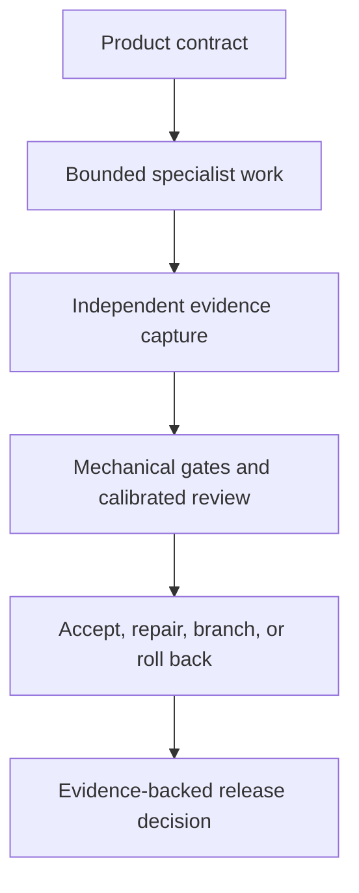

# Three.js Evidence Graph

Evidence-driven multi-agent production for source-generated Three.js vertical slices, with *The Hollow Meridian* as an applied RPG specification.

[English](README.md) | [简体中文](README.zh-CN.md) | [日本語](README.ja.md) | [한국어](README.ko.md)


> **Publication status**
>
> This repository contains two design specifications and production prompts. It does not contain a playable game, a completed reference implementation, benchmark results, or a full evidence run. Performance charts and budgets in the publications are targets unless explicitly identified as measured data.

## The publication set

| Publication | Role | Edition | Download |
|---|---|---:|---|
| **Three.js Evidence Graph** | General operational method for governing, testing, repairing, and releasing an agent-built browser vertical slice | v2.0, 64 pages | [Read the PDF](publications/threejs-evidence-graph-operational-manual-v2.0-en.pdf) |
| **The Hollow Meridian** | Game-specific product contract and multi-agent production prompt for a procedural third-person action RPG | v1.0, 81 pages | [Read the PDF](publications/the-hollow-meridian-rpg-full-prompt-v1.0-en.pdf) |


The first document defines how production decisions become evidence-backed transitions. The second defines what one ambitious RPG slice should contain. They share the same evidence-graph lineage, but they are not fully version-aligned. *The Hollow Meridian* incorporates many core ideas from the framework and predates several v2 safeguards.

## Why this work exists

Large game-generation prompts often combine product direction, architecture, implementation, quality judgment, repair, and release authority inside one conversation. That produces a familiar failure mode: a system can write a large amount of code and then describe its own work as successful without producing independent proof.

This publication proposes a different control model:



The prompt is an interface to the control plane. It is not the control plane itself. Repository state, typed task packets, deterministic checks, evidence manifests, budgets, and release predicates carry the authority that a conversation cannot safely hold.

## Three.js Evidence Graph at a glance


*Three.js Evidence Graph v2.0* describes a repository-local production system for a narrow browser-game vertical slice. Its core contributions are:

1. **A canonical production graph.** Work advances through typed nodes and explicit transition predicates, not through optimistic status messages.
2. **Repository authority.** Product, art, architecture, and quality contracts outrank conversation memory and individual agent judgment.
3. **Bounded delegation.** Every specialist receives one objective, permitted and forbidden files, invariants, acceptance commands, evidence requirements, retries, and a resource budget.
4. **Separated authority.** Builders implement. Read-only critics evaluate captured artifacts. A provenance auditor can block release. A named human director can change the constitution but cannot waive a failed gate.
5. **Two evidence regimes.** Simulation state and other controlled data may use bit-exact comparison. GPU-rasterized output and cross-profile visual evidence use declared tolerances.
6. **Renderer selection by proof.** WebGPU/TSL and WebGL 2 are treated as candidates to test against representative materials, effects, devices, browsers, and traces.
7. **Procedural generation as compilation.** A generator needs a grammar, bounded parameters, seeds, rejection tests, collision and LOD policy, provenance, and diagnostic output. Randomness does not replace composition.
8. **Supply-chain-aware provenance.** The asset policy examines source files, dependencies, built bundles, fonts, opaque blobs, encoded media, runtime requests, and generated outputs.
9. **Calibrated evaluation.** Critics must detect known defects, survive presentation-order reversal, cite evidence, and report observable failures rather than generic taste.
10. **Root-cause repair.** Every repair records the defect, evidence, hypothesis, intervention, expected change, protected metrics, acceptance test, cost, and rollback condition.
11. **Performance distributions.** The method evaluates frame-time percentiles, long frames, CPU and GPU cost, memory growth, compilation stalls, and renderer statistics rather than relying on average FPS.
12. **Compute economics.** Mechanical checks use no model. Model calls are routed by task value and recorded in a run-level cost ledger.

The manual includes a v1-to-v2 defect ledger, a 15-node control graph, a four-part orchestrator prompt, and draft-07 schemas for task packets, defect records, and run manifests.

## The Hollow Meridian at a glance


*Concept artwork for the publication. Not a gameplay capture or implementation evidence.*

*The Hollow Meridian v1.0* is an 81-page product contract and orchestration prompt for a desktop-browser, third-person dark-fantasy action RPG built in Three.js without downloaded final art, audio, models, textures, fonts, or asset packs.

> [Read the expanded English game guide](docs/THE_HOLLOW_MERIDIAN_GUIDE.md) for the world premise, ten-beat route, combat model, enemies, boss phases, relic and save systems, procedural-media rules, accessibility targets, evidence surface, and practical use sequence.
>
> Game guide languages: [English](docs/THE_HOLLOW_MERIDIAN_GUIDE.md) | [简体中文](docs/THE_HOLLOW_MERIDIAN_GUIDE.zh-CN.md) | [日本語](docs/THE_HOLLOW_MERIDIAN_GUIDE.ja.md) | [한국어](docs/THE_HOLLOW_MERIDIAN_GUIDE.ko.md)

The player is the Cartographer, a faceless adult warden exploring a ruined observatory that stores the true names of vanished cities. The intended first playthrough is 10 to 14 minutes and includes:

- one safe hub and one authored route;
- five principal spaces;
- one quest giver and one three-ring spatial puzzle;
- three enemy archetypes;
- one three-choice relic decision;
- one two-phase boss, *The Bell Without a Name*;
- two ending outcomes;
- local checkpoint, save, death, recovery, victory, and return-to-hub loops.

The specification deliberately excludes open-world expansion, crafting, shops, random loot, companions, multiplayer, and character creation. Its purpose is to resolve one compact experience instead of hiding weak interaction beneath feature volume.

Its production prompt defines specialist roles for architecture, gameplay and combat, procedural world construction, enemy and boss behavior, RPG and UI systems, audio and effects, integration, QA and performance, visual criticism, and provenance audit. It also defines fixed-tick simulation, replay capture, state hashes, stable diagnostic URLs, evidence folders, bounded repair tasks, isolated candidates, rollback, and final release gates.

### What the player does

The route begins in the Ash Court, where movement, interaction, the Mnemonic Keeper, and a resting checkpoint establish the world. The player accepts a two-seal quest, crosses the Orrery Bridge combat tutorial, explores the Archive Nave, solves a deterministic three-ring alignment puzzle, defeats the Bell Sentinel in the Foundry, selects one combat-changing relic, opens the Meridian Chamber, confronts *The Bell Without a Name*, chooses to bind or release the stolen names, and returns to the hub with the consequence saved.

Moment to moment, the player reads architecture and light, manages spacing and stamina, commits to attacks or defense, earns Resonance through effective timing, resolves one authored obstacle, and preserves meaningful state at checkpoints. Procedural systems construct bounded geometry and media, but they do not choose the dramatic route, encounter order, focal hierarchy, or narrative purpose.

## How the two editions relate

*The Hollow Meridian* is best understood as a core-aligned reference specification from the Evidence Graph lineage, not as a certified implementation of every v2 rule.

| Area | Evidence Graph v2.0 | Hollow Meridian v1.0 |
|---|---|---|
| Product scope | Recommends a very narrow 45 to 90 second baseline slice | Specifies an ambitious 10 to 14 minute RPG route |
| Evidence regimes | Explicit bit-exact and tolerance-based regimes | Deterministic evidence exists, but the two regimes are not fully integrated |
| Critic controls | Calibration, both-order review, and drift rechecks | Independent critics are present; calibration is not fully specified |
| Compute economics | Model tiers and mandatory cost ledger | Not yet integrated |
| Human authority | Named director with bounded amendment power | Not yet integrated |
| Cross-engine determinism | Requires a controlled deterministic math kernel for exact claims | Not yet fully specified |
| Audio evidence | Offline render, loudness, true-peak, dropout, and voice-budget gates | Procedural audio is specified; equivalent measurement gates need an update |
| Accessibility | Evidence-backed release gate | Substantial accessibility requirements are included |
| Provenance | Source, dependency, bundle, network, and output auditing | Strong source-generated media and provenance rules are included |

This distinction matters. A future revision can bring the RPG specification into full alignment without pretending that compatibility already exists.

## What “AAA-grade” means here

The phrase is used as an internal release contract for a deliberately narrow slice. It refers to resolved presentation, game feel, coherence, performance, accessibility, provenance, and evidence. It does not claim the content volume, budget, team scale, market status, or completed quality of a commercial AAA title.

No document in this repository proves that the target has been achieved. Such a claim would require a runnable implementation, declared device profiles, complete evidence manifests, calibrated evaluation, reproducible resources, clean regression cycles, and a release candidate tied to one accepted commit.

## Technical baseline and boundaries

- The publications were authored against a **Three.js r185 baseline**.
- WebGPU/TSL and WebGL 2 are evaluated through a renderer decision gate.
- “No downloaded assets” applies to final visible and audible media. Pinned development dependencies, browser APIs, build tools, test tools, and profilers remain permitted and must be audited.
- Bit-exact claims are reserved for controlled data classes. Browser and GPU output can vary across operating systems, drivers, hardware, browsers, and settings.
- Accessibility requirements in the documents are engineering targets. They do not establish formal WCAG conformance.
- Provenance controls improve traceability. They are not a proof of copyright originality or software security.
- Host agents need repository access, shell execution, browser automation, capture infrastructure, isolated branches or worktrees, and structured task dispatch. A basic chat interface is not enough.

## Recommended reading paths

### Technical directors and researchers

1. Read the Evidence Graph defect ledger and document-status page.
2. Review the control graph, authority hierarchy, evidence regimes, critic calibration, operations, and normative schemas.
3. Read the compatibility table above before treating *The Hollow Meridian* as an applied example.

### Game and technical-art teams

1. Read *The Hollow Meridian* game contract, route, experience pillars, and anti-slop rules.
2. Continue through game systems, procedural-media policy, and QA gates.
3. Use the specialist cards only after repository authority documents and acceptance commands exist.

### Agent-system builders

1. Begin with the Evidence Graph orchestrator prompt and schemas.
2. Implement validation and state transitions before model routing.
3. Add one real end-to-end run with captured artifacts, a repaired defect, a rollback, frame-time distributions, cost accounting, and an accepted commit.

## Repository map

```text
.
├── .gitattributes
├── AUTHORS.md
├── LICENSE
├── README.md
├── README.zh-CN.md
├── README.ja.md
├── README.ko.md
├── assets/
│   ├── publication-set.jpg
│   ├── readme-hero.jpg
│   ├── readme-hero.prompt.md
│   ├── section-heroes.prompt.md
│   ├── evidence-graph-control-hero.jpg
│   ├── hollow-meridian-world-hero.jpg
│   ├── hollow-meridian-boss-hero.jpg
│   ├── threejs-evidence-graph-cover.jpg
│   └── the-hollow-meridian-cover.jpg
├── publications/
│   ├── threejs-evidence-graph-operational-manual-v2.0-en.pdf
│   └── the-hollow-meridian-rpg-full-prompt-v1.0-en.pdf
├── docs/
│   ├── GLOSSARY.md
│   ├── PUBLICATION_STATUS.md
│   ├── THE_HOLLOW_MERIDIAN_GUIDE.md
│   ├── THE_HOLLOW_MERIDIAN_GUIDE.zh-CN.md
│   ├── THE_HOLLOW_MERIDIAN_GUIDE.ja.md
│   ├── THE_HOLLOW_MERIDIAN_GUIDE.ko.md
│   └── TRANSLATION_POLICY.md
├── CHANGELOG.md
├── CITATION.cff
├── CITATIONS.md
├── CONTRIBUTING.md
├── RELEASE_NOTES.md
├── release-manifest.json
└── SHA256SUMS.txt
```

## Current roadmap

The most valuable next release is not a larger prompt. It is an executable companion surface that makes the existing contracts testable:

- canonical machine-readable schemas;
- graph state and transition predicates;
- task-packet and defect validators;
- renderer proof harness;
- deterministic replay and state hashing;
- asset and provenance scanners;
- Playwright capture profiles;
- critic calibration fixtures;
- run manifest and cost ledger;
- one complete `run-0001` evidence package;
- one accepted repair, one rejected candidate, and one verified rollback.

Until that exists, this repository claims design and specification value, not empirical production results.

## Translation policy

English is the normative edition. Simplified Chinese, Japanese, and Korean versions are provided for both the repository guide and the expanded *The Hollow Meridian* companion guide. Publication titles, game proper nouns, filenames, commands, schema keys, graph-node identifiers, paths, enum values, and code identifiers remain in canonical English.

These companion guides explain the game and production system in more detail, but they are not translations of the complete 145 PDF pages. If a translation and the English edition differ, use the English edition for technical interpretation and report the discrepancy through an issue. See the [Translation Policy](docs/TRANSLATION_POLICY.md) and [Multilingual Technical Glossary](docs/GLOSSARY.md).

## Integrity

The SHA-256 values in [SHA256SUMS.txt](SHA256SUMS.txt) identify the exact PDF files in this release.

## Contributing

Focused contributions are welcome for:

- factual or editorial defects with page references;
- broken source links;
- translation corrections;
- terminology improvements;
- accessibility improvements;
- reproducible implementation reports;
- machine-readable contracts that preserve the published authority model.

Read [CONTRIBUTING.md](CONTRIBUTING.md) before opening an issue or pull request.

## Citation

Use the metadata in [CITATION.cff](CITATION.cff). A concise citation is:

> Emily Paradox. *Three.js Evidence Graph v2.0 and The Hollow Meridian RPG Full Prompt v1.0*. Technical Systems and Game Systems Series, July 2026.

## License

This repository is released under the [MIT License](LICENSE).

Copyright (c) 2026 Iamemily2050 (@iamemily2050).

Unless a file states otherwise, the license covers the repository documentation, PDFs, and original concept artwork. Copies or substantial portions must retain the copyright and permission notices. Citation is requested for academic, editorial, and technical discussion, but it is not an additional license condition.

## Author and rights holder

- **Publication byline:** Emily Paradox
- **Creator and copyright holder:** Iamemily2050 (@iamemily2050)
- **Role:** AI Digital Artist
- **GitHub:** [Emily2040](https://github.com/Emily2040)
- **Website:** [iamemily2050.com](https://iamemily2050.com)
- **X:** [@iamemily2050](https://x.com/iamemily2050)
- **Instagram:** [@iamemily2050](https://instagram.com/iamemily2050)

See [AUTHORS.md](AUTHORS.md) for the identity distinction, contact address, and attribution guidance.
