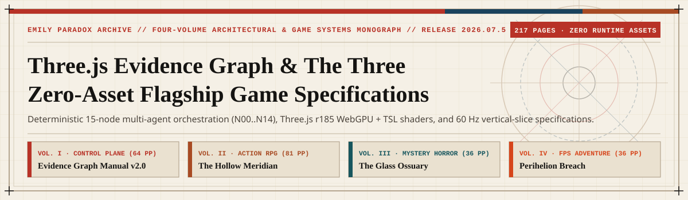
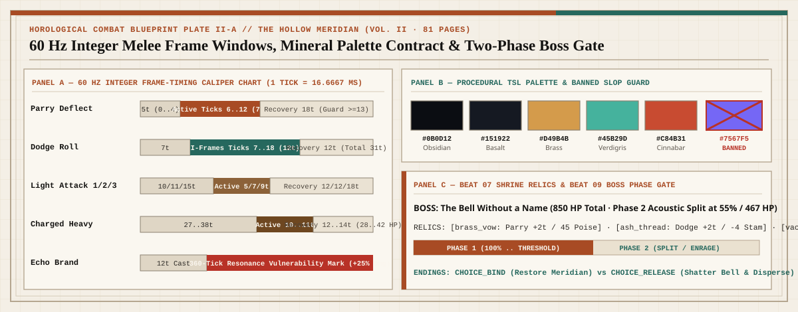

# Three.js Evidence Graph & The Three Zero-Asset Flagship Volumes



| **MONOGRAPH EDITIONS** | [**English (Original Folio)**](README.md) | [**简体中文 (典藏设定集版)**](README.zh-CN.md) | [**日本語 (公式設定資料集・解体新書版)**](README.ja.md) | [**한국어 (공식 아트북 & 마스터북판)**](README.ko.md) |
| :--- | :---: | :---: | :---: | :---: |
| **ARCHIVE COLOPHON** | `Release 2026.07.5` | `4 Volumes · 217 Pages` | `Three.js r185 (0.185.0) WebGPU + TSL` | `Zero External Binary Assets · MIT License` |


*Plate 00: Architectural triptych across the three procedural worlds governed by the Evidence Graph control plane. Left: the basalt cathedrals, brass meridian rings, and Unnamed Bell of **The Hollow Meridian** (Volume II). Center: the 1894 storm-lashed Fresnel lighthouse and bone-glass crypt of **The Glass Ossuary** (Volume III). Right: the 0.09 AU sun-grazing heliostat array and solar corona of **Perihelion Breach** (Volume IV).*

---

## Curatorial Statement & Folio Architecture

Single-prompt browser game generation collapses as soon as the same model context invents scope, writes shaders, tunes frame windows, and grades its own output. This four-volume, `217`-page engineering monograph by **Emily Paradox (`@iamemily2050`)** replaces self-certified chat loops with an evidence-gated multi-agent production system for **Three.js `r185` (`0.185.0`)**.

Every mesh, `TSL` (`Three.js Shading Language`) material node, skeletal rig, acoustic impulse response, and 60 Hz combat or forensic frame table in this suite is compiled deterministically from source code with **zero downloaded runtime assets** (`external_network_requests = 0`, `downloaded_assets_count = 0`).


### The Four Collector's Monograph Volumes (`publications/`)

| **VOLUME I · 64 PAGES** | **VOLUME II · 81 PAGES** | **VOLUME III · 36 PAGES** | **VOLUME IV · 36 PAGES** |
| :---: | :---: | :---: | :---: |
| [](publications/threejs-evidence-graph-operational-manual-v2.0-en.pdf) | [](publications/the-hollow-meridian-rpg-full-prompt-v1.0-en.pdf) | [](publications/the-glass-ossuary-mystery-horror-full-prompt-v1.0-en.pdf) | [](publications/perihelion-breach-fps-adventure-full-prompt-v1.0-en.pdf) |
| [**Operational Manual v2.0**](publications/threejs-evidence-graph-operational-manual-v2.0-en.pdf)<br/>`Control Plane & Determinism` | [***The Hollow Meridian***](publications/the-hollow-meridian-rpg-full-prompt-v1.0-en.pdf)<br/>`Game 01 · Third-Person Action RPG` | [***The Glass Ossuary***](publications/the-glass-ossuary-mystery-horror-full-prompt-v1.0-en.pdf)<br/>`Game 02 · Mystery Horror Inquest` | [***Perihelion Breach***](publications/perihelion-breach-fps-adventure-full-prompt-v1.0-en.pdf)<br/>`Game 03 · 0.09 AU FPS Adventure` |
| `sha256: d3830d411a61c52c`<br/>`416,827 bytes` | `sha256: c4f8fe83995d526b`<br/>`357,144 bytes` | `sha256: efead090be003782`<br/>`98,649 bytes` | `sha256: 75bdfff21c905122`<br/>`95,265 bytes` |
| **Native Guides**:<br/>[EN](docs/EVIDENCE_GRAPH_GUIDE.md) · [中文](docs/EVIDENCE_GRAPH_GUIDE.zh-CN.md) · [日本語](docs/EVIDENCE_GRAPH_GUIDE.ja.md) · [한국어](docs/EVIDENCE_GRAPH_GUIDE.ko.md) | **Native Guides**:<br/>[EN](docs/THE_HOLLOW_MERIDIAN_GUIDE.md) · [中文](docs/THE_HOLLOW_MERIDIAN_GUIDE.zh-CN.md) · [日本語](docs/THE_HOLLOW_MERIDIAN_GUIDE.ja.md) · [한국어](docs/THE_HOLLOW_MERIDIAN_GUIDE.ko.md) | **Native Guides**:<br/>[EN](docs/THE_GLASS_OSSUARY_GUIDE.md) · [中文](docs/THE_GLASS_OSSUARY_GUIDE.zh-CN.md) · [日本語](docs/THE_GLASS_OSSUARY_GUIDE.ja.md) · [한국어](docs/THE_GLASS_OSSUARY_GUIDE.ko.md) | **Native Guides**:<br/>[EN](docs/PERIHELION_BREACH_GUIDE.md) · [中文](docs/PERIHELION_BREACH_GUIDE.zh-CN.md) · [日本語](docs/PERIHELION_BREACH_GUIDE.ja.md) · [한국어](docs/PERIHELION_BREACH_GUIDE.ko.md) |
| **Contracts & Prompts**:<br/>[`prompts/evidence-graph/`](prompts/evidence-graph/) · [`schemas/`](schemas/) | **Prompts & Golden Run**:<br/>[`prompts/hollow-meridian/`](prompts/hollow-meridian/) · [`run-0001`](examples/run-0001/) | **Prompts & Golden Run**:<br/>[`prompts/glass-ossuary/`](prompts/glass-ossuary/) · [`run-0002`](examples/run-0002/) | **Prompts & Golden Run**:<br/>[`prompts/perihelion-breach/`](prompts/perihelion-breach/) · [`run-0003`](examples/run-0003/) |

---

## Volume I · The Deterministic Control Plane (*Three.js Evidence Graph v2.0* · 64 Pages)

| Plate I-A: Horological Verification & Optical Control Atelier | Plate I-B: Zero-Asset Procedural Geometry & TSL Compilation Studio |
| :---: | :---: |
|  |  |


Volume I defines the engineering constitution shared by all three games:

1. **15-Node Directed Cyclic Control Plane (`N00_BRIEF` .. `N14_RELEASE_CANDIDATE`)**: Governed by [`schemas/graph-state.d.ts`](schemas/graph-state.d.ts). The orchestrator cannot advance a node without a schema-valid [`TaskPacket`](schemas/task-packet.schema.json) and passing CLI verification gates. Failed gates trigger bounded rollback (`N13_REPAIR_ROUTER -> N05..N08`, maximum `3` cycles per node, `8` global rollbacks).
2. **Seven File-Ownership-Isolated Specialist Roles**: Each game vertical slice is built by 7 isolated worker agents (`combat_gameplay`, `world_quest`, `procedural_art_vfx`, `procedural_audio`, `ui_hud_accessibility`, `qa_perf_playwright`, and read-only `independent_critic`). No worker may write outside its `allowed_paths` or weaken verification thresholds.
3. **Dual Determinism Regimes (`A-PinnedBrowser` & `B-CrossPlatform`)**:
   - **Regime A (`A-PinnedBrowser`)**: Bit-exact SHA-256 verification inside a pinned Chromium + GPU/SwiftShader container for 60 Hz integer simulation ticks (`state_hash`), 16-bit PCM quantized `OfflineAudioContext` renders (`audio_hash`), and `1e-5` quantized vertex buffers (`geometry_hash`).
   - **Regime B (`B-CrossPlatform`)**: Perceptual and invariant tolerance gates across `THREE.WebGPURenderer` and `{ forceWebGL: true }` fallback (`P50 <= 8.3 ms`, `P95 <= 16.6 ms`, `P99 <= 22.0 ms`, `-16 LUFS +- 1.0 LU`, `<= -1.0 dBTP`).
4. **Anti-Slop & Zero-Asset Provenance Gate (`provenance_critic`)**: Forbids external `.glb/.gltf/.fbx/.obj/.png/.jpg/.wav/.mp3/.ogg` fetches and bans generic AI purple (`#7567F5`) across all shaders and UI layers.

---

## Volume II · Game 01: *The Hollow Meridian* (Third-Person Dark-Fantasy Action RPG · 81 Pages)

| Plate II-1: The Sunken Astrolabe Causeway & Orrery Bridge | Plate II-2: The Bell Foundry & Shrine of Three Relics | Plate II-3: The Meridian Chamber & The Unnamed Bell |
| :---: | :---: | :---: |
|  |  |  |



Set inside a ruined volcanic-basalt and tarnished-brass observatory built to preserve the true names of vanished cities, *The Hollow Meridian* casts the player as **The Cartographer (`Sable Veren`)**. Over a 10 to 14 minute vertical slice, players traverse five interconnected spaces (`Ash Court` -> `Orrery Bridge` -> `Archive Nave` -> `Bell Foundry` -> `Meridian Chamber`), solve the three-ring `Meridian Alignment` puzzle, bind one of three Shrine Relics, and confront **The Bell Without a Name** (`850 HP`, Phase 2 acoustic split at `55%` / `467 HP`).

| 60 Hz Action (`seed=1337`) | Startup | Active / Deflect / I-Frames | Recovery | Total | Stamina / Resonance & Mechanical Consequence |
| :--- | :--- | :--- | :--- | :--- | :--- |
| `Light Attack 1 / 2 / 3` | `10 / 11 / 15t` | `5 / 7 / 9 ticks` | `12 / 12 / 18t` | `27 / 30 / 42t` | `10 / 11 / 14 Stamina`; `16 / 18 / 25 HP` damage |
| `Charged Heavy` | `27..38 ticks` | `10..11 ticks` | `12..14 ticks` | `49..63 ticks` | `28 Stamina`; `28..42 HP` + high poise break |
| `Dodge Roll` | `7 ticks` | `Ticks 7..18` (`12t` i-frames) | `12 ticks` | `31 ticks` | `22 Stamina` (`18` with `ash_thread`); zero-damage invulnerability window |
| `Parry Deflect` | `5 ticks` (`0..4`) | `Ticks 6..12` (`7t` deflect) | `18 ticks` | `31 ticks` | `12 Stamina`; transitions to `Guard` at `tick >= 13` if held |
| `Echo Brand` | `12 ticks` | `360-tick` vulnerability mark | `0 ticks` | `12 ticks` | `50 Resonance` (`60` with `vacant_name`, `540-tick` mark); `+25%` damage taken |

- **Normative PDF (`81 pp`)**: [`publications/the-hollow-meridian-rpg-full-prompt-v1.0-en.pdf`](publications/the-hollow-meridian-rpg-full-prompt-v1.0-en.pdf)
- **Native Monograph Guides**: [English](docs/THE_HOLLOW_MERIDIAN_GUIDE.md) · [简体中文](docs/THE_HOLLOW_MERIDIAN_GUIDE.zh-CN.md) · [日本語](docs/THE_HOLLOW_MERIDIAN_GUIDE.ja.md) · [한국어](docs/THE_HOLLOW_MERIDIAN_GUIDE.ko.md)
- **Agent Cards & Golden Fixtures**: [`prompts/hollow-meridian/`](prompts/hollow-meridian/) (`orchestrator.md` + 7 specialist cards) · [`examples/run-0001/`](examples/run-0001/)

---

## Volume III · Game 02: *The Glass Ossuary* (First-Person Investigative Mystery Horror · 36 Pages)

| Plate III-1: Saint-Vane Reef & The Refraction Gallery | Plate III-2: The Caretaker's Forensic Stripping Workbench | Plate III-3: The Choir in the Glass Apparition Encounter |
| :---: | :---: | :---: |
|  |  |  |


Set in October 1894 on the storm-lashed tidal rock of **Saint-Vane Reef**, *The Glass Ossuary* places acoustic archivist **Clara Vane** inside a coastal lighthouse fused with a subterranean bone-glass reliquary. Refusing combat weapons and cheap jump scares, the 12 to 16 minute investigation relies on three diegetic 19th-century forensic instruments (`Split-Diopter Brass Loupe`, `Wax-Cylinder Phonograph`, and `Silver-Salt Ferrotype Plate`), a 6-node `Inquest Board`, and strict acoustic/optical stealth against **The Choir in the Glass** (`600 Resonance Integrity`, Phase 2 split at `300 Integrity`).

| 60 Hz Forensic Action (`seed=1894`) | Startup | Active Window | Recovery | Total | Resource Cost & Forensic / Stealth Consequence |
| :--- | :--- | :--- | :--- | :--- | :--- |
| `Lantern Shutter` | `6 ticks` | Toggle (`tick 7..`) | `6 ticks` | `12 ticks` | `0 Oil`; cuts optical cone and breaks `Glass Septum Watcher` sightline |
| `Brass Loupe Focus` | `9 ticks` | Hold (`ticks 10..69`) | `6 ticks` | `75 ticks` | `0 Oil`; decodes Fresnel ring angles (`45/135/270 deg`) & bone-glass seams |
| `Phonograph Cancel` | `24 ticks` | `Ticks 25..114` (`90t`) | `36 ticks` | `150 ticks` | Emits anti-phase waveform; masks footsteps from `Mire Listener` |
| `Ferrotype UV Flash` | `18 ticks` | `Ticks 19..24` (`6t`) | `66 ticks` | `90 ticks` | Stuns apparitions for `102 ticks` (`132 ticks` with `lens_sabotage`) within `6.5 m` |
| `Crouch Sidestep` | `5 ticks` | `Ticks 6..16` (`11t`) | `12 ticks` | `28 ticks` | Caps wet-stone footstep acoustic peak at `<= -38 dBFS` |
| `Smelling Salts` | `15 ticks` | `Ticks 16..45` (`30t`) | `10 ticks` | `55 ticks` | Restores `+40 Composure` and purges `-25 Exposure` |

- **Normative PDF (`36 pp`)**: [`publications/the-glass-ossuary-mystery-horror-full-prompt-v1.0-en.pdf`](publications/the-glass-ossuary-mystery-horror-full-prompt-v1.0-en.pdf)
- **Native Monograph Guides**: [English](docs/THE_GLASS_OSSUARY_GUIDE.md) · [简体中文](docs/THE_GLASS_OSSUARY_GUIDE.zh-CN.md) · [日本語](docs/THE_GLASS_OSSUARY_GUIDE.ja.md) · [한국어](docs/THE_GLASS_OSSUARY_GUIDE.ko.md)
- **Agent Cards & Golden Fixtures**: [`prompts/glass-ossuary/`](prompts/glass-ossuary/) (`orchestrator.md` + 7 specialist cards) · [`examples/run-0002/`](examples/run-0002/)

---

## Volume IV · Game 03: *Perihelion Breach* (First-Person Sci-Fi Shooter Adventure · 36 Pages)

| Plate IV-1: The 0.09 AU Icarus-9 Heliostat Spine | Plate IV-2: Cryo-Coolant Manifold & Thermal Vent Gunplay | Plate IV-3: The Heliarch Warden Aerial Arena |
| :---: | :---: | :---: |
|  |  |  |


Set aboard the sun-grazing **Icarus-9 Orbital Solar Relay** at `0.09 AU`, *Perihelion Breach* drops vanguard specialist **Soren Kestrel** into a 12 to 15 minute high-velocity FPS adventure after the station's autonomous defense grid locks the heliostat array into a thermal runaway cascade. Players chain `18.0 m/s` `Magnetic Grapple` slingshots and `11.5 m/s` `Slide-Boost` vectors across `240-tick` (`4.0 s`) solar flare shadow corridors, master active `Thermal Vent Reload` timings (`ticks 14..20`), calibrate one of three Exo-Rig Cores, and dismantle **The Heliarch Warden** (`1,000 Armor Integrity`, Phase 2 at `500 Integrity`).

| 60 Hz Ballistics / Traversal (`seed=2142`) | Startup | Active / Window | Recovery | Total | Heat / Velocity & Mechanical Consequence |
| :--- | :--- | :--- | :--- | :--- | :--- |
| `Carbine 3-Burst` | `2 ticks` | `Ticks 3..11` (`3x`) | `10 ticks` | `21 ticks` | `+12 Heat`; `3 x 14 dmg` hitscan (`1.5x` weak-point multiplier) |
| `Scatter Uncharged` | `3 ticks` | `Tick 4` (`5x12` spread) | `15 ticks` | `18 ticks` | `+18 Heat`; `60 dmg` close-range arc; strips `Aegis Drone` shields |
| `Scatter ADS Rail Slug` | `30..54t` | `Tick 31..55` | `18 ticks` | `48..72 ticks` | `+28 Heat`; `55..85 dmg` piercing slug (`1.75x` weak-point multiplier) |
| `Breach Anchor` | `6 ticks` | Projectile tether | `24 ticks` | `30 ticks` | `+30 Heat`; `60 AoE dmg` slag fracture or conduit phase link |
| `Thermal Vent Reload` | `13 ticks` | `Ticks 14..20` (`7t`) | `16 ticks` | `36 ticks` | Input in `ticks 14..20` purges `100% Heat` + grants `90t` overcharge |
| `Slide-Boost` | `3 ticks` | `Ticks 4..18` (`15t`) | `6 ticks` | `24 ticks` | `11.5 m/s` low-profile slide; jump-cancel window at `ticks 8..18` |
| `Magnetic Grapple` | `6 ticks` | `18..42 ticks` pull | `12 ticks` | `36..60 ticks` | `18.0 m/s` pull to anchor; preserves tangential slingshot momentum |

- **Normative PDF (`36 pp`)**: [`publications/perihelion-breach-fps-adventure-full-prompt-v1.0-en.pdf`](publications/perihelion-breach-fps-adventure-full-prompt-v1.0-en.pdf)
- **Native Monograph Guides**: [English](docs/PERIHELION_BREACH_GUIDE.md) · [简体中文](docs/PERIHELION_BREACH_GUIDE.zh-CN.md) · [日本語](docs/PERIHELION_BREACH_GUIDE.ja.md) · [한국어](docs/PERIHELION_BREACH_GUIDE.ko.md)
- **Agent Cards & Golden Fixtures**: [`prompts/perihelion-breach/`](prompts/perihelion-breach/) (`orchestrator.md` + 7 specialist cards) · [`examples/run-0003/`](examples/run-0003/)

---

## Cross-Volume Comparative Specification Matrix

| Architectural Dimension | Vol. II · *The Hollow Meridian* | Vol. III · *The Glass Ossuary* | Vol. IV · *Perihelion Breach* |
| :--- | :--- | :--- | :--- |
| **Genre & Camera** | Third-Person Dark-Fantasy Action RPG | First-Person Investigative Mystery Horror | First-Person Sci-Fi Shooter Adventure |
| **Target Playtime** | 10 to 14 minutes (`81` pages) | 12 to 16 minutes (`36` pages) | 12 to 15 minutes (`36` pages) |
| **Protagonist** | `Sable Veren` (`The Cartographer`) | `Clara Vane` (`The Acoustic Archivist`) | `Soren Kestrel` (`The Relay Vanguard`) |
| **Core Resources** | `100 Health` · `100 Stamina` · `0-100 Resonance` | `100 Composure` · `100 Lantern Oil` · `0-100 Exposure` | `100 Shield` · `100 Hull Integrity` · `0-100 Core Heat` |
| **Signature 60 Hz Skill Check** | `Parry Deflect` (`ticks 6..12`) vs held `Guard` (`>=13`) | `Lantern Shutter` (`6t`) + `Phonograph Cancel` (`25..114t`) + `Ferrotype Flash` (`19..24t`) | `Thermal Vent Reload` (`ticks 14..20`) + `18.0 m/s` `Magnetic Grapple` + `Slide-Boost` |
| **Five Authored Spaces** | `Ash Court` -> `Orrery Bridge` -> `Archive Nave` -> `Bell Foundry` -> `Meridian Chamber` | `Tidewater Causeway` -> `Caretaker's Stripping Room` -> `Refraction Gallery` -> `Submerged Crypt` -> `The Glass Ossuary` | `Umbilical Airlock` -> `Heliostat Truss` -> `Cryo-Coolant Manifold` -> `Ballistic Foundry` -> `Perihelion Core Chamber` |
| **Beat 05 Spatial Puzzle** | `Meridian Alignment` (3 brass rings -> `North Seal`) | `Prism Triangulation` (`45/135/270 deg` -> `Tide Ledger`) + `110/220/330 Hz` sluices | `Conduit Phase Routing` (3 plasma anchors within `180-tick` decay -> `Coolant Bypass`) |
| **Three Enemy Archetypes** | `Ashbound Skirmisher`, `Lantern Wraith`, `Bell Sentinel` | `Mire Listener` (acoustic), `Glass Septum Watcher` (optical), `Drowned Chorister` (aura) | `Volt Skitter` (wall-runner), `Aegis Drone` (shield sniper), `Slag Enforcer` (mortar heavy) |
| **Beat 07 Build Choice** | **Shrine Relic**: `brass_vow` · `ash_thread` · `vacant_name` | **Inquest Hypothesis**: `lens_sabotage` · `tidal_quarantine` · `acoustic_calling` | **Exo-Rig Core**: `recoil_gyro` · `thermal_siphon` · `grapple_overdrive` |
| **Beat 09 Two-Phase Boss** | **The Bell Without a Name** (`850 HP`, Phase 2 at `467 HP`) | **The Choir in the Glass** (`600 Integrity`, Phase 2 at `300`) | **The Heliarch Warden** (`1,000 Integrity`, Phase 2 at `500`) |
| **Beat 10 Dual Endings** | `CHOICE_BIND` or `CHOICE_RELEASE` | `VERDICT_PUBLISH` or `VERDICT_SUBMERGE` | `DIRECTIVE_DIVERT` or `DIRECTIVE_VENT` |
| **Performance Budget** | `<= 300` draw calls · `<= 500,000` tris | `<= 280` draw calls · `<= 460,000` tris | `<= 300` draw calls · `<= 500,000` tris |
| **Golden Reference Run** | [`examples/run-0001/`](examples/run-0001/) (`seed=1337`) | [`examples/run-0002/`](examples/run-0002/) (`seed=1894`) | [`examples/run-0003/`](examples/run-0003/) (`seed=2142`) |

---

## Native Four-Language Monograph Matrix

Every surface in this archive is written natively for graphics engineers, technical directors, and systems designers in **English**, **Simplified Chinese (`简体中文`)**, **Japanese (`日本語`)**, and **Korean (`한국어`)**, while keeping canonical code identifiers, CLI flags, and JSON Schema keys invariant:

| Monograph Surface | Native English (`en`) | Native Simplified Chinese (`zh-CN`) | Native Japanese (`ja`) | Native Korean (`ko`) |
| :--- | :--- | :--- | :--- | :--- |
| **Archive Front Door & Curatorial Folio** | [`README.md`](README.md) | [`README.zh-CN.md`](README.zh-CN.md) | [`README.ja.md`](README.ja.md) | [`README.ko.md`](README.ko.md) |
| **Vol. I: Evidence Graph v2.0 Manual (64 pp)** | [`EVIDENCE_GRAPH_GUIDE.md`](docs/EVIDENCE_GRAPH_GUIDE.md) | [`EVIDENCE_GRAPH_GUIDE.zh-CN.md`](docs/EVIDENCE_GRAPH_GUIDE.zh-CN.md) | [`EVIDENCE_GRAPH_GUIDE.ja.md`](docs/EVIDENCE_GRAPH_GUIDE.ja.md) | [`EVIDENCE_GRAPH_GUIDE.ko.md`](docs/EVIDENCE_GRAPH_GUIDE.ko.md) |
| **Vol. II: The Hollow Meridian · RPG (81 pp)** | [`THE_HOLLOW_MERIDIAN_GUIDE.md`](docs/THE_HOLLOW_MERIDIAN_GUIDE.md) | [`THE_HOLLOW_MERIDIAN_GUIDE.zh-CN.md`](docs/THE_HOLLOW_MERIDIAN_GUIDE.zh-CN.md) | [`THE_HOLLOW_MERIDIAN_GUIDE.ja.md`](docs/THE_HOLLOW_MERIDIAN_GUIDE.ja.md) | [`THE_HOLLOW_MERIDIAN_GUIDE.ko.md`](docs/THE_HOLLOW_MERIDIAN_GUIDE.ko.md) |
| **Vol. III: The Glass Ossuary · Horror (36 pp)** | [`THE_GLASS_OSSUARY_GUIDE.md`](docs/THE_GLASS_OSSUARY_GUIDE.md) | [`THE_GLASS_OSSUARY_GUIDE.zh-CN.md`](docs/THE_GLASS_OSSUARY_GUIDE.zh-CN.md) | [`THE_GLASS_OSSUARY_GUIDE.ja.md`](docs/THE_GLASS_OSSUARY_GUIDE.ja.md) | [`THE_GLASS_OSSUARY_GUIDE.ko.md`](docs/THE_GLASS_OSSUARY_GUIDE.ko.md) |
| **Vol. IV: Perihelion Breach · FPS (36 pp)** | [`PERIHELION_BREACH_GUIDE.md`](docs/PERIHELION_BREACH_GUIDE.md) | [`PERIHELION_BREACH_GUIDE.zh-CN.md`](docs/PERIHELION_BREACH_GUIDE.zh-CN.md) | [`PERIHELION_BREACH_GUIDE.ja.md`](docs/PERIHELION_BREACH_GUIDE.ja.md) | [`PERIHELION_BREACH_GUIDE.ko.md`](docs/PERIHELION_BREACH_GUIDE.ko.md) |
| **Terminology & Governance** | [`GLOSSARY.md`](docs/GLOSSARY.md) · [`TRANSLATION_POLICY.md`](docs/TRANSLATION_POLICY.md) | [`GLOSSARY.md`](docs/GLOSSARY.md) | [`GLOSSARY.md`](docs/GLOSSARY.md) | [`GLOSSARY.md`](docs/GLOSSARY.md) |

---

## Archive Directory & Verification Protocol

```text
threejs-evidence-graph/
├── publications/                                                     # 4 Normative English PDFs (217 pages total)
│   ├── threejs-evidence-graph-operational-manual-v2.0-en.pdf         # Vol. I  (64 pp) · Control Plane & Determinism Manual
│   ├── the-hollow-meridian-rpg-full-prompt-v1.0-en.pdf               # Vol. II (81 pp) · Game 01: Third-Person Action RPG
│   ├── the-glass-ossuary-mystery-horror-full-prompt-v1.0-en.pdf      # Vol. III(36 pp) · Game 02: First-Person Mystery Horror
│   └── perihelion-breach-fps-adventure-full-prompt-v1.0-en.pdf       # Vol. IV (36 pp) · Game 03: First-Person Shooter Adventure
├── schemas/                                                          # Normative Draft 2020-12 JSON Schemas & TypeScript State
│   ├── task-packet.schema.json
│   ├── defect-record.schema.json
│   ├── run-manifest.schema.json
│   └── graph-state.d.ts
├── orchestration/                                                    # Drop-in mirror for agent runtime working directories
│   ├── *.schema.json & graph-state.d.ts
│   └── prompts/{orchestrator,hollow-meridian-orchestrator,glass-ossuary-orchestrator,perihelion-breach-orchestrator}.md
├── prompts/                                                          # Copy-pasteable Orchestrator + 21 Specialist Agent Cards
│   ├── evidence-graph/orchestrator.md
│   ├── hollow-meridian/{orchestrator.md, agents/*.md}              # 7 specialist cards for Vol. II
│   ├── glass-ossuary/{orchestrator.md, agents/*.md}                # 7 specialist cards for Vol. III
│   └── perihelion-breach/{orchestrator.md, agents/*.md}            # 7 specialist cards for Vol. IV
├── examples/                                                         # Schema-validated Golden Reference Fixtures
│   ├── run-0001/{task-packet,defect-record,run-manifest}.json      # Vol. II fixtures  (seed=1337, 3 Shrine Relic branches)
│   ├── run-0002/{task-packet,defect-record,run-manifest}.json      # Vol. III fixtures (seed=1894, 3 Inquest Hypotheses)
│   └── run-0003/{task-packet,defect-record,run-manifest}.json      # Vol. IV fixtures  (seed=2142, 3 Exo-Rig Core branches)
├── docs/                                                             # 16 Native Monograph Guides + Errata + Governance
│   ├── EVIDENCE_GRAPH_GUIDE.{md,zh-CN.md,ja.md,ko.md}
│   ├── THE_HOLLOW_MERIDIAN_GUIDE.{md,zh-CN.md,ja.md,ko.md}
│   ├── THE_GLASS_OSSUARY_GUIDE.{md,zh-CN.md,ja.md,ko.md}
│   ├── PERIHELION_BREACH_GUIDE.{md,zh-CN.md,ja.md,ko.md}
│   ├── TECHNICAL_ERRATA_AND_V2_ALIGNMENT.md
│   ├── GLOSSARY.md, TRANSLATION_POLICY.md, PUBLICATION_STATUS.md
│   └── ARTWORK_PROVENANCE.md
├── assets/                                                           # 17 Zero-EXIF Monograph JPEGs + 21 Blueprint SVGs
│   ├── svg/{masthead-*,architecture-pipeline*,game-01..03-telemetry-*}.svg
│   └── *.jpg
├── scripts/verify_release.py                                         # Automated SHA-256, Schema, PDF, EXIF & Link Verifier
├── SHA256SUMS.txt                                                    # Bit-exact SHA-256 checksums (LF line endings)
└── release-manifest.json                                             # Machine-readable archive inventory
```

### Run the Automated Release Verifier

```bash
# 1. Verify all SHA-256 digests in SHA256SUMS.txt
sha256sum -c SHA256SUMS.txt

# 2. Execute the full verification suite (4 PDFs / 217 pages, 9 golden fixtures, 17 zero-EXIF JPEGs, 21 SVGs, and 4-language links)
python scripts/verify_release.py
```

### Governance, Provenance & Citation

- **Technical Errata & Cross-Volume Alignment**: [`docs/TECHNICAL_ERRATA_AND_V2_ALIGNMENT.md`](docs/TECHNICAL_ERRATA_AND_V2_ALIGNMENT.md)
- **Publication Status & Epistemic Boundaries**: [`docs/PUBLICATION_STATUS.md`](docs/PUBLICATION_STATUS.md)
- **Artwork Provenance & Zero-EXIF Policy**: [`docs/ARTWORK_PROVENANCE.md`](docs/ARTWORK_PROVENANCE.md)
- **Academic Citation**: [`CITATION.cff`](CITATION.cff) · [`CITATIONS.md`](CITATIONS.md)
- **License**: [MIT License](LICENSE) · Copyright (c) 2026 Emily Paradox (`@iamemily2050`)
