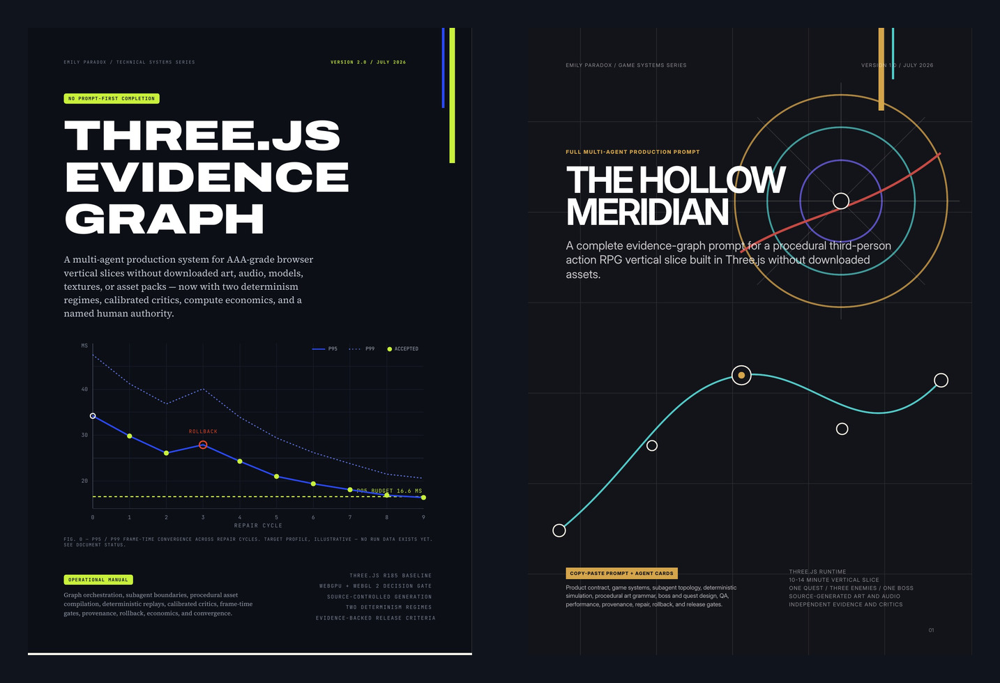
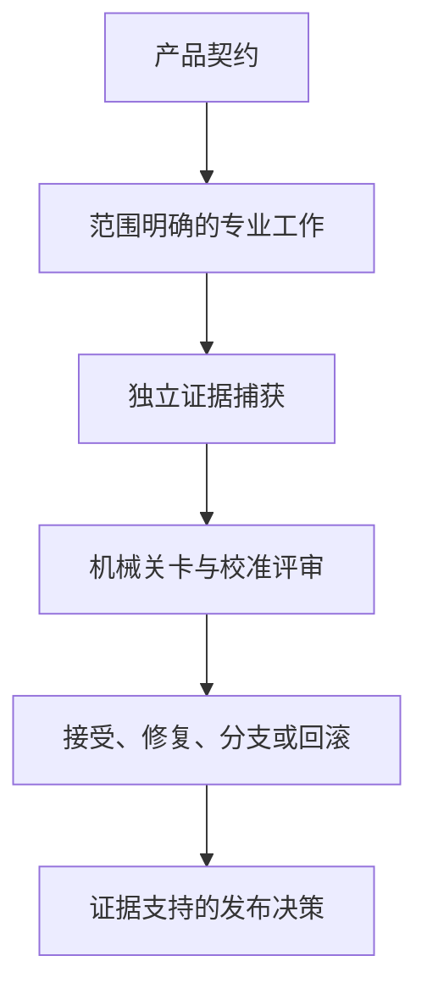

# Three.js Evidence Graph
<!-- source_version: 2026.07.1; translation_status: unreviewed; language: zh-CN -->

面向源码生成型 Three.js 垂直切片、由证据驱动的多智能体生产体系，并以 *The Hollow Meridian* 作为 RPG 应用规范。

[English](README.md) | [简体中文](README.zh-CN.md) | [日本語](README.ja.md) | [한국어](README.ko.md)


> **发布状态**
>
> 本仓库包含两份设计规范与生产提示词。仓库中不包含可游玩的游戏、已完成的参考实现、基准测试结果或完整的证据运行记录。除非出版物明确标注为实测数据，其中的性能图表与预算均为目标值。

## 出版物套装

| 出版物 | 定位 | 版本 | 下载 |
|---|---|---:|---|
| **Three.js Evidence Graph** | 用于治理、测试、修复并发布由智能体构建的浏览器垂直切片的通用操作方法 | v2.0，64 页 | [阅读 PDF](publications/threejs-evidence-graph-operational-manual-v2.0-en.pdf) |
| **The Hollow Meridian** | 面向程序化第三人称动作 RPG、针对特定游戏的产品契约与多智能体生产提示词 | v1.0，81 页 | [阅读 PDF](publications/the-hollow-meridian-rpg-full-prompt-v1.0-en.pdf) |



第一份文档定义生产决策如何转化为有证据支持的状态转移。第二份文档定义一个高目标 RPG 切片应包含的内容。两者源自同一条 Evidence Graph 方法谱系，但版本尚未完全对齐。*The Hollow Meridian* 在设计规范中纳入了该框架的许多核心理念，但其成文早于若干 v2 防护机制。

## 本项目为何存在

大型游戏生成提示词往往将产品方向、架构、实现、质量判断、修复与发布权限集中在一次对话中。这会造成一种常见的失败模式：系统可以编写大量代码，随后在没有提供独立证明的情况下，自行宣称工作已经成功。

本出版物提出一种不同的控制模型：



提示词是控制平面的接口，而非控制平面本身。仓库状态、类型化任务包、确定性检查、证据清单、预算与发布谓词，共同承载对话本身无法安全持有的权威。

## Three.js Evidence Graph 概览


*Three.js Evidence Graph v2.0* 描述了一套位于仓库内部、面向小范围浏览器游戏垂直切片的生产系统。其核心贡献包括：

1. **规范化生产图。** 工作通过类型化节点和明确的转移谓词推进，而非依赖乐观的状态消息。
2. **仓库权威。** 产品、美术、架构与质量契约的优先级高于对话记忆和单个智能体的判断。
3. **有边界的委派。** 每位专家只接收一个目标，并获得允许与禁止修改的文件、不可变条件、验收命令、证据要求、重试次数及资源预算。
4. **权限分离。** 构建者负责实现。只读评审者评估已捕获的产物。溯源审计员可以阻止发布。具名的人类主管可以修订根本规则，但不能豁免已失败的关卡。
5. **两种证据制度。** 模拟状态及其他受控数据可以采用逐比特精确比较。GPU 光栅化输出和跨配置的视觉证据则采用预先声明的容差。
6. **以证明选择渲染器。** WebGPU/TSL 与 WebGL 2 均被视为候选方案，并通过具有代表性的材质、效果、设备、浏览器和性能轨迹进行测试。
7. **将程序化生成视为编译。** 生成器需要语法、有界参数、种子、拒绝测试、碰撞与 LOD 策略、溯源信息及诊断输出。随机性不能取代构图。
8. **具备供应链意识的溯源。** 资产策略检查源文件、依赖项、构建产物包、字体、不透明二进制对象、编码媒体、运行时请求及生成输出。
9. **经过校准的评估。** 评审者必须能够检出已知缺陷，在呈现顺序反转后仍保持判断一致，引用证据，并报告可观察到的故障，而不是给出笼统的审美意见。
10. **根因修复。** 每次修复都要记录缺陷、证据、假设、干预措施、预期变化、受保护指标、验收测试、成本及回滚条件。
11. **性能分布。** 该方法评估帧时间百分位数、长帧、CPU 与 GPU 成本、内存增长、编译停顿及渲染器统计信息，而非仅依赖平均 FPS。
12. **算力经济性。** 机械检查不使用模型。模型调用按任务价值进行路由，并记录在运行级成本账本中。

本手册包含一份 v1 至 v2 缺陷账本、一个包含 15 个节点的控制图、一个由四部分组成的编排器提示词，以及用于任务包、缺陷记录与运行清单的 draft-07 schema。

## The Hollow Meridian 概览


*用于出版物说明的概念美术，并非游戏实机截图或实现证据。*

*The Hollow Meridian v1.0* 是一份 81 页的产品契约与编排提示词，目标是在 Three.js 中构建一款面向桌面浏览器的第三人称黑暗奇幻动作 RPG，且不下载最终使用的美术、音频、模型、纹理、字体或资产包。

> **深入了解游戏：** 阅读[《The Hollow Meridian》中文游戏说明指南](docs/THE_HOLLOW_MERIDIAN_GUIDE.zh-CN.md)，其中系统说明了世界设定、十段路线、战斗、谜题、遗物、存档、首领、无障碍要求及证据驱动的生产方法。该指南不是完整 81 页 PDF 的中文译本。
>
> 游戏说明指南：[English](docs/THE_HOLLOW_MERIDIAN_GUIDE.md) | [简体中文](docs/THE_HOLLOW_MERIDIAN_GUIDE.zh-CN.md) | [日本語](docs/THE_HOLLOW_MERIDIAN_GUIDE.ja.md) | [한국어](docs/THE_HOLLOW_MERIDIAN_GUIDE.ko.md)

玩家扮演 Cartographer，一名没有面孔的成年守卫者，探索一座保存着消失城市真名的废弃天文台。首次游玩的预期时长为 10 至 14 分钟，其中包括：

- 一个安全枢纽与一条经编排的路线；
- 五个主要空间；
- 一名任务发布者与一个三环空间谜题；
- 三种敌人原型；
- 一次包含三个选项的遗物抉择；
- 一名具有两个阶段的首领 *The Bell Without a Name*；
- 两种结局结果；
- 本地检查点、保存、死亡、恢复、胜利与返回枢纽循环。

该规范有意排除开放世界扩展、制作系统、商店、随机战利品、同伴、多人游戏和角色创建。其目的在于完整解决一段紧凑体验，而不是用功能数量掩盖薄弱的交互。

其生产提示词为架构、游戏玩法与战斗、程序化世界构建、敌人和首领行为、RPG 与 UI 系统、音频和特效、集成、QA 与性能、视觉评审以及溯源审计定义了专家角色。它还定义了固定时间步模拟、回放捕获、状态哈希、稳定诊断 URL、证据文件夹、有边界的修复任务、隔离的候选版本、回滚以及最终发布关卡。

### 十段路线与核心玩法闭环

路线的十个节拍均由作者明确编排，而不是交给随机生成决定：

1. 在 **Ash Court** 学习移动、镜头、交互与检查点；
2. 接受任务并开启寻找两枚方位印记的路线；
3. 在 **Orrery Bridge** 遭遇 Ashbound Skirmisher，学习锁定、闪避、防御与招架；
4. 穿过 **Archive Nave**，应对 Lantern Wraith 的远程压力并发现可选背景信息；
5. 对齐三个 Meridian 圆环，解开确定性的空间谜题并取得 North Seal；
6. 在 **Bell Foundry** 击破 Bell Sentinel 的防御并取得 Depth Seal；
7. 从三件遗物中选择一件，使实际战斗决策发生改变；
8. 开启 Meridian Chamber，通过一段简短且可跳过的生成式过场揭示首领；
9. 与 **The Bell Without a Name** 完成一场具有空间规则变化的两阶段战斗；
10. 选择束缚或释放，保存结局后果并返回安全枢纽。

每时每刻的玩法循环是：借助建筑与 Name-light 辨认方向，读取敌人或交互信息，在移动、防御与攻击之间做出承诺，管理耐力，通过有效行动积累 Resonance，再使用 Echo Brand 或经遗物修改的能力推进任务。谜题不是装饰性机关，而是一个由种子与状态控制、结果可复现的三环对齐系统。

战斗采用规模有限但意图清晰的动作集，包括轻攻击连段、蓄力重击、闪避、防御、限定窗口招架、锁定及耐力约束。三种敌人分别教授距离与时机、远程压力与横向移动、防御压力与架势击破。遗物选择不只是数值标签，而会修改真实的战斗选项。版本化本地存档记录任务、印记、遗物、消耗品、检查点、设置、控制映射、完成状态与结局选择。

首领不是普通敌人的放大版本。**The Bell Without a Name** 具有独立结构、四种可读攻击与 55% 生命值时的受保护阶段转换。第二阶段引入旋转的子午线危险区域和可见安全扇区，在改变空间与节奏的同时保留玩家已经学会的战斗规则。

> **规范与实现的区别**
>
> 上述内容是产品与工程契约，说明实现必须满足什么条件以及需要提交哪些证据。它不是可游玩的实现、实际游戏截图、性能实测或已通过验收的构建版本。本仓库目前提供的是设计规范与生产控制系统，而不是已经完成的游戏。

## 两个版本之间的关系

应将 *The Hollow Meridian* 理解为源自 Evidence Graph 谱系、与核心理念对齐的参考规范，而不是已通过认证、完整实现每项 v2 规则的版本。

| 领域 | Evidence Graph v2.0 | Hollow Meridian v1.0 |
|---|---|---|
| 产品范围 | 建议采用非常窄的 45 至 90 秒基准切片 | 规定一条高目标的 10 至 14 分钟 RPG 路线 |
| 证据制度 | 明确区分逐比特精确与基于容差的制度 | 已包含确定性证据，但两种制度尚未完整整合 |
| 评审控制 | 包含校准、双顺序评审及漂移复查 | 已有独立评审者，但校准尚未完整规定 |
| 算力经济性 | 包含模型分级和强制成本账本 | 尚未整合 |
| 人类权限 | 具名主管拥有有边界的修订权 | 尚未整合 |
| 跨引擎确定性 | 对精确声明要求使用受控的确定性数学内核 | 尚未完整规定 |
| 音频证据 | 包含离线渲染、响度、真峰值、信号丢失及语音预算关卡 | 已规定程序化音频；仍需更新同等的测量关卡 |
| 无障碍 | 由证据支持的发布关卡 | 已包含大量无障碍要求 |
| 溯源 | 审计源文件、依赖项、构建包、网络及输出 | 已包含严格的源码生成型媒体与溯源规则 |

这一区别至关重要。未来修订可以让 RPG 规范实现完全对齐，而不必假装目前已经具备这种兼容性。

## 此处的“AAA 级”意味着什么

本项目将该表述作为一个刻意收窄范围的切片所使用的内部发布契约。它指的是完成度充分的呈现、操作手感、一致性、性能、无障碍、溯源与证据，并不声称拥有商业 AAA 游戏的内容体量、预算、团队规模、市场地位或成品质量。

本仓库中的任何文档都不能证明这一目标已经实现。要提出这样的主张，必须具备可运行的实现、已声明的设备配置、完整的证据清单、经过校准的评估、可复现的资源、无缺陷的回归周期，以及与一个已接受提交绑定的候选发布版本。

## 技术基线与边界

- 两份出版物以 **Three.js r185 baseline** 为编写基线。
- WebGPU/TSL 与 WebGL 2 通过渲染器决策关卡进行评估。
- “No downloaded assets”适用于最终可见与可听的媒体。仍允许使用锁定版本的开发依赖、浏览器 API、构建工具、测试工具及性能分析器，但必须接受审计。
- 逐比特精确声明仅适用于受控数据类别。浏览器与 GPU 输出会因操作系统、驱动程序、硬件、浏览器和设置而有所不同。
- 文档中的无障碍要求属于工程目标，并不构成正式的 WCAG 合规声明。
- 溯源控制可以提升可追踪性，但不能证明版权原创性或软件安全性。
- 主控智能体需要具备仓库访问、shell 执行、浏览器自动化、捕获基础设施、隔离分支或 worktree，以及结构化任务调度能力。基础聊天界面不足以完成这些工作。

## 建议阅读路径

### 技术主管与研究人员

1. 阅读 Evidence Graph 缺陷账本与文档状态页。
2. 审阅控制图、权限层级、证据制度、评审校准、操作流程及规范性 schema。
3. 在将 *The Hollow Meridian* 作为应用示例之前，先阅读上方兼容性表格。

### 游戏与技术美术团队

1. 阅读 *The Hollow Meridian* 游戏契约、路线、体验支柱与反粗制滥造规则。
2. 继续阅读游戏系统、程序化媒体策略和 QA 关卡。
3. 只有在仓库权威文档与验收命令已经存在后，才使用专家任务卡。

### 智能体系统构建者

1. 从 Evidence Graph 编排器提示词与 schema 开始。
2. 在实现模型路由之前，先实现验证与状态转移。
3. 增加一次真实的端到端运行，包含已捕获的产物、一个已修复缺陷、一次回滚、帧时间分布、成本核算，以及一个已接受提交。

## 仓库结构

```text
.
├── .gitattributes
├── README.md
├── README.zh-CN.md
├── README.ja.md
├── README.ko.md
├── assets/
│   ├── evidence-graph-control-hero.jpg
│   ├── hollow-meridian-boss-hero.jpg
│   ├── hollow-meridian-world-hero.jpg
│   ├── publication-set.jpg
│   ├── readme-hero.jpg
│   ├── readme-hero.prompt.md
│   ├── section-heroes.prompt.md
│   ├── threejs-evidence-graph-cover.jpg
│   └── the-hollow-meridian-cover.jpg
├── publications/
│   ├── threejs-evidence-graph-operational-manual-v2.0-en.pdf
│   └── the-hollow-meridian-rpg-full-prompt-v1.0-en.pdf
├── docs/
│   ├── GLOSSARY.md
│   ├── PUBLICATION_STATUS.md
│   ├── THE_HOLLOW_MERIDIAN_GUIDE.md
│   ├── THE_HOLLOW_MERIDIAN_GUIDE.zh-CN.md
│   ├── THE_HOLLOW_MERIDIAN_GUIDE.ja.md
│   ├── THE_HOLLOW_MERIDIAN_GUIDE.ko.md
│   └── TRANSLATION_POLICY.md
├── CHANGELOG.md
├── CITATION.cff
├── CITATIONS.md
├── CONTRIBUTING.md
├── RELEASE_NOTES.md
├── release-manifest.json
└── SHA256SUMS.txt
```

## 当前路线图

下一个最有价值的版本不是更长的提示词，而是一个可执行的配套层，使现有契约能够接受测试：

- 规范的机器可读 schema；
- 图状态与转移谓词；
- 任务包与缺陷验证器；
- 渲染器证明工具链；
- 确定性回放与状态哈希；
- 资产与溯源扫描器；
- Playwright 捕获配置；
- 评审校准夹具；
- 运行清单与成本账本；
- 一个完整的 `run-0001` 证据包；
- 一次已接受修复、一个已拒绝候选版本及一次已验证回滚。

在此之前，本仓库所主张的是设计与规范价值，而非经实证的生产成果。

## 翻译政策

英文版是规范性版本。简体中文、日文与韩文 README 均提供完整的仓库说明；*The Hollow Meridian* 另有对应的本地化游戏说明指南。中文读者可从[《The Hollow Meridian》中文游戏说明指南](docs/THE_HOLLOW_MERIDIAN_GUIDE.zh-CN.md)深入了解十段路线、玩法系统与生产契约。两份出版物 PDF 目前仍仅提供英文版，配套指南不应被理解为完整 81 页 PDF 的翻译。

出版物标题、游戏专有名称、文件名、命令、schema key、图节点标识符、路径、enum value 及代码标识符均保留规范英文形式，以便与英文 PDF、仓库产物和诊断证据进行追踪对应。

如果译文与英文版存在差异，请以英文版进行技术解释，并通过 issue 报告不一致之处。请参阅[翻译政策](docs/TRANSLATION_POLICY.md)与[多语言技术术语表](docs/GLOSSARY.md)。

## 完整性

[SHA256SUMS.txt](SHA256SUMS.txt) 中的 SHA-256 值用于标识本次发布中完全一致的 PDF 文件。

## 贡献

欢迎针对以下内容进行聚焦明确的贡献：

- 附有页码引用的事实或编辑错误；
- 失效的来源链接；
- 翻译修正；
- 术语改进；
- 无障碍改进；
- 可复现的实现报告；
- 保留已发布权威模型的机器可读契约。

在提交 issue 或 pull request 前，请阅读 [CONTRIBUTING.md](CONTRIBUTING.md)。

## 引用

请使用 [CITATION.cff](CITATION.cff) 中的元数据。简洁引用格式如下：

> Emily Paradox. *Three.js Evidence Graph v2.0 and The Hollow Meridian RPG Full Prompt v1.0*. Technical Systems and Game Systems Series, July 2026.

## 许可证状态

本次出版物发布尚未选择复用许可证。缺少许可证不应被解释为允许再分发、销售或发布衍生版本。

## 作者

**Emily Paradox**  
AI 数字艺术家、提示系统设计师与创意技术专家  
GitHub: [@Emily2040](https://github.com/Emily2040)
