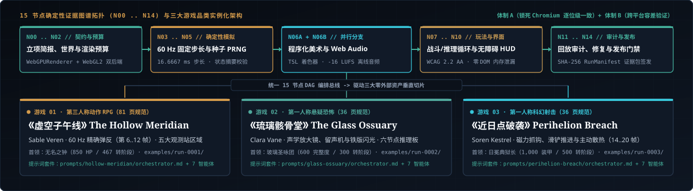
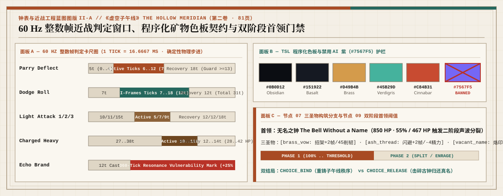
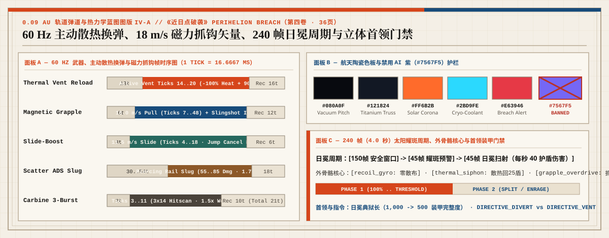

<!-- source_version: 2026.07.5; translation_status: reviewed; language: zh-CN -->

# 《造物主法典：Three.js 证据图谱与三大零资产旗舰游戏工程设定集》


| **典藏设定集母语版本** | [**English (Original Folio)**](README.md) | [**简体中文 (典藏设定集版)**](README.zh-CN.md) | [**日本語 (公式設定資料集・解体新書版)**](README.ja.md) | [**한국어 (공식 아트북 & 마스터북판)**](README.ko.md) |
| :--- | :---: | :---: | :---: | :---: |
| **工程档案版权页** | `版本 2026.07.5` | `全四卷 · 217 页` | `Three.js r185 (0.185.0) WebGPU + TSL` | `零外部二进制资产 · MIT 开源协议` |


*图版 00：受证据图谱（Evidence Graph）总控平面统辖的三大程序化世界观建筑三联画。左卷：玄武岩大教堂、黄铜子午环与“无名之钟”构成的暗黑动作 RPG《虚空子午线》（第二卷）；中卷：1894 年风暴潮汐礁石上的菲涅尔灯塔与水下骨质琉璃墓穴构成的悬疑恐怖调查作《琉璃骸骨堂》（第三卷）；右卷：0.09 AU 掠日轨道上的定日镜阵列与狂暴日冕构成的科幻高速射击冒险作《近日点破袭》（第四卷）。*

---

## 典藏序言与四卷本工程法典总览

传统的“单窗口大模型对话生成游戏”一旦进入复杂工程阶段便会迅速崩塌：同一个上下文窗口既要编造需求、手写着色器、调整帧判定参数，又要自己给自己打分验收。由 **Emily Paradox (`@iamemily2050`)** 撰写的这套**全四卷、共 `217` 页的工程设定集与多智能体架构法典**，彻底终结了“自说自话式”的生成循环，代之以面向 **Three.js `r185` (`0.185.0`)** 的确定性证据门禁生产体系。

本套丛书中的每一处几何网格、`TSL`（`Three.js Shading Language`）程序化材质节点、骨骼绑定、声学脉冲响应以及 60 Hz 近战/取证/弹道帧表，均由源代码通过确定性数学算法实时编译生成，**运行时外部下载资产严格锁死为零**（`external_network_requests = 0`，`downloaded_assets_count = 0`）。


### 四卷本典藏工程设定集目录 (`publications/`)

| **第一卷 · 64 页** | **第二卷 · 81 页** | **第三卷 · 36 页** | **第四卷 · 36 页** |
| :---: | :---: | :---: | :---: |
| [](publications/threejs-evidence-graph-operational-manual-v2.0-en.pdf) | [](publications/the-hollow-meridian-rpg-full-prompt-v1.0-en.pdf) | [](publications/the-glass-ossuary-mystery-horror-full-prompt-v1.0-en.pdf) | [](publications/perihelion-breach-fps-adventure-full-prompt-v1.0-en.pdf) |
| [**《证据图谱操作手册 v2.0》**](publications/threejs-evidence-graph-operational-manual-v2.0-en.pdf)<br/>`多智能体总控台与双轨确定性法典` | [**《虚空子午线》**](publications/the-hollow-meridian-rpg-full-prompt-v1.0-en.pdf)<br/>`游戏 01 · 第三人称暗黑动作 RPG` | [**《琉璃骸骨堂》**](publications/the-glass-ossuary-mystery-horror-full-prompt-v1.0-en.pdf)<br/>`游戏 02 · 第一人称悬疑恐怖调查` | [**《近日点破袭》**](publications/perihelion-breach-fps-adventure-full-prompt-v1.0-en.pdf)<br/>`游戏 03 · 0.09 AU 科幻射击冒险` |
| `sha256: d3830d411a61c52c`<br/>`416,827 字节` | `sha256: c4f8fe83995d526b`<br/>`357,144 字节` | `sha256: efead090be003782`<br/>`98,649 字节` | `sha256: 75bdfff21c905122`<br/>`95,265 字节` |
| **原生导读手册**：<br/>[EN](docs/EVIDENCE_GRAPH_GUIDE.md) · [中文](docs/EVIDENCE_GRAPH_GUIDE.zh-CN.md) · [日本語](docs/EVIDENCE_GRAPH_GUIDE.ja.md) · [한국어](docs/EVIDENCE_GRAPH_GUIDE.ko.md) | **原生导读手册**：<br/>[EN](docs/THE_HOLLOW_MERIDIAN_GUIDE.md) · [中文](docs/THE_HOLLOW_MERIDIAN_GUIDE.zh-CN.md) · [日本語](docs/THE_HOLLOW_MERIDIAN_GUIDE.ja.md) · [한국어](docs/THE_HOLLOW_MERIDIAN_GUIDE.ko.md) | **原生导读手册**：<br/>[EN](docs/THE_GLASS_OSSUARY_GUIDE.md) · [中文](docs/THE_GLASS_OSSUARY_GUIDE.zh-CN.md) · [日本語](docs/THE_GLASS_OSSUARY_GUIDE.ja.md) · [한국어](docs/THE_GLASS_OSSUARY_GUIDE.ko.md) | **原生导读手册**：<br/>[EN](docs/PERIHELION_BREACH_GUIDE.md) · [中文](docs/PERIHELION_BREACH_GUIDE.zh-CN.md) · [日本語](docs/PERIHELION_BREACH_GUIDE.ja.md) · [한국어](docs/PERIHELION_BREACH_GUIDE.ko.md) |
| **契约与提示词库**：<br/>[`prompts/evidence-graph/`](prompts/evidence-graph/) · [`schemas/`](schemas/) | **提示词与黄金样本**：<br/>[`prompts/hollow-meridian/`](prompts/hollow-meridian/) · [`run-0001`](examples/run-0001/) | **提示词与黄金样本**：<br/>[`prompts/glass-ossuary/`](prompts/glass-ossuary/) · [`run-0002`](examples/run-0002/) | **提示词与黄金样本**：<br/>[`prompts/perihelion-breach/`](prompts/perihelion-breach/) · [`run-0003`](examples/run-0003/) |

---

## 第一卷 · 确定性多智能体总控台（《Three.js 证据图谱 v2.0》 · 64 页）

| 图版 I-A：钟表级确定性验证与光学控制工坊 | 图版 I-B：零资产程序化几何与 TSL 材质编译工坊 |
| :---: | :---: |
|  |  |



第一卷确立了三大游戏共享的四项核心工程铁律：

1. **15 节点有向带环控制平面（`N00_BRIEF` .. `N14_RELEASE_CANDIDATE`）**：由 [`schemas/graph-state.d.ts`](schemas/graph-state.d.ts) 严格定义。任何节点若未能提供通过 JSON Schema 校验的 [`TaskPacket`](schemas/task-packet.schema.json) 与终端验收命令输出，编排器绝不允许推进状态；验收失败将触发有界回滚环路（`N13_REPAIR_ROUTER -> N05..N08`，单节点最多 `3` 次修复，全局最多 `8` 次回滚）。
2. **7 个文件所有权物理隔离的专职子智能体角色**：每款游戏均由 7 张职责正交的专职角色卡（`combat_gameplay`、`world_quest`、`procedural_art_vfx`、`procedural_audio`、`ui_hud_accessibility`、`qa_perf_playwright` 及只读评审 `independent_critic`）协同构建，严禁越权修改 `allowed_paths` 之外的代码或篡改验收标准。
3. **双轨确定性体制（`A-PinnedBrowser` 与 `B-CrossPlatform`）**：
   - **体制 A（`A-PinnedBrowser`）**：在固定版本 Chromium + GPU/SwiftShader 容器内执行比特级 SHA-256 校验，涵盖 60 Hz 整数模拟帧（`state_hash`）、16-bit PCM 量化离线音频渲染（`audio_hash`）与 `1e-5` 量化顶点缓冲区（`geometry_hash`）。
   - **体制 B（`B-CrossPlatform`）**：在跨平台 `THREE.WebGPURenderer` 与 `{ forceWebGL: true }` 回退路径上执行有界不变量与感知容差门禁（`P50 <= 8.3 ms`、`P95 <= 16.6 ms`、`P99 <= 22.0 ms`、响度 `-16 LUFS +- 1.0 LU`、真峰值 `<= -1.0 dBTP`）。
4. **反 AI 劣质审美（Anti-Slop）与零外部资产溯源门禁（`provenance_critic`）**：严禁运行时请求任何外部 `.glb/.gltf/.fbx/.obj/.png/.jpg/.wav/.mp3/.ogg` 资源，并在所有着色器与 UI 层中明令封杀通用 AI 霓虹紫（`#7567F5`）。

---

## 第二卷 · 游戏 01：《虚空子午线》 *The Hollow Meridian*（第三人称暗黑动作 RPG · 81 页）

| 图版 II-1：沉没星盘栈道与天体仪长桥 | 图版 II-2：铸钟熔炉与三圣物祭坛 | 图版 II-3：子午线圣殿与“无名之钟”首领战 |
| :---: | :---: | :---: |
|  |  |  |



《虚空子午线》将舞台设在一座由火山玄武岩与氧化黄铜筑成的巨型地下天文台——这里曾用来铭刻并保存消逝古城的“真名”。玩家扮演**测绘师（`The Cartographer` / `Sable Veren`）**，在 10 至 14 分钟的垂直切片中穿越五大连通区域（`Ash Court` -> `Orrery Bridge` -> `Archive Nave` -> `Bell Foundry` -> `Meridian Chamber`），解开三环同心圆 `Meridian Alignment` 机关，在祭坛择一绑定三件改变招式机制的圣物，最终迎战双阶段首领**无名之钟（The Bell Without a Name，850 HP，55% / 467 HP 触发二阶段声波分裂）**。

| 60 Hz 近战动作 (`seed=1337`) | 前摇 (Startup) | 生效 / 弹反 / 无敌帧 | 后摇 (Recovery) | 总帧数 | 精力 / 共鸣消耗与机制判定 |
| :--- | :--- | :--- | :--- | :--- | :--- |
| `Light Attack 1 / 2 / 3` | `10 / 11 / 15帧` | `5 / 7 / 9 帧` | `12 / 12 / 18帧` | `27 / 30 / 42帧` | 消耗 `10 / 11 / 14 精力`；造成 `16 / 18 / 25 HP` 伤害 |
| `Charged Heavy`（蓄力重击） | `27..38 帧` | `10..11 帧` | `12..14 帧` | `49..63 帧` | 消耗 `28 精力`；造成 `28..42 HP` 伤害与高额削韧 |
| `Dodge Roll`（翻滚闪避） | `7 帧` | `第 7..18 帧`（`12帧`无敌） | `12 帧` | `31 帧` | 消耗 `22 精力`（`ash_thread` 降至 `18`）；完整无敌帧 |
| `Parry Deflect`（招架弹反） | `5 帧` (`0..4`) | `第 6..12 帧`（`7帧`弹反） | `18 帧` | `31 帧` | 消耗 `12 精力`；按住至 `第 13 帧` 自动转为持续 `Guard` |
| `Echo Brand`（回响烙印） | `12 帧` | `360 帧` 易伤印记 | `0 帧` | `12 帧` | 消耗 `50 共鸣`（`vacant_name` 升至 `60` 并延至 `540 帧`）；增伤 `+25%` |

- **规范级英文原版 PDF（`81` 页）**：[`publications/the-hollow-meridian-rpg-full-prompt-v1.0-en.pdf`](publications/the-hollow-meridian-rpg-full-prompt-v1.0-en.pdf)
- **四语原生设定集导读**：[简体中文](docs/THE_HOLLOW_MERIDIAN_GUIDE.zh-CN.md) · [English](docs/THE_HOLLOW_MERIDIAN_GUIDE.md) · [日本語](docs/THE_HOLLOW_MERIDIAN_GUIDE.ja.md) · [한국어](docs/THE_HOLLOW_MERIDIAN_GUIDE.ko.md)
- **智能体提示词与黄金样本**：[`prompts/hollow-meridian/`](prompts/hollow-meridian/)（含 `orchestrator.md` 与 7 张角色卡） · [`examples/run-0001/`](examples/run-0001/)

---

## 第三卷 · 游戏 02：《琉璃骸骨堂》 *The Glass Ossuary*（第一人称悬疑恐怖调查 · 36 页）

| 图版 III-1：圣维恩暗礁与菲涅尔折射长廊 | 图版 III-2：守塔人剥离室与 1894 取证工作台 | 图版 III-3：骨质琉璃墓穴与“琉璃圣咏团” |
| :---: | :---: | :---: |
|  |  |  |


《琉璃骸骨堂》将时间定格在 1894 年 10 月风暴肆虐的**圣维恩暗礁（Saint-Vane Reef）**。玩家扮演声学档案员 **Clara Vane**，深入一座与水下骨质琉璃墓穴融为一体的海岸灯塔，调查 12 名海难幸存者与灯塔守塔人集体失踪的悬案。本作彻底摒弃常规枪械与廉价突脸惊吓（Jump Scare），依托三件 19 世纪实体取证仪器（`Split-Diopter Brass Loupe` 双焦黄铜放大镜、`Wax-Cylinder Phonograph` 蜡筒留声机、`Silver-Salt Ferrotype Plate` 银盐铁版闪光灯）、6 节点红线 `Inquest Board`（审讯推理板）以及严苛的声光潜行纪律，对抗双阶段声学首领**琉璃圣咏团（The Choir in the Glass，600 共鸣完整度，300 完整度触发二阶段分裂）**。

| 60 Hz 取证与潜行动作 (`seed=1894`) | 前摇 (Startup) | 生效窗口 (Active) | 后摇 / 冷却 | 总帧数 | 资源消耗与光学/声学取证效果 |
| :--- | :--- | :--- | :--- | :--- | :--- |
| `Lantern Shutter`（提灯快门） | `6 帧` | 切换持续（`第 7 帧..`） | `6 帧` | `12 帧` | `0 灯油`；瞬间切断锥形光束，解除光学怨灵视线锁定 |
| `Brass Loupe Focus`（双焦镜对焦） | `9 帧` | 按住对焦（`第 10..69 帧`） | `6 帧` | `75 帧` | `0 灯油`；破译菲涅尔透镜刻度（`45/135/270 度`）与骨琉璃裂隙 |
| `Phonograph Cancel`（留声机反相） | `24 帧` | `第 25..114 帧`（`90帧`） | `36 帧` | `150 帧` | 播放反相声波抵消房间驻波，向听音怨灵掩盖脚步声 |
| `Ferrotype UV Flash`（铁版紫外闪光） | `18 帧` | `第 19..24 帧`（`6帧`） | `66 帧` | `90 帧` | 致盲 `6.5 m` 内怨灵 `102 帧`（`lens_sabotage` 延至 `132 帧`） |
| `Crouch Sidestep`（蹲伏静步） | `5 帧` | `第 6..16 帧`（`11帧`） | `12 帧` | `28 帧` | 将湿石地面脚步声峰值严格压制在 `<= -38 dBFS` 以下 |
| `Smelling Salts`（嗅盐镇定） | `15 帧` | `第 16..45 帧`（`30帧`） | `10 帧` | `55 帧` | 恢复 `+40 镇定度 (Composure)` 并清除 `-25 暴露值 (Exposure)` |

- **规范级英文原版 PDF（`36` 页）**：[`publications/the-glass-ossuary-mystery-horror-full-prompt-v1.0-en.pdf`](publications/the-glass-ossuary-mystery-horror-full-prompt-v1.0-en.pdf)
- **四语原生设定集导读**：[简体中文](docs/THE_GLASS_OSSUARY_GUIDE.zh-CN.md) · [English](docs/THE_GLASS_OSSUARY_GUIDE.md) · [日本語](docs/THE_GLASS_OSSUARY_GUIDE.ja.md) · [한국어](docs/THE_GLASS_OSSUARY_GUIDE.ko.md)
- **智能体提示词与黄金样本**：[`prompts/glass-ossuary/`](prompts/glass-ossuary/)（含 `orchestrator.md` 与 7 张角色卡） · [`examples/run-0002/`](examples/run-0002/)

---

## 第四卷 · 游戏 03：《近日点破袭》 *Perihelion Breach*（第一人称科幻射击冒险 · 36 页）

| 图版 IV-1：0.09 AU 伊卡洛斯 9 号定日镜主桁架 | 图版 IV-2：低温冷却歧管与主动散热换弹交火 | 图版 IV-3：近日点核心舱与“日冕典狱长”空战 |
| :---: | :---: | :---: |
|  |  |  |



《近日点破袭》将战场推向距离太阳仅 `0.09 AU` 的掠日轨道——**伊卡洛斯 9 号轨道太阳中继站（Icarus-9 Orbital Solar Relay）**。防卫主机失控锁死定日镜阵列并引发热失控级联后，先锋特勤官 **Soren Kestrel** 必须在 12 至 15 分钟的高速立体突袭中，利用 `18.0 m/s` `Magnetic Grapple`（磁力抓钩摆荡）、`11.5 m/s` `Slide-Boost`（滑铲冲刺）与 `ticks 14..20` 的 `Thermal Vent Reload`（主动散热换弹），穿越每 `240 帧`（`4.0 秒`）爆发一次的日冕耀斑阴影走廊，并在立体球形核心舱击败**日冕典狱长（The Heliarch Warden，1,000 装甲完整度，500 完整度进入二阶段）**。

| 60 Hz 弹道与机动动作 (`seed=2142`) | 前摇 (Startup) | 生效窗口 (Active) | 后摇 / 恢复 | 总帧数 | 热量 / 速度与战术效果 |
| :--- | :--- | :--- | :--- | :--- | :--- |
| `Carbine 3-Burst`（卡宾三连发） | `2 帧` | `第 3..11 帧`（3 发） | `10 帧` | `21 帧` | `+12 热量`；`3 x 14` 瞬发命中伤害（弱点倍率 `1.5x`） |
| `Scatter Uncharged`（霰弹速射） | `3 帧` | `第 4 帧`（`5x12` 散射） | `15 帧` | `18 帧` | `+18 热量`；`60` 近距电弧伤害，瞬间剥离无人机能量护盾 |
| `Scatter ADS Rail Slug`（开镜磁轨独头弹） | `30..54 帧` | `第 31..55 帧` | `18 帧` | `48..72 帧` | `+28 热量`；`55..85` 穿透独头弹伤害（弱点倍率 `1.75x`） |
| `Breach Anchor`（破袭锚弹） | `6 帧` | 抛射物锚定 | `24 帧` | `30 帧` | `+30 热量`；`60 AoE` 碎甲爆炸或建立等离子导管相位连接 |
| `Thermal Vent Reload`（主动散热换弹） | `13 帧` | `第 14..20 帧`（`7帧`） | `16 帧` | `36 帧` | 在 `14..20 帧` 完美触发可瞬间清空 `100% 热量` 并获 `90帧` 超载 |
| `Slide-Boost`（滑铲冲刺） | `3 帧` | `第 4..18 帧`（`15帧`） | `6 帧` | `24 帧` | `11.5 m/s` 低姿态滑铲；`第 8..18 帧` 支持跳跃取消保留动量 |
| `Magnetic Grapple`（磁力抓钩） | `6 帧` | `18..42 帧` 牵引 | `12 帧` | `36..60 帧` | `18.0 m/s` 高速牵引，支持切线释放实现高空抛物线摆荡 |

- **规范级英文原版 PDF（`36` 页）**：[`publications/perihelion-breach-fps-adventure-full-prompt-v1.0-en.pdf`](publications/perihelion-breach-fps-adventure-full-prompt-v1.0-en.pdf)
- **四语原生设定集导读**：[简体中文](docs/PERIHELION_BREACH_GUIDE.zh-CN.md) · [English](docs/PERIHELION_BREACH_GUIDE.md) · [日本語](docs/PERIHELION_BREACH_GUIDE.ja.md) · [한국어](docs/PERIHELION_BREACH_GUIDE.ko.md)
- **智能体提示词与黄金样本**：[`prompts/perihelion-breach/`](prompts/perihelion-breach/)（含 `orchestrator.md` 与 7 张角色卡） · [`examples/run-0003/`](examples/run-0003/)

---

## 三大零资产旗舰游戏跨卷横向对比表

| 工程与设计维度 | 第二卷：《虚空子午线》 | 第三卷：《琉璃骸骨堂》 | 第四卷：《近日点破袭》 |
| :--- | :--- | :--- | :--- |
| **品类与镜头视角** | 第三人称暗黑奇幻动作 RPG | 第一人称悬疑恐怖取证调查 | 第一人称硬核科幻高速射击冒险 |
| **目标流程与篇幅** | 10 至 14 分钟（`81` 页 PDF） | 12 至 16 分钟（`36` 页 PDF） | 12 至 15 分钟（`36` 页 PDF） |
| **主角设定** | `Sable Veren`（测绘师） | `Clara Vane`（声学档案员） | `Soren Kestrel`（中继站先锋特勤） |
| **三大核心资源** | `100 生命` · `100 精力` · `0-100 共鸣` | `100 镇定度` · `100 灯油` · `0-100 暴露值` | `100 护盾` · `100 船体完整度` · `0-100 核心热量` |
| **60 Hz 标志性操作博弈** | 按下瞬时弹反（`6..12帧`）与长按格挡（`>=13帧`） | 提灯快门（`6帧`）+ 留声机反相消音 + 铁版紫外闪光（`19..24帧`） | 主动散热换弹（`14..20帧` 清空热量）+ `18 m/s` 抓钩 + 滑铲冲刺 |
| **五大连通空间拓扑** | `Ash Court` -> `Orrery Bridge` -> `Archive Nave` -> `Bell Foundry` -> `Meridian Chamber` | `Tidewater Causeway` -> `Caretaker's Stripping Room` -> `Refraction Gallery` -> `Submerged Crypt` -> `The Glass Ossuary` | `Umbilical Airlock` -> `Heliostat Truss` -> `Cryo-Coolant Manifold` -> `Ballistic Foundry` -> `Perihelion Core Chamber` |
| **节点 05 空间解谜** | `Meridian Alignment`（三环星盘对齐 -> `North Seal`） | `Prism Triangulation`（`45/135/270度` 棱镜）+ `110/220/330 Hz` 声学水闸 | `Conduit Phase Routing`（`180帧` 衰减窗内串联 3 锚点 -> `Coolant Bypass`） |
| **三类敌人原型** | `Ashbound Skirmisher`、`Lantern Wraith`、`Bell Sentinel` | `Mire Listener`（听音）、`Glass Septum Watcher`（视锥）、`Drowned Chorister`（场域） | `Volt Skitter`（爬墙集群）、`Aegis Drone`（护盾狙击）、`Slag Enforcer`（重装迫击） |
| **节点 07 构筑分支** | **三圣物**：`brass_vow` · `ash_thread` · `vacant_name` | **三调查假设**：`lens_sabotage` · `tidal_quarantine` · `acoustic_calling` | **三外骨骼核心**：`recoil_gyro` · `thermal_siphon` · `grapple_overdrive` |
| **节点 09 双阶段首领** | **无名之钟**（`850 HP`，`467 HP` 进二阶段） | **琉璃圣咏团**（`600 完整度`，`300` 进二阶段） | **日冕典狱长**（`1,000 完整度`，`500` 进二阶段） |
| **节点 10 双结局抉择** | `CHOICE_BIND` 或 `CHOICE_RELEASE` | `VERDICT_PUBLISH` 或 `VERDICT_SUBMERGE` | `DIRECTIVE_DIVERT` 或 `DIRECTIVE_VENT` |
| **渲染性能预算** | `<= 300` Draw Calls · `<= 500,000` 三角面 | `<= 280` Draw Calls · `<= 460,000` 三角面 | `<= 300` Draw Calls · `<= 500,000` 三角面 |
| **黄金基准运行样本** | [`examples/run-0001/`](examples/run-0001/) (`seed=1337`) | [`examples/run-0002/`](examples/run-0002/) (`seed=1894`) | [`examples/run-0003/`](examples/run-0003/) (`seed=2142`) |

---

## 四语原生典藏文档矩阵

本仓库的所有导读与设定集均以**英语（`en`）**、**简体中文（`zh-CN`）**、**日语（`ja`）**和**韩语（`ko`）**母语级技术文风独立撰写，同时保留核心代码标识符、CLI 命令与 Schema 字段不变，方便全球图形与游戏工程团队无障碍研读：

| 档案表面 | 原生英文版 (`en`) | 原生简体中文版 (`zh-CN`) | 原生日语版 (`ja`) | 原生韩语版 (`ko`) |
| :--- | :--- | :--- | :--- | :--- |
| **仓库门户与典藏总览** | [`README.md`](README.md) | [`README.zh-CN.md`](README.zh-CN.md) | [`README.ja.md`](README.ja.md) | [`README.ko.md`](README.ko.md) |
| **第一卷：证据图谱 v2.0 手册 (64页)** | [`EVIDENCE_GRAPH_GUIDE.md`](docs/EVIDENCE_GRAPH_GUIDE.md) | [`EVIDENCE_GRAPH_GUIDE.zh-CN.md`](docs/EVIDENCE_GRAPH_GUIDE.zh-CN.md) | [`EVIDENCE_GRAPH_GUIDE.ja.md`](docs/EVIDENCE_GRAPH_GUIDE.ja.md) | [`EVIDENCE_GRAPH_GUIDE.ko.md`](docs/EVIDENCE_GRAPH_GUIDE.ko.md) |
| **第二卷：《虚空子午线》动作 RPG (81页)** | [`THE_HOLLOW_MERIDIAN_GUIDE.md`](docs/THE_HOLLOW_MERIDIAN_GUIDE.md) | [`THE_HOLLOW_MERIDIAN_GUIDE.zh-CN.md`](docs/THE_HOLLOW_MERIDIAN_GUIDE.zh-CN.md) | [`THE_HOLLOW_MERIDIAN_GUIDE.ja.md`](docs/THE_HOLLOW_MERIDIAN_GUIDE.ja.md) | [`THE_HOLLOW_MERIDIAN_GUIDE.ko.md`](docs/THE_HOLLOW_MERIDIAN_GUIDE.ko.md) |
| **第三卷：《琉璃骸骨堂》悬疑恐怖 (36页)** | [`THE_GLASS_OSSUARY_GUIDE.md`](docs/THE_GLASS_OSSUARY_GUIDE.md) | [`THE_GLASS_OSSUARY_GUIDE.zh-CN.md`](docs/THE_GLASS_OSSUARY_GUIDE.zh-CN.md) | [`THE_GLASS_OSSUARY_GUIDE.ja.md`](docs/THE_GLASS_OSSUARY_GUIDE.ja.md) | [`THE_GLASS_OSSUARY_GUIDE.ko.md`](docs/THE_GLASS_OSSUARY_GUIDE.ko.md) |
| **第四卷：《近日点破袭》科幻 FPS (36页)** | [`PERIHELION_BREACH_GUIDE.md`](docs/PERIHELION_BREACH_GUIDE.md) | [`PERIHELION_BREACH_GUIDE.zh-CN.md`](docs/PERIHELION_BREACH_GUIDE.zh-CN.md) | [`PERIHELION_BREACH_GUIDE.ja.md`](docs/PERIHELION_BREACH_GUIDE.ja.md) | [`PERIHELION_BREACH_GUIDE.ko.md`](docs/PERIHELION_BREACH_GUIDE.ko.md) |
| **多语言术语表与规范** | [`GLOSSARY.md`](docs/GLOSSARY.md) · [`TRANSLATION_POLICY.md`](docs/TRANSLATION_POLICY.md) | [`GLOSSARY.md`](docs/GLOSSARY.md) | [`GLOSSARY.md`](docs/GLOSSARY.md) | [`GLOSSARY.md`](docs/GLOSSARY.md) |

---

## 自动化完整性校验与引用信息

```bash
# 1. 校验 SHA256SUMS.txt 中全部归档文件的比特级哈希值
sha256sum -c SHA256SUMS.txt

# 2. 运行全量发布校验套件（验证 4 部 PDF 共 217 页、9 份黄金样本、17 张零 EXIF 画册图版、21 张工程蓝图 SVG 及四语链接）
python scripts/verify_release.py
```

- **技术勘误与跨卷对齐说明**：[`docs/TECHNICAL_ERRATA_AND_V2_ALIGNMENT.md`](docs/TECHNICAL_ERRATA_AND_V2_ALIGNMENT.md)
- **发布状态与认识论边界**：[`docs/PUBLICATION_STATUS.md`](docs/PUBLICATION_STATUS.md)
- **画册图版溯源与零 EXIF 规范**：[`docs/ARTWORK_PROVENANCE.md`](docs/ARTWORK_PROVENANCE.md)
- **学术引用元数据**：[`CITATION.cff`](CITATION.cff) · [`CITATIONS.md`](CITATIONS.md)
- **开源许可**：[MIT License](LICENSE) · Copyright (c) 2026 Emily Paradox (`@iamemily2050`)
