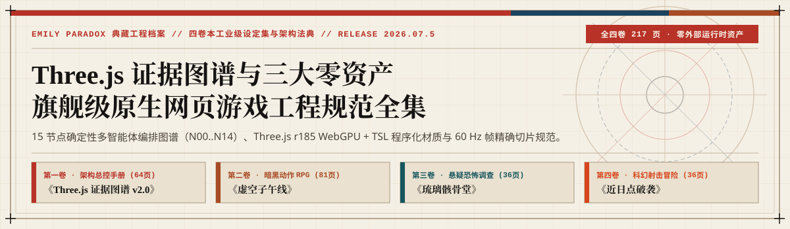
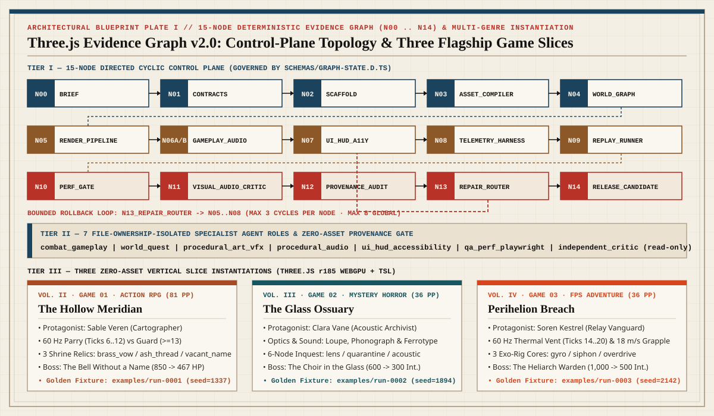
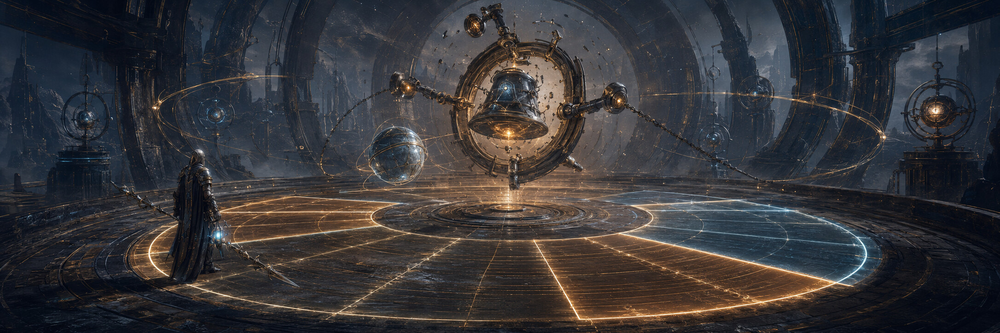
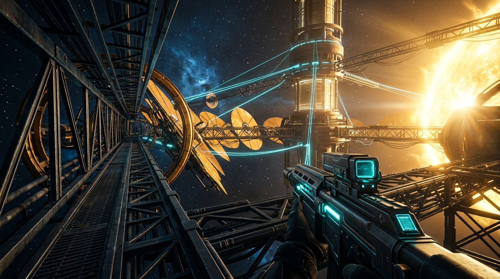
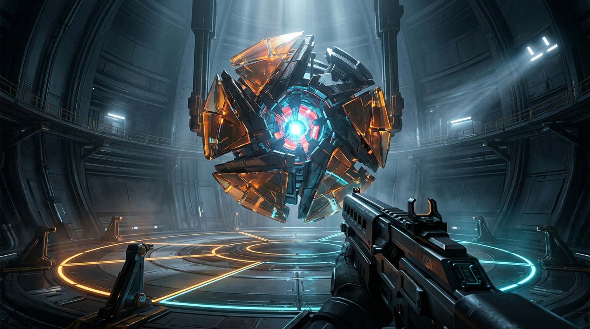

<!-- source_version: 2026.07.5; translation_status: reviewed; language: zh-CN -->

# Three.js 证据图谱与多品类无资产游戏研发套件

<div align="center">

[](README.md)
[-45B29D?style=for-the-badge)](README.zh-CN.md)
[-38C6D9?style=for-the-badge)](README.ja.md)
[-C89B54?style=for-the-badge)](README.ko.md)

[](RELEASE_NOTES.md)
[-45B29D?style=flat-square)](docs/TECHNICAL_ERRATA_AND_V2_ALIGNMENT.md)
[](docs/PUBLICATION_STATUS.md)
[](schemas/)
[](LICENSE)

</div>



> **仓库核心定位**
>
> 本仓库由 **Emily Paradox（`@iamemily2050`）** 编撰发布，是一套面向 Three.js `r185`（`0.185.0`）的**四卷本、总计 `217` 页的工程架构规格书与多智能体研发提示词套件**，专门用于构建**零外部下载二进制资产**（不依赖外部 `.glb` 模型、贴图、字体或预录音频）的确定性网页游戏垂直切片。套件包含一部通用多智能体控制平面规范（《Three.js Evidence Graph: Operational Manual v2.0》，`64` 页）以及三部跨品类旗舰游戏垂直切片生产规格书：
> 1. **游戏 01 — 第三人称暗黑奇幻动作 RPG**：**《虚空子午线》（*The Hollow Meridian*，81 页）**
> 2. **游戏 02 — 第一人称声学取证悬疑恐怖**：**《琉璃骸骨堂》（*The Glass Ossuary*，36 页）**
> 3. **游戏 03 — 第一人称高速科幻射击冒险**：**《近日点破袭》（*Perihelion Breach*，36 页）**
>
> 四部出版物均配备独立的 JSON Schema Draft 2020-12 强契约文件（`schemas/`）、可直接复制投喂的主控编排器与 21 张专家子智能体提示词卡（`prompts/`）、通过 Schema 校验的黄金参考运行样本（`examples/run-0001/` 至 `examples/run-0003/`），以及采用**英文、简体中文、日文、韩文**四国语言母语级研发语境撰写的配套技术指南。

---

## 四卷本工程出版物总览（共计 `217` 页）


*本图为仓库四部 PDF 出版物的合集展示图。所有封面与章节头图均为出版物版式与概念美术设定图，并非实机运行截图或性能实测证据。*

| 卷号 | 出版物名称与品类定位 | PDF 规范文件（`publications/`） | 页数 | 文件大小 | 四语种母语级配套指南（`docs/`） | 独立提示词与黄金样本 |
| :-: | :--- | :--- | ---: | ---: | :--- | :--- |
| **01** | **Three.js Evidence Graph v2.0**<br/>*多智能体控制平面与双重确定性操作手册* | [`threejs-evidence-graph-operational-manual-v2.0-en.pdf`](publications/threejs-evidence-graph-operational-manual-v2.0-en.pdf)<br/>`sha256[0..16]: d3830d411a61c52c` | `64` 页 | `416,827` 字节 | [EN](docs/EVIDENCE_GRAPH_GUIDE.md) · [中文](docs/EVIDENCE_GRAPH_GUIDE.zh-CN.md) · [日本語](docs/EVIDENCE_GRAPH_GUIDE.ja.md) · [한국어](docs/EVIDENCE_GRAPH_GUIDE.ko.md) | [`prompts/evidence-graph/`](prompts/evidence-graph/)<br/>[`schemas/`](schemas/) |
| **02** | **《虚空子午线》The Hollow Meridian v1.0**<br/>*游戏 01 · 第三人称暗黑奇幻动作 RPG* | [`the-hollow-meridian-rpg-full-prompt-v1.0-en.pdf`](publications/the-hollow-meridian-rpg-full-prompt-v1.0-en.pdf)<br/>`sha256[0..16]: c4f8fe83995d526b` | `81` 页 | `357,144` 字节 | [EN](docs/THE_HOLLOW_MERIDIAN_GUIDE.md) · [中文](docs/THE_HOLLOW_MERIDIAN_GUIDE.zh-CN.md) · [日本語](docs/THE_HOLLOW_MERIDIAN_GUIDE.ja.md) · [한국어](docs/THE_HOLLOW_MERIDIAN_GUIDE.ko.md) | [`prompts/hollow-meridian/`](prompts/hollow-meridian/)<br/>[`examples/run-0001/`](examples/run-0001/) |
| **03** | **《琉璃骸骨堂》The Glass Ossuary v1.0**<br/>*游戏 02 · 第一人称调查取证悬疑恐怖* | [`the-glass-ossuary-mystery-horror-full-prompt-v1.0-en.pdf`](publications/the-glass-ossuary-mystery-horror-full-prompt-v1.0-en.pdf)<br/>`sha256[0..16]: efead090be003782` | `36` 页 | `98,649` 字节 | [EN](docs/THE_GLASS_OSSUARY_GUIDE.md) · [中文](docs/THE_GLASS_OSSUARY_GUIDE.zh-CN.md) · [日本語](docs/THE_GLASS_OSSUARY_GUIDE.ja.md) · [한국어](docs/THE_GLASS_OSSUARY_GUIDE.ko.md) | [`prompts/glass-ossuary/`](prompts/glass-ossuary/)<br/>[`examples/run-0002/`](examples/run-0002/) |
| **04** | **《近日点破袭》Perihelion Breach v1.0**<br/>*游戏 03 · 第一人称高速科幻射击冒险* | [`perihelion-breach-fps-adventure-full-prompt-v1.0-en.pdf`](publications/perihelion-breach-fps-adventure-full-prompt-v1.0-en.pdf)<br/>`sha256[0..16]: 75bdfff21c905122` | `36` 页 | `95,265` 字节 | [EN](docs/PERIHELION_BREACH_GUIDE.md) · [中文](docs/PERIHELION_BREACH_GUIDE.zh-CN.md) · [日本語](docs/PERIHELION_BREACH_GUIDE.ja.md) · [한국어](docs/PERIHELION_BREACH_GUIDE.ko.md) | [`prompts/perihelion-breach/`](prompts/perihelion-breach/)<br/>[`examples/run-0003/`](examples/run-0003/) |

---

## 核心工程架构：15 节点证据图谱（`N00` .. `N14`）



在传统的单轮或多轮对话式大模型游戏生成中，同一个上下文既当策划、又写着色器、还自己给自己打分验收，极易陷入上下文漂移、着色器编译卡顿与虚假自夸。**Three.js Evidence Graph v2.0** 通过以下四项硬性工程约束彻底解决这一顽疾：

1. **确定性主控编排器（`orchestrator`）**：基于 [`schemas/graph-state.d.ts`](schemas/graph-state.d.ts) 驱动从 `N00_BRIEF` 到 `N14_RELEASE_CANDIDATE` 的 15 节点有向状态图。任何节点必须提交符合 [`task-packet.schema.json`](schemas/task-packet.schema.json) 的任务包并通过自动化验收命令后方能推进。
2. **文件写入权限物理隔离的专家智能体（每款游戏 7 张角色卡）**：涵盖 `combat_gameplay`（战斗/取证/弹道状态机）、`world_quest`（空间拓扑与任务状态）、`procedural_art_vfx`（程序化几何与 TSL 着色器）、`procedural_audio`（Web Audio 离线音频合成）、`ui_hud_accessibility`（HUD 与无障碍）、`qa_perf_playwright`（自动化回放与性能门禁）以及完全只读的 `independent_critic`（独立评审员）。构建者绝不允许越权修改自身 `allowed_paths` 以外的文件。
3. **双重确定性验证体制（`A-PinnedBrowser` 与 `B-CrossPlatform`）**：
   - **体制 A（`A-PinnedBrowser`，固定容器逐位对齐）**：在固定版本的 Chromium 容器中，对 60 Hz 整数步进状态哈希（`state_hash`）、16-bit PCM 量化后的 `OfflineAudioContext` 音频哈希（`audio_hash`）以及 `1e-5` 精度量化的程序化几何顶点哈希（`geometry_hash`）执行严格的 SHA-256 比对。
   - **体制 B（`B-CrossPlatform`，跨平台容差门禁）**：在异构硬件与双渲染后端（`THREE.WebGPURenderer` 主路径与 `{ forceWebGL: true }` 回退路径）下，验证帧耗时分位数（`P50 <= 8.3 ms`、`P95 <= 16.6 ms`、`P99 <= 22.0 ms`）与 EBU R128 响度（`-16 LUFS +- 1.0 LU`，真峰值 `<= -1.0 dBTP`）。
4. **零外部运行时资产铁律（`provenance_critic`）**：所有三维建筑网格、TSL（`Three.js Shading Language`）程序化材质、骨骼绑定、界面字形与空间音效均由源码实时编译生成，`external_network_requests` 与 `downloaded_assets_count` 强制锁定为 `0`。

---

## 三款跨品类旗舰游戏横向对比矩阵

| 核心维度 | 游戏 01：《虚空子午线》(*The Hollow Meridian*) | 游戏 02：《琉璃骸骨堂》(*The Glass Ossuary*) | 游戏 03：《近日点破袭》(*Perihelion Breach*) |
| :--- | :--- | :--- | :--- |
| **品类定位与视角** | 第三人称暗黑奇幻动作 RPG | 第一人称声学取证悬疑恐怖（Mystery on Horror） | 第一人称高速科幻射击冒险（FPS Adventure） |
| **单局目标时长** | 10 至 14 分钟 | 12 至 16 分钟 | 12 至 15 分钟 |
| **主角与身份** | `The Cartographer`（制图师 `Sable Veren`） | `Clara Vane`（声学档案调查员 `The Acoustic Archivist`） | `Soren Kestrel`（中继站先锋官 + 战术 AI `Vesper`） |
| **三维核心资源** | `100 生命` · `100 精力` · `0–100 共鸣值` | `100 定力` · `100 提灯鲸油` · `0–100 精神侵蚀度` | `100 护盾` · `100 装甲完整度` · `0–100 核心热量` |
| **60 Hz 标志性机制** | 按下瞬发 `弹反`（`ticks 6..12`）与按住持续 `格挡`（`tick >= 13`）优先级消歧 | 正交声光位掩码：`提灯遮光闸`（`6t`）+ `留声机反相消音`（`25..114t`）+ `铁版紫外闪光`（`19..24t`） | `主动散热装填`（`14..20t` 清空热量并超载）+ `磁力抓钩摆荡`（`18.0 m/s`）+ `滑铲推进`（`11.5 m/s`） |
| **五大精编空间路线** | `Ash Court` -> `Orrery Bridge` -> `Archive Nave` -> `Bell Foundry` -> `Meridian Chamber` | `Tidewater Causeway` -> `Caretaker's Stripping Room` -> `Refraction Gallery` -> `Submerged Crypt` -> `The Glass Ossuary` | `Umbilical Airlock` -> `Heliostat Truss` -> `Cryo-Coolant Manifold` -> `Ballistic Foundry` -> `Perihelion Core Chamber` |
| **第 05 拍空间解谜** | `Meridian Alignment`（三环黄铜星象仪对齐 -> `North Seal`） | `Prism Triangulation`（`45/135/270 deg` 菲涅尔透镜环 -> 《潮汐账本残页》）+ `110/220/330 Hz` 水闸调谐 | `Conduit Phase Routing`（`180 ticks` 衰减窗口内接通 3 枚等离子锚点 -> `冷却旁路核心`） |
| **三类敌人/灵体原型** | `Ashbound Skirmisher`、`Lantern Wraith`、`Bell Sentinel` | `Mire Listener`（听音猎手）、`Glass Septum Watcher`（视线残影）、`Drowned Chorister`（次声圣咏灵） | `Volt Skitter`（攀墙掠行虫）、`Aegis Drone`（护盾狙击机）、`Slag Enforcer`（熔渣重装兵） |
| **第 07 拍流派抉择** | **祭坛遗物**：`brass_vow` · `ash_thread` · `vacant_name` | **推理板假说**：`lens_sabotage` · `tidal_quarantine` · `acoustic_calling` | **外骨骼核心**：`recoil_gyro` · `thermal_siphon` · `grapple_overdrive` |
| **第 09 拍双阶段 Boss** | **无名之钟**（`The Bell Without a Name`，`850 HP`，`55%` 血量进二阶段） | **玻璃圣咏团**（`The Choir in the Glass`，`600 共鸣完整度`，`300` 进二阶段） | **日冕典狱长**（`The Heliarch Warden`，`1,000 装甲完整度`，`500` 进二阶段） |
| **第 10 拍双结局分歧** | `CHOICE_BIND`（束缚）或 `CHOICE_RELEASE`（释放） | `VERDICT_PUBLISH`（公之于众）或 `VERDICT_SUBMERGE`（永沉海底） | `DIRECTIVE_DIVERT`（偏转护盾）或 `DIRECTIVE_VENT`（抛射核心） |
| **渲染性能预算上限** | `<= 300` Draw Calls · `<= 500,000` 三角面 | `<= 280` Draw Calls · `<= 460,000` 三角面 | `<= 300` Draw Calls · `<= 500,000` 三角面 |
| **黄金参考样本** | [`examples/run-0001/`](examples/run-0001/)（`seed=1337`） | [`examples/run-0002/`](examples/run-0002/)（`seed=1894`） | [`examples/run-0003/`](examples/run-0003/)（`seed=2142`） |

---

## 三款旗舰游戏深度解析

### 1. 游戏 01 — 《虚空子午线》（*The Hollow Meridian* · 第三人称暗黑奇幻动作 RPG · 81 页）

| 观测站世界路线概念图 | 双阶段 Boss“无名之钟”概念图 |
| :---: | :---: |
|  |  |

《虚空子午线》将舞台设定在一座曾用来封存失落城市真名的黄铜与玄武岩废墟观测站中。玩家扮演无面守望者 **The Cartographer（制图师）**，手持分段长刃与回响提灯，在五大建筑空间中掌握严谨的 60 Hz 精力管理与 7 帧弹反窗口，解开三环子午线星象仪谜题，在祭坛做出唯一一次流派遗物抉择，并迎战双阶段首领 **无名之钟（The Bell Without a Name）**。

<details>
<summary><strong>展开查看《虚空子午线》十拍推进路线、60 Hz 战斗帧数表与三大祭坛遗物分支</strong></summary>

- **十拍精编路线（`recover_orientation`）**：`01 Ash Court Arrival`（灰烬庭院安全屋与 `Mnemonic Keeper`）-> `02 Quest Acceptance`（接取双封印任务）-> `03 Orrery Bridge Tutorial`（星象仪桥战斗教学与 `Ashbound Skirmisher`）-> `04 Archive Nave`（档案中殿立体推进与 `Lantern Wraith`）-> `05 Meridian Alignment`（三环空间对齐解谜获取 `North Seal`）-> `06 Bell Foundry`（铸钟厂破防击败 `Bell Sentinel` 获取 `Depth Seal`）-> `07 Shrine Choice`（祭坛三选一遗物：`brass_vow`、`ash_thread`、`vacant_name`）-> `08 Chamber Opening` -> `09 The Unnamed Bell`（`850 HP` 双阶段首领战）-> `10 Bind or Release`（`CHOICE_BIND` / `CHOICE_RELEASE` 双结局存档）。

| 动作 | 前摇 | 判定 / 无敌帧 | 后摇 | 总帧数 | 消耗与战斗效果 |
| :--- | :--- | :--- | :--- | :--- | :--- |
| `轻攻击三连 1 / 2 / 3` | `10 / 11 / 15t` | `5 / 7 / 9t` | `12 / 12 / 18t` | `27 / 30 / 42t` | `10 / 11 / 14 精力`；`16 / 18 / 25 伤害` |
| `蓄力重击` | `27..38t` | `10..11t` | `12..14t` | `49..63t` | `28 精力`；`28..42 伤害` + 高额削韧 |
| `翻滚闪避` | `7t` | `Ticks 7..18`（`12t`） | `12t` | `31t` | `22 精力`；`ticks 7..18` 期间完全无敌 |
| `弹反偏转` | `5t`（`0..4`） | `Ticks 6..12`（`7t`） | `18t` | `31t` | `12 精力`；按住至 `tick 13` 自动转为持续格挡 |
| `回响烙印` | `12t` | `360t 标记` | `0t` | `12t 施放` | `50 共鸣值`；目标易伤 `+25%` + 暴露首领弱点 |

- **PDF 规范文件**：[`publications/the-hollow-meridian-rpg-full-prompt-v1.0-en.pdf`](publications/the-hollow-meridian-rpg-full-prompt-v1.0-en.pdf)
- **完整中文指南**：[`docs/THE_HOLLOW_MERIDIAN_GUIDE.zh-CN.md`](docs/THE_HOLLOW_MERIDIAN_GUIDE.zh-CN.md)
- **独立提示词与样本**：[`prompts/hollow-meridian/`](prompts/hollow-meridian/) · [`examples/run-0001/`](examples/run-0001/)

</details>

---

### 2. 游戏 02 — 《琉璃骸骨堂》（*The Glass Ossuary* · 第一人称调查取证悬疑恐怖 · 36 页）

| 折射回廊光学取证概念图 | 骨琉璃圣堂“玻璃圣咏团”概念图 |
| :---: | :---: |
|  |  |

《琉璃骸骨堂》讲述声学档案调查员 **Clara Vane** 于 1894 年风暴之夜登上圣范恩孤岛观测站，调查“子午线号”海难失踪乘员的遗音。游戏摒弃传统枪械与廉价突脸惊吓，玩家必须操作三件 19 世纪物理取证器械（`双焦黄铜放大镜`、`蜡筒留声机`、`银盐铁版照相机`），在六节点 `Inquest Board`（推理板）上串联物证、推导假说，并利用提灯遮光闸与反相声波在双阶段首领 **玻璃圣咏团（The Choir in the Glass）** 的共鸣圣堂中完成定案。

<details>
<summary><strong>展开查看《琉璃骸骨堂》十拍调查路线、60 Hz 取证器械帧数表与推理板假说分支</strong></summary>

- **十拍调查路线（`case_saint_vane`）**：`01 Causeway Landfall`（栈桥登岸与提灯百叶校准）-> `02 The Sealed Inquest`（剥离室安全屋、六节点推理板与 Moreau 蜡筒）-> `03 Ferrotype Calibration`（铁版相机 `ticks 19..24` 紫外闪光定身校准）-> `04 Refraction Gallery`（规避 `Glass Septum Watcher` 视线锥与放大镜勘验）-> `05 Prism Triangulation`（`45/135/270 deg` 菲涅尔透镜环解谜获取《潮汐账本残页》）-> `06 Submerged Crypt`（涉水潜行规避 `Mire Listener`，调谐 `110/220/330 Hz` 水闸获取《水听器蜡筒》）-> `07 Inquest Board Deduction`（锁定三大假说之一：`lens_sabotage`、`tidal_quarantine`、`acoustic_calling`）-> `08 Ossuary Unsealing` -> `09 The Choir in the Glass`（`600 共鸣完整度` 双阶段声光对抗）-> `10 Publish or Submerge`（`VERDICT_PUBLISH` / `VERDICT_SUBMERGE`）。

| 器械 / 动作 | 前摇 | 有效窗口 | 后摇 | 总帧数 | 消耗与调查机制效果 |
| :--- | :--- | :--- | :--- | :--- | :--- |
| `提灯遮光闸` | `6 ticks` | 切换维持（`7..`） | `6 ticks` | `12 ticks` | `0 鲸油`；切断光锥并消除光学视线仇恨 |
| `黄铜放大镜对焦` | `9 ticks` | 按住维持（`10..69`） | `6 ticks` | `75 ticks` | `0 鲸油`；破译微刻棱镜刻度与骨琉璃铭文 |
| `留声机反相消音` | `24 ticks` | `Ticks 25..114` | `36 ticks` | `150 ticks` | 抵消房间共振频率；向 `Mire Listener` 隐蔽脚步声 |
| `铁版紫外闪光` | `18 ticks` | `Ticks 19..24` | `66 ticks` | `90 ticks` | 强光定身 `6.5 m` 内灵体 `150 ticks`；显影共振裂隙 |
| `蹲姿静步侧移` | `5 ticks` | `Ticks 6..16` | `12 ticks` | `28 ticks` | 将湿石地面脚步声压制在 `<= -38 dBFS` 以下 |
| `嗅盐镇定剂` | `15 ticks` | `Ticks 16..45` | `10 ticks` | `55 ticks` | 恢复 `+40 定力` 并清除 `-25 精神侵蚀度` |

- **PDF 规范文件**：[`publications/the-glass-ossuary-mystery-horror-full-prompt-v1.0-en.pdf`](publications/the-glass-ossuary-mystery-horror-full-prompt-v1.0-en.pdf)
- **完整中文指南**：[`docs/THE_GLASS_OSSUARY_GUIDE.zh-CN.md`](docs/THE_GLASS_OSSUARY_GUIDE.zh-CN.md)
- **独立提示词与样本**：[`prompts/glass-ossuary/`](prompts/glass-ossuary/) · [`examples/run-0002/`](examples/run-0002/)

</details>

---

### 3. 游戏 03 — 《近日点破袭》（*Perihelion Breach* · 第一人称高速科幻射击冒险 · 36 页）

| 伊卡洛斯-9号定日镜桁架机动概念图 | 近日点核心舱“日冕典狱长”激战概念图 |
| :---: | :---: |
|  |  |

《近日点破袭》将玩家送上距离太阳仅 `0.09 AU` 的**伊卡洛斯-9号（Icarus-9）轨道太阳中继站**。先锋官 **Soren Kestrel** 在战术 AI **Vesper** 的导航下，必须在定日镜阵列引发热失控熔毁前夺回姿态控制权。游戏将 60 Hz 电磁卡宾枪/穿透磁轨炮射击与 `主动散热装填`（`ticks 14..20` 黄金窗口清空热量）、`磁力抓钩摆荡`（`18.0 m/s`）、`240-tick` 日冕耀斑硬阴影走廊以及双阶段空中竞技场 Boss **日冕典狱长（The Heliarch Warden）** 融为一体。

<details>
<summary><strong>展开查看《近日点破袭》十拍轨道作战路线、60 Hz 武器/抓钩帧数表与外骨骼核心分支</strong></summary>

- **十拍轨道作战路线（`restore_perihelion_attitude`）**：`01 Airlock Breach`（零重力气闸对接与双线圈卡宾枪）-> `02 Lockdown Override`（滑铲推进与 `ticks 14..20` 主动散热装填校准）-> `03 Heliostat Skirmish`（`240-tick` 日冕耀斑周期掩体战、迎击 `Volt Skitter` 并解锁磁力抓钩）-> `04 Cryo-Coolant Ascent`（垂直涡轮井道抓钩攀升、突破 `Aegis Drone` 夺取破障榴弹发射器）-> `05 Conduit Phase Routing`（`180 ticks` 内接通 3 枚等离子锚点获取 `冷却旁路核心`）-> `06 Ballistic Foundry Siege`（击败 `Slag Enforcer` 夺取 `赫利俄斯散射磁轨炮`）-> `07 Suit Rig Calibration`（安装外骨骼核心：`recoil_gyro`、`thermal_siphon` 或 `grapple_overdrive`）-> `08 Shutter Retraction` -> `09 The Heliarch Warden`（`1,000 装甲完整度` 双阶段首领战）-> `10 Divert or Vent`（`DIRECTIVE_DIVERT` / `DIRECTIVE_VENT`）。

| 动作 / 武器 | 前摇 | 判定 / 窗口 | 后摇 | 总帧数 | 热量 / 伤害 / 战术机动效果 |
| :--- | :--- | :--- | :--- | :--- | :--- |
| `卡宾枪三连点射` | `2 ticks` | `Ticks 3..11`（3发） | `10 ticks` | `21 ticks` | `+12 热量`；`3 x 14 伤害` 即时射线（弱点 `1.5x`） |
| `散射磁轨腰射` | `3 ticks` | `Tick 4`（`5x12`） | `15 ticks` | `18 ticks` | `+18 热量`；`60 伤害` 近距散射；高效击穿能量护盾 |
| `散射磁轨蓄力狙击` | `30..54 ticks` | `Tick 31..55` | `18 ticks` | `48..72 ticks` | `+28 热量`；`55..85 伤害` 穿透电磁弹丸（弱点 `1.75x`） |
| `破障等离子锚点` | `6 ticks` | 抛物线弹体 | `24 ticks` | `30 ticks` | `+30 热量`；`60 范围伤害` 破甲或接通导管节点 |
| `主动散热装填` | `13 ticks` | `Ticks 14..20` | `16 ticks` | `36 ticks` | 在 `14..20t` 按下清空 `100% 热量` 并获 `90t` 过载增伤 |
| `滑铲推进` | `3 ticks` | `Ticks 4..18` | `6 ticks` | `24 ticks` | `11.5 m/s` 高速滑铲；`ticks 8..18` 可跳跃取消惯性保留 |
| `磁力抓钩摆荡` | `6 ticks` | `18..42 ticks` 牵引 | `12 ticks` | `36..60 ticks` | `18.0 m/s` 牵引；脱离时保留切向抛射动量 |

- **PDF 规范文件**：[`publications/perihelion-breach-fps-adventure-full-prompt-v1.0-en.pdf`](publications/perihelion-breach-fps-adventure-full-prompt-v1.0-en.pdf)
- **完整中文指南**：[`docs/PERIHELION_BREACH_GUIDE.zh-CN.md`](docs/PERIHELION_BREACH_GUIDE.zh-CN.md)
- **独立提示词与样本**：[`prompts/perihelion-breach/`](prompts/perihelion-breach/) · [`examples/run-0003/`](examples/run-0003/)

</details>

---

## 四语种母语级技术文档导航矩阵

本仓库的所有 README 与四卷本配套指南均采用**英语、简体中文、日语、韩语**四国语言的母语级游戏研发与图形工程语境撰写，同时完整保留代码标识符、命令行与 Schema 键名以确保跨语种工程溯源零歧义：

| 文档模块 | 英文版 (`en`) | 简体中文母语版 (`zh-CN`) | 日文母语版 (`ja`) | 韩文母语版 (`ko`) |
| :--- | :--- | :--- | :--- | :--- |
| **仓库总览与套件导读** | [`README.md`](README.md) | [`README.zh-CN.md`](README.zh-CN.md) | [`README.ja.md`](README.ja.md) | [`README.ko.md`](README.ko.md) |
| **卷一：Evidence Graph v2.0 手册（64 页）** | [`EVIDENCE_GRAPH_GUIDE.md`](docs/EVIDENCE_GRAPH_GUIDE.md) | [`EVIDENCE_GRAPH_GUIDE.zh-CN.md`](docs/EVIDENCE_GRAPH_GUIDE.zh-CN.md) | [`EVIDENCE_GRAPH_GUIDE.ja.md`](docs/EVIDENCE_GRAPH_GUIDE.ja.md) | [`EVIDENCE_GRAPH_GUIDE.ko.md`](docs/EVIDENCE_GRAPH_GUIDE.ko.md) |
| **卷二：《虚空子午线》动作 RPG（81 页）** | [`THE_HOLLOW_MERIDIAN_GUIDE.md`](docs/THE_HOLLOW_MERIDIAN_GUIDE.md) | [`THE_HOLLOW_MERIDIAN_GUIDE.zh-CN.md`](docs/THE_HOLLOW_MERIDIAN_GUIDE.zh-CN.md) | [`THE_HOLLOW_MERIDIAN_GUIDE.ja.md`](docs/THE_HOLLOW_MERIDIAN_GUIDE.ja.md) | [`THE_HOLLOW_MERIDIAN_GUIDE.ko.md`](docs/THE_HOLLOW_MERIDIAN_GUIDE.ko.md) |
| **卷三：《琉璃骸骨堂》悬疑恐怖（36 页）** | [`THE_GLASS_OSSUARY_GUIDE.md`](docs/THE_GLASS_OSSUARY_GUIDE.md) | [`THE_GLASS_OSSUARY_GUIDE.zh-CN.md`](docs/THE_GLASS_OSSUARY_GUIDE.zh-CN.md) | [`THE_GLASS_OSSUARY_GUIDE.ja.md`](docs/THE_GLASS_OSSUARY_GUIDE.ja.md) | [`THE_GLASS_OSSUARY_GUIDE.ko.md`](docs/THE_GLASS_OSSUARY_GUIDE.ko.md) |
| **卷四：《近日点破袭》科幻射击（36 页）** | [`PERIHELION_BREACH_GUIDE.md`](docs/PERIHELION_BREACH_GUIDE.md) | [`PERIHELION_BREACH_GUIDE.zh-CN.md`](docs/PERIHELION_BREACH_GUIDE.zh-CN.md) | [`PERIHELION_BREACH_GUIDE.ja.md`](docs/PERIHELION_BREACH_GUIDE.ja.md) | [`PERIHELION_BREACH_GUIDE.ko.md`](docs/PERIHELION_BREACH_GUIDE.ko.md) |
| **多语言专业术语表与政策** | [`docs/GLOSSARY.md`](docs/GLOSSARY.md) · [`docs/TRANSLATION_POLICY.md`](docs/TRANSLATION_POLICY.md) | [`docs/GLOSSARY.md`](docs/GLOSSARY.md) | [`docs/GLOSSARY.md`](docs/GLOSSARY.md) | [`docs/GLOSSARY.md`](docs/GLOSSARY.md) |

---

## 仓库目录结构与工程拓扑

```text
threejs-evidence-graph/
├── publications/                                                     # 4 部规范性英文 PDF 出版物（总计 217 页）
│   ├── threejs-evidence-graph-operational-manual-v2.0-en.pdf         # 64 页 · 控制平面与双重确定性手册
│   ├── the-hollow-meridian-rpg-full-prompt-v1.0-en.pdf               # 81 页 · 游戏 01：《虚空子午线》动作 RPG
│   ├── the-glass-ossuary-mystery-horror-full-prompt-v1.0-en.pdf      # 36 页 · 游戏 02：《琉璃骸骨堂》悬疑恐怖
│   └── perihelion-breach-fps-adventure-full-prompt-v1.0-en.pdf       # 36 页 · 游戏 03：《近日点破袭》科幻射击
├── schemas/                                                          # Draft 2020-12 JSON Schema 契约与 TypeScript 状态
├── orchestration/                                                    # 供智能体运行时直接挂载的契约与提示词镜像
├── prompts/                                                          # 4 部主控编排器 + 21 张专家子智能体角色卡
├── examples/                                                         # 3 组通过 Schema 校验的黄金参考样本（run-0001..0003）
├── docs/                                                             # 16 份四语种母语级配套指南 + 勘误表 + 术语治理
├── assets/                                                           # 13 张零 EXIF 元数据 JPEG + 5 张定制排版 SVG
├── scripts/verify_release.py                                         # 自动化哈希、Schema、PDF、EXIF 与链接校验脚本
├── SHA256SUMS.txt                                                    # 全部发布资产的 SHA-256 校验清单（LF 换行）
└── release-manifest.json                                             # 机器可读的发布清单
```

---

## 一键完整性校验与使用方法

在仓库根目录执行以下命令，即可一次性校验全部文件的 SHA-256 哈希、JSON Schema Draft 2020-12 契约、三组黄金样本（`run-0001` 至 `run-0003`）、4 部 PDF 的无障碍标签与可点击引用链接、13 张零 EXIF 元数据图片以及全部多语言 Markdown 链接：

```bash
sha256sum -c SHA256SUMS.txt
python scripts/verify_release.py
```

---

## 交付边界与非声明事项（Epistemic Honesty）

本仓库交付的是**工程架构规格书、多智能体生产提示词、JSON Schema 契约与黄金参考样本**。本版本明确**不包含**也**不声称已交付**：

- 可直接游玩的 Three.js 游戏运行时成品代码；
- 来自实机运行版本的 GPU 帧率或性能基准实测数据；
- 真实浏览器 Playwright 捕获录像包；或
- 已完成 UI 的正式 WCAG 无障碍合规认证。

文档中列出的帧耗时预算（`P50 <= 8.3 ms`、`P95 <= 16.6 ms`、`P99 <= 22.0 ms`）、Draw Call 上限及音频响度指标（`-16 LUFS +- 1.0 LU`、`<= -1.0 dBTP`）均为智能体在 `N14_RELEASE_CANDIDATE` 节点签发前必须通过的**规范性验收门禁**。

---

## 作者署名、学术引用与开源许可证

- **出版物署名**：Emily Paradox
- **创作者与版权所有者**：**Iamemily2050（`@iamemily2050`）**
- **GitHub**：[Emily2040](https://github.com/Emily2040) · **个人网站**：[iamemily2050.com](https://iamemily2050.com) · **X**：[`@iamemily2050`](https://x.com/iamemily2050) · **Instagram**：[`@iamemily2050`](https://instagram.com/iamemily2050)
- **引用元数据**：[`CITATION.cff`](CITATION.cff) 与 [`CITATIONS.md`](CITATIONS.md)
- **开源协议**：除非文件另有声明，本仓库全部内容均基于 [MIT 许可证](LICENSE) 发布。完整署名记录请参阅 [`AUTHORS.md`](AUTHORS.md)。
