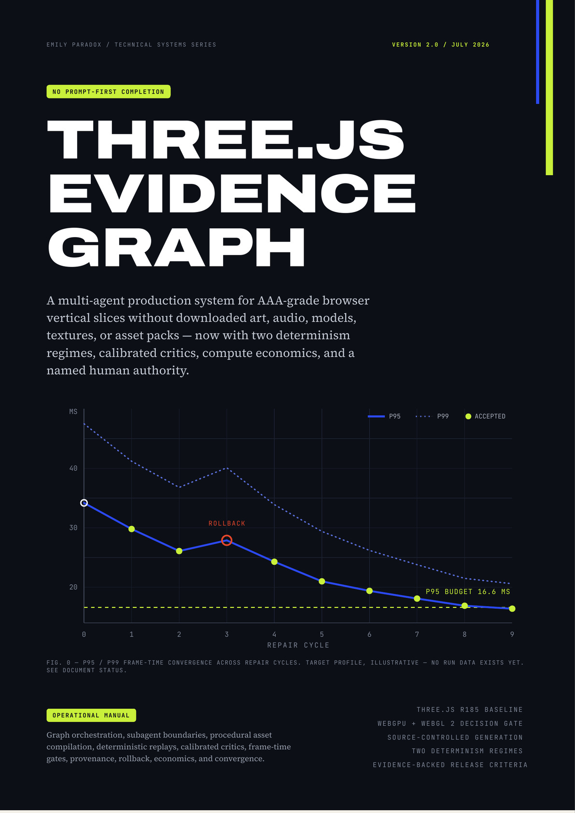

# Three.js Evidence Graph: Operational Manual v2.0 - Companion Guide

[-45B29D?style=for-the-badge)](EVIDENCE_GRAPH_GUIDE.zh-CN.md)
[-38C6D9?style=for-the-badge)](EVIDENCE_GRAPH_GUIDE.ja.md)
[-C89B54?style=for-the-badge)](EVIDENCE_GRAPH_GUIDE.ko.md)

[-D49B4B?style=flat-square)](../publications/threejs-evidence-graph-operational-manual-v2.0-en.pdf)

| Publication Cover Plate (`64 Pages`) | Multi-Agent Control Plane Hero Plate |
| :---: | :---: |
|  |  |

## 1. Purpose & Core Thesis

*Three.js Evidence Graph: Operational Manual v2.0* ([`publications/threejs-evidence-graph-operational-manual-v2.0-en.pdf`](../publications/threejs-evidence-graph-operational-manual-v2.0-en.pdf), 64 pages, `416,827` bytes, SHA-256 `d3830d411a61c52c92d6d9f4454d317a5e5bb7dbc3660824e7d24b7a959eb6cd`) defines a repository-local, evidence-driven multi-agent production system for building narrow, source-generated Three.js browser-game vertical slices without downloaded runtime assets.

Instead of allowing an LLM conversation to act as builder, reviewer, and release authority simultaneously, the Evidence Graph separates authority across four layers:

- **Deterministic Control Plane (`orchestrator`)**: Owns graph state (`schemas/graph-state.d.ts`), dispatches scoped `TaskPacket` contracts (`schemas/task-packet.schema.json`), enforces compute and retry budgets, and triggers automatic git worktree rollback on non-convergent repair cycles.
- **Bounded Specialist Builders (6 Roles)**: `combat_gameplay`, `world_quest`, `procedural_art_vfx`, `procedural_audio`, `ui_hud_accessibility`, and `qa_perf_playwright`. Each specialist writes only to its `allowed_paths` and must pass mechanical acceptance commands before handoff.
- **Calibrated Read-Only Critics (`independent_critic`)**: Evaluate captured visual frames, offline audio renders, gameplay replay telemetry, and zero-external-asset provenance in presentation-order-reversed pairs without write access to source code.
- **Dual Evidence Regimes**:
  - **Regime A (`A-PinnedBrowser`)**: Bit-exact SHA-256 verification inside a pinned Chromium + GPU/SwiftShader container for 60 Hz simulation state (`state_hash`), 16-bit PCM quantized `OfflineAudioContext` buffers (`audio_hash`), and `1e-5` quantized procedural geometry (`geometry_hash`).
  - **Regime B (`B-CrossPlatform`)**: Bounded invariant and perceptual tolerance checks across heterogeneous hardware and browsers (`webgpu` primary and `webgl2-fallback`).

---

## 2. Eight-Section Architecture of the 64-Page Manual

| Section | Pages | Scope & Normative Deliverables |
| :--- | :--- | :--- |
| **Delta v1 -> v2 Defect Ledger** | p. 04 | Catalogs the 10 structural failures of prompt-only v1 workflows (`DOC-001` through `DOC-010`) and maps each defect to its v2.0 architectural control. |
| **00. Diagnosis** | pp. 05-09 | Explains why single-conversation game generation fails (context drift, silent shader stalls, unverified self-praise, and uncalibrated visual review). |
| **01. Control Plane** | pp. 10-17 | Defines the 15-node directed cyclic Evidence Graph (`N00_BRIEF` to `N14_RELEASE_CANDIDATE`), authority hierarchy, file-ownership isolation, and repository layout. |
| **02. Three.js Architecture** | pp. 18-29 | Pins Three.js `r185` (`0.185.0`), `THREE.WebGPURenderer` with `{ forceWebGL: true }` fallback, TSL node materials, `compileAsync` + `postProcessing.renderAsync()` pre-warming, and frame-time budgets (`P50 <= 8.3 ms`, `P95 <= 16.6 ms`, `P99 <= 22.0 ms`). |
| **03. Asset-Free Production** | pp. 30-36 | Treats procedural generation as deterministic compilation: seeded PRNGs, constructive solid/lathe/extrude geometry grammars, TSL procedural surface shaders, and Web Audio synthesis (`-16 LUFS +/- 2`, `-1.0 dBTP`). |
| **04. Evidence + Convergence** | pp. 37-45 | Specifies Playwright telemetry capture (`window.__rpgReady`, `window.__rpgQA`), Regime A/B determinism gates, calibrated critic rubrics, and root-cause `DefectRecord` repair loops (maximum 3 iterations before rollback). |
| **05. Operations** | pp. 46-48 | Defines compute-economics model routing, run-level `cost_ledger` accounting, supply-chain provenance auditing, and named `human_signoff` authority. |
| **06. Prompt Language** | pp. 49-52 | Provides the four-part orchestrator system prompt and specialist delegation templates (available standalone in [`prompts/evidence-graph/orchestrator.md`](../prompts/evidence-graph/orchestrator.md)). |
| **07. Implementation Program** | pp. 53-57 | Lays out the step-by-step execution sequence from `N00_BRIEF` to `N14_RELEASE_CANDIDATE` and the v1-to-v2 migration checklist. |
| **Appendices A-B & Primary Sources** | pp. 58-64 | Normative JSON Schemas (upgraded in [`schemas/`](../schemas/) to Draft 2020-12) and 23 primary technical references with clickable URI annotations. |

---

## 3. Canonical 15-Node Production Graph (`N00` to `N14`)

1. `N00_BRIEF` (`01 BRIEF_COMPILE`): Compile product brief, scope exclusions, and slice duration targets.
2. `N01_CONTRACTS` (`02 CONSTITUTION_AUDIT`): Freeze JSON Schemas (`task-packet`, `defect-record`, `run-manifest`) and seed invariants.
3. `N02_SCAFFOLD` (`03 ARCHITECTURE_DECISION`): Establish deterministic 60 Hz clock, PRNG, and Three.js `r185` `WebGPURenderer` boot harness.
4. `N03_ASSET_COMPILER` (`04 ART+GAMEPLAY_BIBLE_FREEZE`): Freeze procedural geometry grammars, palette rules, and TSL material contracts.
5. `N04_WORLD_GRAPH` (`05 MILESTONE_PLAN`): Build authored spatial route, collision volumes, and checkpoint state graph.
6. `N05_RENDER_PIPELINE` (`06B PROCEDURAL + RENDER + AUDIO` - Render): Configure lighting, `PMREMGenerator`, `InstancedMesh`/`BatchedMesh`, and `THREE.PostProcessing`.
7. `N06A_GAMEPLAY_COMBAT` (`06A GAMEPLAY + CAMERA WORKERS`): Implement integer-tick combat state machine, enemies, boss phases, and camera collision.
8. `N06B_AUDIO_SYNTH` (`06B PROCEDURAL + RENDER + AUDIO` - Audio): Implement procedural Web Audio synthesis and `OfflineAudioContext` loudness/PCM hash harness.
9. `N07_UI_HUD_A11Y` (`07 INTEGRATION`): Integrate HUD, remappable controls, high-contrast/reduced-motion modes, and versioned local save schema.
10. `N08_TELEMETRY_HARNESS` (`08 STATIC_VERIFICATION`): Run static verification and wire `window.__rpgReady` / `window.__rpgQA` hooks.
11. `N09_REPLAY_RUNNER` (`09 DETERMINISTIC_REPLAY`): Execute seeded deterministic replay scenarios and record `state_hash`, `audio_hash`, and `geometry_hash`.
12. `N10_PERF_GATE` (`10 EVIDENCE_CAPTURE`): Capture 1920x1080 frame-time percentiles, draw calls, triangle counts, and GPU memory telemetry.
13. `N11_VISUAL_AUDIO_CRITIC` (`11 INDEPENDENT_CRITICISM`): Run calibrated read-only visual, audio, and gameplay critics on captured artifacts.
14. `N12_PROVENANCE_AUDIT` (`12 EVIDENCE_REDUCTION`): Verify zero external runtime network requests and zero downloaded media assets.
15. `N13_REPAIR_ROUTER` (`13 DECIDE` / `14 CROSS-BROWSER_RELEASE_AUDIT`): Route any `P0`-`P2` `DefectRecord` to its single write owner (up to 3 repair cycles) or roll back to `accepted_baseline_commit`.
16. `N14_RELEASE_CANDIDATE` (`15 RELEASE_CANDIDATE`): Emit validated `run-manifest.json` with `cost_ledger` and `human_signoff`.

---

## 4. Standalone Repository Artifacts

- **Normative JSON Schemas (Draft 2020-12) & TypeScript State**:
  - [`schemas/task-packet.schema.json`](../schemas/task-packet.schema.json)
  - [`schemas/defect-record.schema.json`](../schemas/defect-record.schema.json)
  - [`schemas/run-manifest.schema.json`](../schemas/run-manifest.schema.json)
  - [`schemas/graph-state.d.ts`](../schemas/graph-state.d.ts)
- **Copy-Pasteable Orchestrator Prompt**:
  - [`prompts/evidence-graph/orchestrator.md`](../prompts/evidence-graph/orchestrator.md)
- **Golden Reference Fixtures**:
  - [`examples/run-0001/task-packet.json`](../examples/run-0001/task-packet.json)
  - [`examples/run-0001/defect-record.json`](../examples/run-0001/defect-record.json)
  - [`examples/run-0001/run-manifest.json`](../examples/run-0001/run-manifest.json)
- **Technical Errata & Cross-Edition Alignment**:
  - [`docs/TECHNICAL_ERRATA_AND_V2_ALIGNMENT.md`](TECHNICAL_ERRATA_AND_V2_ALIGNMENT.md)
- **Three Genre Vertical Slice Companion Guides**:
  - [docs/THE_HOLLOW_MERIDIAN_GUIDE.md](THE_HOLLOW_MERIDIAN_GUIDE.md) (*The Hollow Meridian v1.0* - Action RPG, 81 pages, examples/run-0001/)
  - [docs/THE_GLASS_OSSUARY_GUIDE.md](THE_GLASS_OSSUARY_GUIDE.md) (*The Glass Ossuary v1.0* - Mystery Horror, 36 pages, examples/run-0002/)
  - [docs/PERIHELION_BREACH_GUIDE.md](PERIHELION_BREACH_GUIDE.md) (*Perihelion Breach v1.0* - FPS Adventure, 36 pages, examples/run-0003/)
