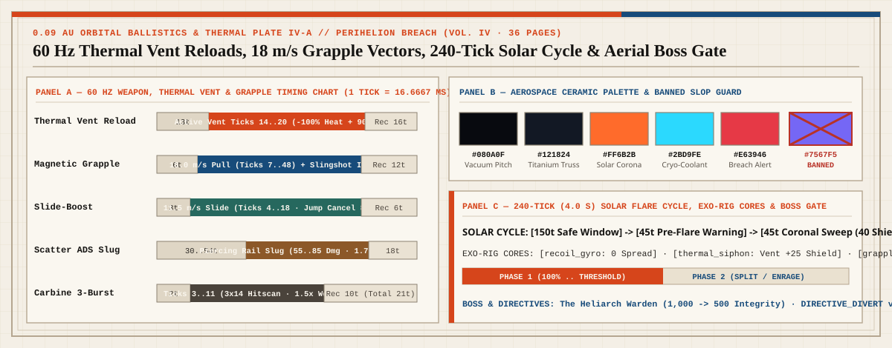

# Perihelion Breach: FPS Adventure Companion Guide

| Publication Cover (36 pp.) | World Hero (`Heliostat Truss`) | Boss Hero (`The Heliarch Warden`) |
| :---: | :---: | :---: |
|  |  |  |

*Concept artwork for the publication. Not a gameplay capture or implementation evidence.*

> **Guide status**
>
> This is a native English companion guide to *Perihelion Breach: FPS Adventure Full Multi-Agent Production Prompt v1.0* ([`publications/perihelion-breach-fps-adventure-full-prompt-v1.0-en.pdf`](../publications/perihelion-breach-fps-adventure-full-prompt-v1.0-en.pdf), 36 pages, `95,265` bytes, SHA-256 `75bdfff21c905122b4e1a0352e8c760c27e7c80cf8c3d5dcad63ea2263f89170`). It explains the first-person shooter adventure design contract, 60 Hz ballistics and grapple traversal kinematics, active Thermal Vent reload mechanics, Exo-Rig Core branches, two-phase boss architecture, and Evidence Graph v2.0 verification gates. It is an architectural specification and prompt package, not a playable runtime build.

---

## 1. What the Publication Is

*Perihelion Breach* is the **First-Person Shooter Adventure** flagship specification in the *Three.js Evidence Graph* suite. It defines a 12 to 15 minute high-velocity sci-fi FPS adventure vertical slice in Three.js `r185` (`0.185.0`) set aboard the sun-grazing **Icarus-9 Orbital Solar Relay** at `0.09 AU`. Every orbital titanium truss, gold-foil heliostat mirror, first-person weapon viewmodel, TSL muzzle/rail shader, and electromagnetic coilgun transient is generated from repository code with zero downloaded external assets.

The design fuses **precision 60 Hz ballistic gunplay** with **spatial grapple/conduit adventure traversal**:

- **Playable Duration**: 12 to 15 minutes across 5 contiguous orbital station sectors.
- **Protagonist**: **Soren Kestrel** (`The Relay Vanguard`), operating with `100 Shield`, `100 Hull Integrity`, and `0 to 100 Core Heat` alongside tactical telemetry from **Station AI Vesper**.
- **Three Multi-Function Weapons & Traversal Tools**: `Kestrel-9 Twin-Coil Carbine` (`coil_carbine` with alt-fire `Magnetic Grapple Tether`), `Helios Scatter-Rail` (`scatter_rail`), and `Arc-Vane Breach Launcher` (`breach_launcher`).
- **Active Thermal Vent Reload & Grapple Kinematics**: Hitting the active vent input during `ticks 14..20` of a `36-tick` reload purges `100% Core Heat` and grants `90 ticks` of ionized overcharge; upper-body weapon timers are decoupled from lower-body `Slide-Boost` (`11.5 m/s`) and `Magnetic Grapple` (`18.0 m/s`) states.
- **One Suit Rig Calibration Choice**: Three mutually exclusive Exo-Rig Cores (`Recoil Gyro`, `Thermal Siphon`, `Grapple Overdrive`) that reshape recoil, heat economy, and aerial momentum.
- **Three Synth Archetypes & One Two-Phase Boss**: `Volt Skitter`, `Aegis Drone`, `Slag Enforcer`, and **The Heliarch Warden** (`1,000 Armor Integrity`).
- **Two Orbital Directive Endings**: `DIRECTIVE_DIVERT` (lock the heliostat array to shield the Earth-facing orbital grid) or `DIRECTIVE_VENT` (jettison the reactor core to launch the crew lifeboat).

---

## 2. Setting, Atmosphere & Material Grammar

Aboard **Icarus-9**, blinding `5800K` solar corona glare clashes against deep vacuum shadow and blue Cherenkov coolant plumes. Players read spatial hazards through hard shadow boundaries during `240-tick` solar flare shutter cycles.

| Material Family | Hex Token | Procedural Surface & Shader Grammar (Three.js `r185` TSL) |
| :--- | :--- | :--- |
| **Vacuum Carbon** | `#090D14` | Matte micrometeorite-shielded carbon paneling with anisotropic carbon-weave normals |
| **Orbital Titanium** | `#1A2433` | Brushed structural trusses, blast shutters, and machined viewmodel receivers |
| **Corona Amber** | `#F08A24` | Kapton gold-foil heliostat reflectors and solar flare thermal hazard telegraphs |
| **Cherenkov Cyan** | `#38C6D9` | Ionized rail-slug trails, cryo-coolant conduits, and active Thermal Vent purge arcs |
| **Overheat Plasma Red** | `#E54848` | Core Heat critical warnings (`>= 85 Heat`), enemy weak-point vents, and mortar arcs |

*Palette guardrail*: Generic AI purple (`#7567F5`) and neon cyberpunk magenta are strictly banned across all procedural shaders, HUD reticles, and plasma effects.

---

## 3. Ten-Beat Orbital Mission Route (`restore_perihelion_attitude`)

| Beat | Orbital Sector | Tactical & Adventure Objective |
| ---: | :--- | :--- |
| **01** | **Umbilical Airlock** | Dock at the zero-G spine, initialize `Station AI Vesper`, and equip the `Kestrel-9 Twin-Coil Carbine` |
| **02** | **Airlock Spine** | Sever magnetic umbilical clamps; calibrate `Slide-Boost` (`24 ticks`) and `Thermal Vent Reload` (`ticks 14..20`) |
| **03** | **Heliostat Truss** | Cross exterior mirror catwalks between `240-tick` solar flare sweeps against `Volt Skitter` packs; unlock `Magnetic Grapple` |
| **04** | **Cryo-Coolant Manifold** | Vertical grapple slingshot ascent through turbine shafts guarded by `Aegis Drone` snipers; claim `Arc-Vane Breach Launcher` |
| **05** | **Conduit Phase Routing** | Fire 3 parabolic plasma anchors to link the capacitor ring within a `180-tick` decay window and extract `Coolant Bypass Core` |
| **06** | **Ballistic Foundry** | Multi-tier crucible siege against `Slag Enforcer` heavy synths; secure `Helios Scatter-Rail` and `Ignition Keycard` |
| **07** | **Engineering Bench** | Calibrate the suit rig by installing one Exo-Rig Core: `Recoil Gyro`, `Thermal Siphon`, or `Grapple Overdrive` |
| **08** | **Corona Blast Shutter** | Retract the primary tungsten shutter overlooking the solar corona and enter `Perihelion Core Chamber` |
| **09** | **Perihelion Core Chamber** | Defeat **The Heliarch Warden** (`1,000 Armor Integrity`) across two high-velocity orbital combat phases |
| **10** | **Attitude Control Bridge** | Execute `DIRECTIVE_DIVERT` or `DIRECTIVE_VENT`, persist the versioned save, and finalize the mission telemetry log |

---

## 4. Deterministic 60 Hz Weapon, Thermal Vent & Grapple Frame Table

All weapon cadences, active reload windows, and movement impulses run on integer 60 Hz ticks (`1 tick = 16.6667 ms`). Upper-body weapon reload timers are strictly decoupled from lower-body grapple detach and slide-boost transitions (`FPS-N06A-COMBAT-019`).

  

| Action | Startup | Active / Window | Recovery | Total Ticks | Heat / Damage / Mechanical Effect |
| :--- | :--- | :--- | :--- | :--- | :--- |
| **Carbine 3-Burst** | `2 ticks` | `Ticks 3..11` (3x) | `10 ticks` | `21 ticks` | `+12 Heat`; `3 x 14 dmg` hitscan (`1.5x` precision weak-point multiplier) |
| **Scatter Uncharged** | `3 ticks` | `Tick 4` (`5x12`) | `15 ticks` | `18 ticks` | `+18 Heat`; `60 dmg` close-range flechette spread; strips energy shields |
| **Scatter ADS Rail Slug** | `30..54 ticks` | `Tick 31..55` | `18 ticks` | `48..72 ticks` | `+28 Heat`; `55..85 dmg` piercing electromagnetic slug (`1.75x` weak point) |
| **Breach Anchor Shot** | `6 ticks` | Projectile flight | `24 ticks` | `30 ticks` | `+30 Heat`; `60 AoE dmg`, cracks heavy armor, or links puzzle conduits |
| **Thermal Vent Reload** | `13 ticks` | `Ticks 14..20` | `16 ticks` | `36 ticks` | Active input in `14..20t` clears `100% Heat` and grants `90t` overcharge |
| **Slide-Boost** | `3 ticks` | `Ticks 4..18` | `6 ticks` | `24 ticks` | `11.5 m/s` low-profile slide; jump-cancel window during `ticks 8..18` |
| **Magnetic Grapple** | `6 ticks` | `18..42 ticks` pull | `12 ticks` | `36..60 ticks` | `18.0 m/s` tether pull to anchor; preserves tangential slingshot momentum |

---

## 5. Enemy Roster & Two-Phase Boss: The Heliarch Warden

### Three Synth Enemy Archetypes
1. **Volt Skitter**: Fast quadruped maintenance synth (`90 Hull`, `6.8 m/s`) that bounds along walls and truss beams to flush the player out of cover.
2. **Aegis Drone**: Hovering directional-shield sentinel (`140 Hull + 80 Shield`) that projects a front barrier and snipes from elevated catwalks; requires a grapple flank or `Scatter-Rail` shield overload.
3. **Slag Enforcer**: Armored foundry frame (`320 Hull`) armed with a molten-slag mortar; exposes its dorsal `Coolant Spine` (`1.75x` weak-point multiplier) for `90 ticks` after each heavy volley.

### Two-Phase Boss: The Heliarch Warden (`1,000 Armor Integrity`)
- **Construction**: A `6.0 m` gyroscopic solar-core automaton suspended inside the rotating reactor gimbals, surrounded by four articulated heliostat wing-vanes and a magnetic grapple ring.
- **Phase 1 (`1,000 -> 501 Integrity`)**: Executes `Solar Sweep Beam` (horizontal corona laser requiring `Slide-Boost` under-clearance or grapple elevation), `Grapple Pylon Drop` (spawns temporary magnetic tether anchors), `Cluster Mortar`, and `Radiant Pulse` (opens the dorsal `Core Vent` weak point for `150 ticks`).
- **Phase 2 (`500 -> 0 Integrity`)**: The reactor floor shutters retract over raw solar plasma, forcing aerial grapple traversal across three counter-rotating catwalk rings. Adds `Coronal Ejection`, `Rotating Mirror Ring`, `Rail Volley`, and `Perihelion Collapse` (exposes the central `Core Vent` for `150 ticks` of charged `Scatter-Rail` fire).

---

## 6. Suit Rig Calibration: Three Exo-Rig Core Branches

At Beat 07 (`Suit Rig Calibration`), the player installs one of three Exo-Rig Cores stored in `GraphState.active_relic`:

- **`Recoil Gyro` (`recoil_gyro`)**: Stabilizes weapon viewmodel kick by `-45%`, tightens uncharged `Scatter-Rail` spread by `-25%`, and increases precision weak-point multipliers from `1.5x` to `1.85x`.
- **`Thermal Siphon` (`thermal_siphon`)**: Widens the `Thermal Vent` active reload window from `ticks 14..20` (`7 ticks`) to `ticks 12..23` (`12 ticks`) and converts purged `Core Heat` into `+25 Shield` overshield.
- **`Grapple Overdrive` (`grapple_overdrive`)**: Increases `Magnetic Grapple` pull velocity from `18.0 m/s` to `22.5 m/s`, reduces tether cooldown by `-35%`, and releases an EMP shockwave on grapple-kick impact.

---

## 7. Standalone Prompts, Schemas & Golden Fixtures

- **Master Orchestrator Prompt**: [`prompts/perihelion-breach/orchestrator.md`](../prompts/perihelion-breach/orchestrator.md) (mirrored at [`orchestration/prompts/perihelion-breach-orchestrator.md`](../orchestration/prompts/perihelion-breach-orchestrator.md))
- **7 Specialist Agent Cards**: [`prompts/perihelion-breach/agents/`](../prompts/perihelion-breach/agents/) (`combat-gameplay.md`, `world-quest.md`, `procedural-art-vfx.md`, `procedural-audio.md`, `ui-hud-accessibility.md`, `qa-perf-playwright.md`, `independent-critic.md`)
- **Golden Reference Fixtures (`run-0003`)**: [`examples/run-0003/task-packet.json`](../examples/run-0003/task-packet.json), [`examples/run-0003/defect-record.json`](../examples/run-0003/defect-record.json), [`examples/run-0003/run-manifest.json`](../examples/run-0003/run-manifest.json)
- **Companion Suite Guides**:
  - [`docs/EVIDENCE_GRAPH_GUIDE.md`](EVIDENCE_GRAPH_GUIDE.md) (*Three.js Evidence Graph v2.0*, 64 pages)
  - [`docs/THE_HOLLOW_MERIDIAN_GUIDE.md`](THE_HOLLOW_MERIDIAN_GUIDE.md) (*The Hollow Meridian v1.0*, 81 pages)
  - [`docs/THE_GLASS_OSSUARY_GUIDE.md`](THE_GLASS_OSSUARY_GUIDE.md) (*The Glass Ossuary v1.0*, 36 pages)
