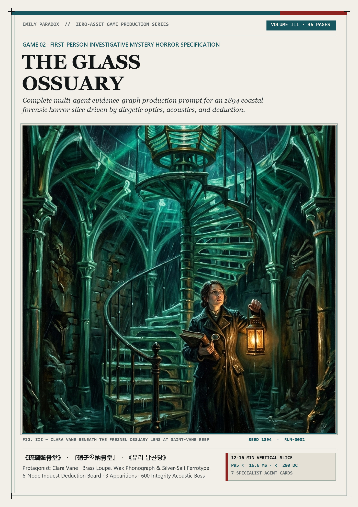
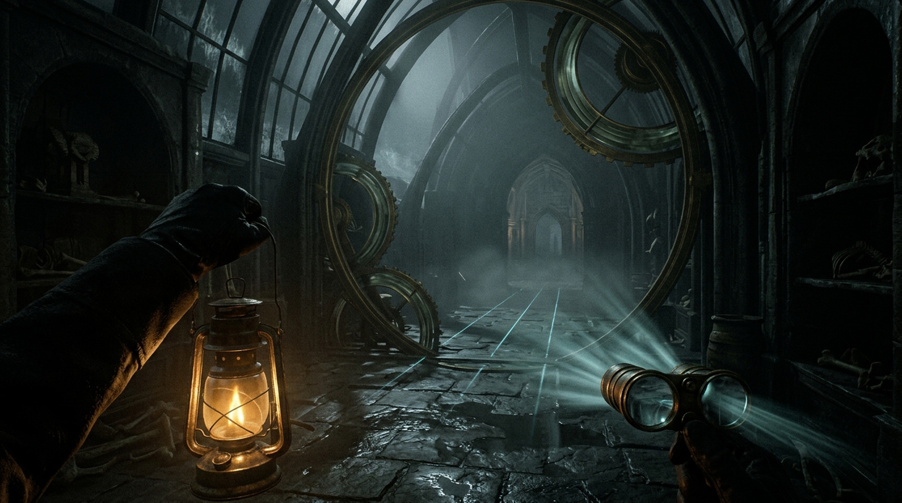
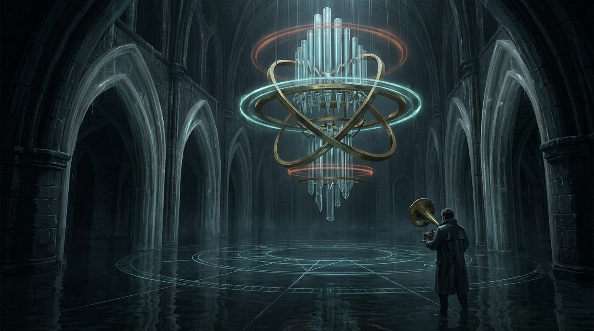
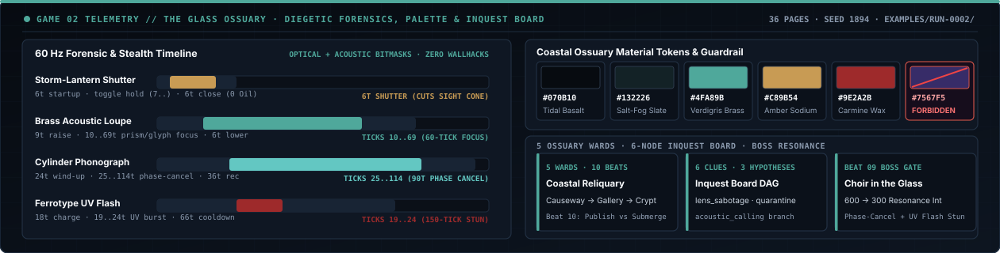

# The Glass Ossuary: Mystery Horror Companion Guide

| Publication Cover (36 pp.) | Investigation Hero (`Refraction Gallery`) | Boss Hero (`The Choir in the Glass`) |
| :---: | :---: | :---: |
|  |  |  |

*Concept artwork for the publication. Not a gameplay capture or implementation evidence.*

> **Guide status**
>
> This is a native English companion guide to *The Glass Ossuary: Mystery Horror Full Multi-Agent Production Prompt v1.0* ([`publications/the-glass-ossuary-mystery-horror-full-prompt-v1.0-en.pdf`](../publications/the-glass-ossuary-mystery-horror-full-prompt-v1.0-en.pdf), 36 pages, `98,649` bytes, SHA-256 `efead090be003782a122463ba17fe686caa1c30aeafcf66f11d294555c7aafda`). It explains the investigative horror design contract, 60 Hz acoustic and optical instruments, 6-node Deduction Board, two-phase boss architecture, and Evidence Graph v2.0 verification harness. It is an architectural specification and prompt package, not a playable runtime build.

---

## 1. What the Publication Is

*The Glass Ossuary* is the **Mystery on Horror** flagship specification in the *Three.js Evidence Graph* suite. It defines a 12 to 16 minute first-person investigative psychological horror vertical slice built in Three.js `r185` (`0.185.0`) where every stone vault, bone-glass rib, Fresnel prism, wax-cylinder phonograph, and acoustic apparition is compiled from repository source code with zero downloaded runtime assets.

Unlike scripted jump-scare corridors, *The Glass Ossuary* binds tension to **physical forensic instrumentation** and **deterministic 60 Hz acoustic/optical state**:

- **Playable Duration**: 12 to 16 minutes across 5 contiguous coastal observatory spaces.
- **Protagonist**: **Clara Vane** (`The Acoustic Archivist`), operating with `100 Composure`, `100 Lantern Oil`, and `0 to 100 Exposure`.
- **Three Diegetic Instruments**: `Split-Diopter Brass Loupe` (`brass_loupe`), `Wax-Cylinder Phonograph` (`wax_phonograph`), and `Silver-Salt Ferrotype Plate` (`ferrotype_plate`).
- **One 6-Node Deduction Board**: Three mutually exclusive forensic hypotheses (`Lens Sabotage`, `Tidal Quarantine`, `Acoustic Calling`) that permanently alter apparition behavior and boss weak-point timings.
- **Three Apparition Archetypes & One Two-Phase Boss**: `Mire Listener`, `Glass Septum Watcher`, `Drowned Chorister`, and **The Choir in the Glass** (`600 Resonance Integrity`).
- **Two Forensic Verdict Endings**: `VERDICT_PUBLISH` (transmit the Saint-Vane acoustic ledger) or `VERDICT_SUBMERGE` (flood the ossuary vaults to contain the harmonic choir).

---

## 2. Setting, Atmosphere & Material Grammar

The slice takes place in **Saint-Vane Coastal Observatory** during an autumn gale in 1894. The observatory's upper lighthouse optics were fused with a subterranean tidal ossuary lined with resonant bone-glass ribs designed to trap the voices of drowned mariners.

| Material Family | Hex Token | Procedural Surface & Shader Grammar (Three.js `r185` TSL) |
| :--- | :--- | :--- |
| **Abyssal Tide Slate** | `#070B10` | Wet columnar basalt masonry with height-mapped tide marks and specular salt sheen |
| **Salt-Frosted Basalt** | `#16202A` | Rough structural ribs with procedural voronoi salt-crust normal perturbations |
| **Tallow Amber** | `#C89B54` | Warm 2100K storm-lantern cone with shuttered penumbra and oil-burn flicker curve |
| **Silver-Halide Cyan** | `#4FA89B` | Refractive bone-glass dispersion (`ior: 1.54`) and UV ferrotype negative highlights |
| **Arterial Rust** | `#B8423A` | Iron sluice chains, wax-cylinder seals, and critical Exposure warning vignettes |

*Palette guardrail*: Generic AI purple (`#7567F5`) and neon cyberpunk magenta are strictly banned across all procedural shaders, UI overlays, and refractive caustics.

---

## 3. Ten-Beat Investigative Route (`case_saint_vane`)

| Beat | Space | Forensic Objective & Mechanical Gate |
| ---: | :--- | :--- |
| **01** | **Tidewater Causeway** | Landfall in the gale; calibrate hydrophone footsteps, `Lantern Shutter` (`6 ticks` toggle), and oil burn rate |
| **02** | **Caretaker's Stripping Room** | Safe hub; inspect the 6-node `Inquest Board` and play `Caretaker Moreau`'s wax cylinder (`case_saint_vane`) |
| **03** | **Vestibule Threshold** | Calibrate the `Silver-Salt Ferrotype Plate` (`ticks 19..24` active UV flash, `150 ticks` stun within `6.5 m`) |
| **04** | **Refraction Gallery** | Evade `Glass Septum Watcher` sight-cones using shuttered lantern stealth and `Split-Diopter Brass Loupe` (`75 ticks`) |
| **05** | **Prism Triangulation** | Align the 3 concentric Fresnel lens rings (`45 deg`, `135 deg`, `270 deg`) to reveal the `Tide Ledger Fragment` |
| **06** | **Submerged Crypt** | Wade knee-deep floodwaters past `Mire Listener` and `Drowned Chorister`; tune `110/220/330 Hz` sluices for `Hydrophone Cylinder` |
| **07** | **Inquest Board Deduction** | Connect all 6 clues and lock one hypothesis: `Lens Sabotage`, `Tidal Quarantine`, or `Acoustic Calling` |
| **08** | **Ossuary Airlock** | Unseal the acoustic bulkhead using the `Saint-Vane Master Seal` and descend into the resonant bone-glass cathedral |
| **09** | **The Glass Ossuary** | Confront **The Choir in the Glass** (`600 Resonance Integrity`) across two acoustic and optical phases |
| **10** | **Archive Telegraph** | Commit to `VERDICT_PUBLISH` or `VERDICT_SUBMERGE`, write the versioned local save, and seal the case record |

---

## 4. Deterministic 60 Hz Instrument & Evasion Frame Table

Every action operates on integer 60 Hz simulation ticks (`1 tick = 16.6667 ms`). Optical visibility (`LANTERN_OPEN` / `LANTERN_SHUTTERED`) and acoustic masking (`PHONOGRAPH_CANCEL_ACTIVE`) occupy orthogonal bitmask channels so toggling the lantern never overwrites active phase cancellation.

  

| Action | Startup | Active Window | Recovery | Total Ticks | Resource Cost & Mechanical Effect |
| :--- | :--- | :--- | :--- | :--- | :--- |
| **Lantern Shutter** | `6 ticks` | Toggle (`7..`) | `6 ticks` | `12 ticks` | `0 Oil`; cuts light cone and optical sight-cone aggro |
| **Brass Loupe Focus** | `9 ticks` | Hold (`10..69`) | `6 ticks` | `75 ticks` | `0 Oil`; decodes refractive prism markings and micro-fractures |
| **Phonograph Cancel** | `24 ticks` | `Ticks 25..114` | `36 ticks` | `150 ticks` | Cancels room harmonic; masks footsteps from `Mire Listener` |
| **Ferrotype Flash** | `18 ticks` | `Ticks 19..24` | `66 ticks` | `90 ticks` | Exposes hidden bone-glass seams; stuns apparitions `150 ticks` within `6.5 m` |
| **Crouch Sidestep** | `5 ticks` | `Ticks 6..16` | `12 ticks` | `28 ticks` | Keeps footstep emission `<= -38 dBFS` across wet stone and grates |
| **Smelling Salts** | `15 ticks` | `Ticks 16..45` | `10 ticks` | `55 ticks` | Restores `+40 Composure` and purges `-25 Exposure` |

---

## 5. Apparition Ecology & Two-Phase Boss: The Choir in the Glass

### Three Apparition Archetypes
1. **Mire Listener**: Blind amphibious acoustic hunter that tracks footsteps, water splashes, and unmasked phonograph spindles whenever player emission exceeds `-28 dBFS`.
2. **Glass Septum Watcher**: Refracted silhouette embedded inside rotating Fresnel glass panes; advances only when caught inside an unshuttered lantern cone or direct line-of-sight, freezing when the shutter closes.
3. **Drowned Chorister**: Slow procession spectre projecting a `4.5 m` harmonic aura that drains `Composure` and builds `Exposure` unless counter-phased with the `Wax-Cylinder Phonograph`.

### Two-Phase Boss: The Choir in the Glass (`600 Resonance Integrity`)
- **Construction**: A `5.2 m` suspended bone-glass pipe organ and tidal bell-jar assembly housing seven fused chorister silhouettes around a silver-halide heart.
- **Phase 1 (`600 -> 301 Integrity`)**: Executes `Refractive Blind` (sweeping prism beam requiring lantern shuttering), `Tidal Undertow` (ankle-deep wave pull), `Shatter Harmonic` (localized glass spike telegraph), and `Hollow Hymn` (chordal blast that exposes the central resonator for `150 ticks` if phase-cancelled).
- **Phase 2 (`300 -> 0 Integrity`)**: The outer bell-jar fractures into three orbiting Fresnel mirrors. Adds `Prism Split`, `Glass Lung Vacuum`, `Echoing Verdict`, and `Final Exposure`. The player uses `Wax-Cylinder Phonograph` phase cancellation (`ticks 25..114`) followed by a point-blank `Silver-Salt Ferrotype Plate` UV flash (`ticks 19..24`) during the `150-tick` weak-point window to shatter the three harmonic seals.

---

## 6. Six-Node Inquest Board & Three Hypothesis Branches

At Beat 07 (`Inquest Board Deduction`), linking the six physical clues unlocks one of three forensic hypotheses stored in `GraphState.active_relic`:

- **`Lens Sabotage` (`lens_sabotage`)**: Proves the lighthouse Fresnel array was intentionally miscalibrated to wreck the *SS Meridian*. Increases `Brass Loupe` reveal range by `+35%` and extends `Ferrotype Flash` stun duration by `+30 ticks`.
- **`Tidal Quarantine` (`tidal_quarantine`)**: Proves `Caretaker Moreau` sealed the flooded crypt to quarantine an acoustic contagion. Reduces `Exposure` accumulation in water by `-30%` and grants `+25%` `Lantern Oil` efficiency.
- **`Acoustic Calling` (`acoustic_calling`)**: Proves the bone-glass ribs were tuned as a harmonic transceiver. Widens the `Wax-Cylinder Phonograph` phase-cancellation window by `+24 ticks` and boosts boss Resonance Integrity damage by `+20%`.

---

## 7. Standalone Prompts, Schemas & Golden Fixtures

- **Master Orchestrator Prompt**: [`prompts/glass-ossuary/orchestrator.md`](../prompts/glass-ossuary/orchestrator.md) (mirrored at [`orchestration/prompts/glass-ossuary-orchestrator.md`](../orchestration/prompts/glass-ossuary-orchestrator.md))
- **7 Specialist Agent Cards**: [`prompts/glass-ossuary/agents/`](../prompts/glass-ossuary/agents/) (`combat-gameplay.md`, `world-quest.md`, `procedural-art-vfx.md`, `procedural-audio.md`, `ui-hud-accessibility.md`, `qa-perf-playwright.md`, `independent-critic.md`)
- **Golden Reference Fixtures (`run-0002`)**: [`examples/run-0002/task-packet.json`](../examples/run-0002/task-packet.json), [`examples/run-0002/defect-record.json`](../examples/run-0002/defect-record.json), [`examples/run-0002/run-manifest.json`](../examples/run-0002/run-manifest.json)
- **Companion Suite Guides**:
  - [`docs/EVIDENCE_GRAPH_GUIDE.md`](EVIDENCE_GRAPH_GUIDE.md) (*Three.js Evidence Graph v2.0*, 64 pages)
  - [`docs/THE_HOLLOW_MERIDIAN_GUIDE.md`](THE_HOLLOW_MERIDIAN_GUIDE.md) (*The Hollow Meridian v1.0*, 81 pages)
  - [`docs/PERIHELION_BREACH_GUIDE.md`](PERIHELION_BREACH_GUIDE.md) (*Perihelion Breach v1.0*, 36 pages)
