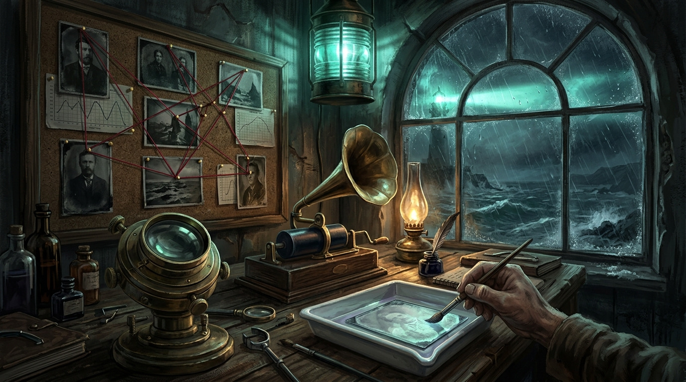
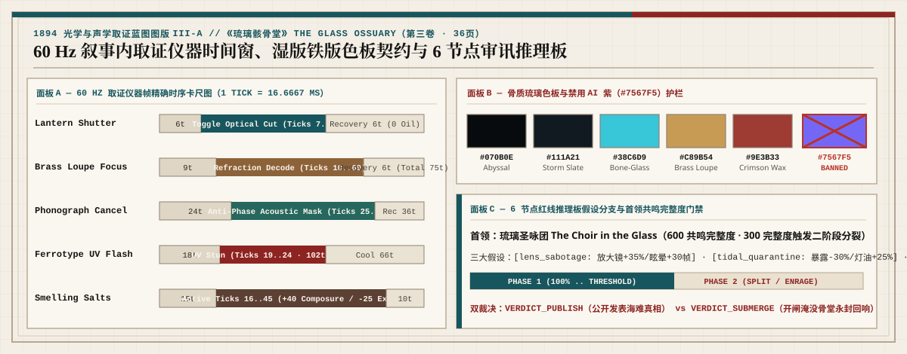

<!-- source_version: 2026.07.5; translation_status: reviewed; language: zh-CN -->

# 《琉璃骸骨堂》（The Glass Ossuary）：悬疑恐怖游戏研发与架构指南

| **MONOGRAPH EDITIONS** | [**English**](THE_GLASS_OSSUARY_GUIDE.md) | [**简体中文**](THE_GLASS_OSSUARY_GUIDE.zh-CN.md) | [**日本語**](THE_GLASS_OSSUARY_GUIDE.ja.md) | [**한국어**](THE_GLASS_OSSUARY_GUIDE.ko.md) |
| :--- | :---: | :---: | :---: | :---: |
| **VOLUME COLOPHON** | `第三卷 · 36 页 · 游戏 02：第一人称悬疑恐怖取证调查《琉璃骸骨堂》 · SEED 1894` | [Normative PDF](../publications/the-glass-ossuary-mystery-horror-full-prompt-v1.0-en.pdf) | [Master Folio](../README.zh-CN.md) | `Three.js r185 · Zero External Assets` |

| 第三卷典藏封面 (36页) | 图版 III-1：圣维恩暗礁与菲涅尔折射长廊 | 图版 III-2：守塔人剥离室与 1894 取证工作台 | 图版 III-3：琉璃圣咏团声学首领战 (600 完整度) |
| :---: | :---: | :---: | :---: |
|  |  |  |  |

> **文档定位说明**
>
> 本文是《The Glass Ossuary: Mystery Horror Full Multi-Agent Production Prompt v1.0》（[`publications/the-glass-ossuary-mystery-horror-full-prompt-v1.0-en.pdf`](../publications/the-glass-ossuary-mystery-horror-full-prompt-v1.0-en.pdf)，共 36 页，`98,649` 字节，SHA-256 `efead090be003782a122463ba17fe686caa1c30aeafcf66f11d294555c7aafda`）的简体中文原生技术指南。本文以国内游戏工业研发语境，详述该第一人称调查悬疑恐怖垂直切片的核心玩法闭环、60 Hz 声学与光学取证器械帧表、六节点推理板分支、双阶段 Boss 机制以及 Evidence Graph v2.0 验证规范。本仓库交付的是架构规格书与多智能体生产提示词套件，尚未包含可运行的 Three.js 成品代码。

---

## 1. 立项定位与核心设计哲学

《琉璃骸骨堂》（*The Glass Ossuary*）是 *Three.js Evidence Graph* 研发套件中的**悬疑恐怖（Mystery on Horror）**旗舰规格书。项目要求在 Three.js `r185`（`0.185.0`）环境下，以**零外部下载二进制资产**（不依赖外部 `.glb`、贴图、字体或预录音频文件）的纯代码编译方式，构建一段流程时长为 **12 至 16 分钟**的第一人称心理与调查恐怖垂直切片。

本作彻底摒弃廉价的脚本化突脸惊吓（Jump Scare），将恐怖压迫感建立在**物理取证器械操作**与 **60 Hz 确定性声光状态机**之上：

- **单局流程时长**：12 至 16 分钟，无缝串联 5 个海岸观测站建筑空间。
- **主角设定**：**Clara Vane**（声学档案调查员，`The Acoustic Archivist`），核心三维生存指标为 **`100 定力（Composure）`**、**`100 提灯鲸油（Lantern Oil）`** 与 **`0–100 精神侵蚀度（Exposure）`**。
- **三大沉浸式取证器械**：`双焦黄铜放大镜`（`brass_loupe`）、`蜡筒留声机`（`wax_phonograph`）与 `银盐铁版照相机`（`ferrotype_plate`）。
- **六节点线索推理板（Inquest Board）**：支持推导并锁定三条互斥的取证假说（`透镜蓄意破坏`、`潮汐隔离封锁`、`声学招魂共鸣`），直接改写灵体仇恨阈值与最终 Boss 的破防窗口。
- **三类声光灵体与双阶段主菜 Boss**：`泥沼听音者`（`Mire Listener`）、`琉璃隔膜窥视者`（`Glass Septum Watcher`）、`溺亡唱诗灵`（`Drowned Chorister`），以及盘踞核心圣堂的 **`玻璃圣咏团`（`The Choir in the Glass`，`600 共鸣完整度`）**。
- **双结局档案裁决**：`VERDICT_PUBLISH`（公开发布圣范恩声学海难账本）或 `VERDICT_SUBMERGE`（引爆潮汐水闸永沉骨堂）。

---

## 2. 世界观舞台与程序化材质规范

故事发生于 1894 年秋季暴风雨夜的**圣范恩海岸观测站（Saint-Vane Coastal Observatory）**。这座孤岛建筑将上层的菲涅尔灯塔光学透镜阵列与下层的潮汐地下骸骨堂融为一体，拱廊内壁镶嵌着由鲸骨粉与铅晶熔铸而成的“骨琉璃（Bone-Glass）”共鸣肋条，用来封存海难死者的遗音。

| 材质家族 | 色值 Token | Three.js `r185` TSL 程序化着色与几何生成规范 |
| :--- | :--- | :--- |
| **深渊潮汐板岩（Abyssal Tide Slate）** | `#070B10` | 柱状玄武岩砌体，带高度图驱动的潮汐水痕与湿润盐霜高光 |
| **盐霜玄武岩（Salt-Frosted Basalt）** | `#16202A` | 承重拱肋结构，叠加 Voronoi 晶格噪波法线扰动 |
| **牛油提灯琥珀（Tallow Amber）** | `#C89B54` | 2100K 暖色防风提灯锥形光源，支持百叶遮光闸门与油量衰减曲线 |
| **银盐显影青（Silver-Halide Cyan）** | `#4FA89B` | 骨琉璃折射色散（折射率 `ior: 1.54`）与铁版相机紫外闪光负片反相高光 |
| **动脉铁锈红（Arterial Rust）** | `#B8423A` | 水闸铁链、火漆封缄与高侵蚀度（Exposure）视野边缘警报暗角 |

*色彩护栏（Palette Guardrail）*：严禁在程序化着色器、UI 界面或骨琉璃折射焦散中使用廉价 AI 模板紫（`#7567F5`）与高饱和霓虹紫红。

---

## 3. 十拍调查推进路线（`case_saint_vane`）

| 节拍 | 空间区域 | 取证目标与核心机制门禁 |
| ---: | :--- | :--- |
| **01** | **潮汐栈桥（`Tidewater Causeway`）** | 暴风雨夜登岸；校准第一人称涉水脚步声、提灯百叶遮光闸（`6 ticks` 切换）与鲸油消耗速率 |
| **02** | **守墓人剥离室（`Caretaker's Stripping Room`）** | 安全屋中枢；检视六节点 `Inquest Board`（推理板），播放守墓人 Moreau 的遗留蜡筒录音（开启 `case_saint_vane`） |
| **03** | **前厅校准廊（`Vestibule Threshold`）** | 校准 `银盐铁版照相机`（`18 ticks` 充能，`19..24 ticks` 紫外闪光判定，`6.5 m` 内造成 `150 ticks` 显影定身） |
| **04** | **折射回廊（`Refraction Gallery`）** | 利用提灯遮光闸规避 `琉璃隔膜窥视者` 的视线折射锥，使用 `双焦黄铜放大镜`（`75 ticks` 对焦）勘验微裂纹 |
| **05** | **棱镜三角测量（`Prism Triangulation`）** | 旋转对齐三层同心菲涅尔透镜环（`45 deg`、`135 deg`、`270 deg`），显影隐藏的《潮汐账本残页》（`Tide Ledger Fragment`） |
| **06** | **淹没地窖（`Submerged Crypt`）** | 齐膝深水潜行，规避 `泥沼听音者` 与 `溺亡唱诗灵`；用留声机调谐 `110/220/330 Hz` 三道水闸共鸣器，取得 `水听器蜡筒` |
| **07** | **推理板定案（`Inquest Board Deduction`）** | 串联全部 6 项物证并锁定唯一假说：`透镜蓄意破坏`（`lens_sabotage`）、`潮汐隔离封锁`（`tidal_quarantine`）或 `声学招魂共鸣`（`acoustic_calling`） |
| **08** | **骨堂启封（`Ossuary Unsealing`）** | 使用《圣范恩主封印》开启声学气密门，深入底层的琉璃骸骨圣堂 |
| **09** | **琉璃骸骨堂（`The Glass Ossuary`）** | 迎战双阶段主菜 Boss **`玻璃圣咏团`（`The Choir in the Glass`，`600 共鸣完整度`）** |
| **10** | **档案电报室（`Archive Telegraph`）** | 做出 `VERDICT_PUBLISH`（公之于众）或 `VERDICT_SUBMERGE`（永沉海底）抉择，写入版本化本地存档 |

---

## 4. 60 Hz 确定性取证器械与潜行帧数表

所有交互动作均绑定 60 Hz 整数仿真帧（`1 tick = 16.6667 ms`）。光学可见度（`LANTERN_OPEN` / `LANTERN_SHUTTERED`）与声学反相掩蔽（`PHONOGRAPH_CANCEL_ACTIVE`）采用正交位掩码通道，确保开关提灯百叶闸绝不会覆盖正在生效的留声机反相消音状态。

  

| 动作名称 | 前摇（Startup） | 判定窗口（Active Window） | 后摇（Recovery） | 总帧数 | 资源消耗与机制效果 |
| :--- | :--- | :--- | :--- | :--- | :--- |
| **提灯百叶遮光（`Lantern Shutter`）** | `6 ticks` | 持续切换（`7..`） | `6 ticks` | `12 ticks` | `0 鲸油`；切断照明光锥并消除光学视线仇恨 |
| **黄铜放大镜对焦（`Brass Loupe Focus`）** | `9 ticks` | 按住对焦（`10..69`） | `6 ticks` | `75 ticks` | `0 鲸油`；解析棱镜刻度与骨琉璃内部微雕铭文 |
| **留声机反相抵消（`Phonograph Cancel`）** | `24 ticks` | `Ticks 25..114` | `36 ticks` | `150 ticks` | 抵消房间驻波谐振；向 `泥沼听音者` 掩蔽玩家脚步分贝 |
| **铁版紫外闪光（`Ferrotype Flash`）** | `18 ticks` | `Ticks 19..24` | `66 ticks` | `90 ticks` | 显影隐藏骨琉璃暗门；使 `6.5 m` 内灵体定身 `150 ticks` |
| **蹲姿静步侧移（`Crouch Sidestep`）** | `5 ticks` | `Ticks 6..16` | `12 ticks` | `28 ticks` | 在积水石板与铁格栅上将脚步声压控制在 `<= -38 dBFS` |
| **樟脑嗅盐（`Smelling Salts`）** | `15 ticks` | `Ticks 16..45` | `10 ticks` | `55 ticks` | 立即恢复 `+40 定力（Composure）` 并清除 `-25 精神侵蚀度` |

---

## 5. 灵体生态与双阶段 Boss：玻璃圣咏团（The Choir in the Glass）

### 三类灵体原型
1. **泥沼听音者（`Mire Listener`）**：双目失明的两栖声学猎手，完全依赖声音寻路。当玩家涉水、奔跑或未开启留声机掩蔽导致音量超过 `-28 dBFS` 时高速扑击。
2. **琉璃隔膜窥视者（`Glass Septum Watcher`）**：封存在旋转菲涅尔透镜夹层中的折射残影；仅在被提灯明火照射或处于无遮挡直视锥内时逼近，合上提灯百叶闸即刻冻结。
3. **溺亡唱诗灵（`Drowned Chorister`）**：沿回廊缓步巡游的圣咏亡魂，散发半径 `4.5 m` 的次声波共鸣场，持续削减玩家 `定力` 并叠加 `精神侵蚀度`，需以留声机反相波形中和。

### 双阶段 Boss：玻璃圣咏团（`The Choir in the Glass`，`600 共鸣完整度`）
- **结构设计**：高约 `5.2 m` 的悬吊式骨琉璃管风琴与潮汐钟罩复合体，内部环绕七具熔接在一起的唱诗班骸骨剪影，核心悬浮一颗银盐共鸣心脏。
- **第一阶段（`600 -> 301 完整度`）**：施展 `折射致盲束`（`Refractive Blind`，需合上提灯百叶并依托石柱遮蔽）、`潮汐暗流拖拽`（`Tidal Undertow`）、`碎裂谐波刺`（`Shatter Harmonic`）与 `空洞圣咏`（`Hollow Hymn`）。当 Boss 吟唱 `空洞圣咏` 时，使用留声机反相抵消（`ticks 25..114`）可使其核心共鸣器暴露 `150 ticks`。
- **第二阶段（`300 -> 0 完整度`）**：外层琉璃钟罩碎裂为三枚环绕旋转的菲涅尔反射镜，新增 `棱镜分裂束`（`Prism Split`）、`琉璃肺真空吸聚`（`Glass Lung Vacuum`）、`回响裁决`（`Echoing Verdict`）与 `终焉曝光`（`Final Exposure`）。玩家需先用留声机剥离其声学护盾，再贴近至 `6.5 m` 内用 `银盐铁版照相机`（`ticks 19..24`）连续击碎三枚共鸣封印。

---

## 6. 六节点推理板与三大取证假说分支

在第 07 拍（`Inquest Board Deduction`）中，玩家将 6 项核心线索相连后，必须在以下三条互斥假说中锁定一条（记录于 `GraphState.active_relic`）：

- **`透镜蓄意破坏`（`lens_sabotage`）**：证实灯塔菲涅尔透镜曾遭人为偏转以诱发“子午线号”触礁。使 `双焦黄铜放大镜` 的暗门勘验距离提升 `+35%`，并将 `铁版紫外闪光` 的定身时长延长 `+30 ticks`。
- **`潮汐隔离封锁`（`tidal_quarantine`）**：证实守墓人 Moreau 主动淹没地窖是为了封锁声学精神污染。使涉水移动时的 `精神侵蚀度` 增速降低 `-30%`，提灯鲸油燃烧效率提升 `+25%`。
- **`声学招魂共鸣`（`acoustic_calling`）**：证实骨琉璃拱肋原本就是为了放大海难死者频率而建的声学收发器。将 `蜡筒留声机` 的反相抵消有效窗口拓宽 `+24 ticks`，并对 Boss 造成 `+20%` 的共鸣完整度伤害。

---

## 7. 独立提示词、Schema 契约与黄金验证样本

- **主控编排器提示词（Orchestrator Prompt）**：[`prompts/glass-ossuary/orchestrator.md`](../prompts/glass-ossuary/orchestrator.md)（同步镜像于 [`orchestration/prompts/glass-ossuary-orchestrator.md`](../orchestration/prompts/glass-ossuary-orchestrator.md)）
- **7 张专家智能体卡（Specialist Agent Cards）**：[`prompts/glass-ossuary/agents/`](../prompts/glass-ossuary/agents/)
- **黄金参考样本（`run-0002`）**：[`examples/run-0002/task-packet.json`](../examples/run-0002/task-packet.json)、[`examples/run-0002/defect-record.json`](../examples/run-0002/defect-record.json)、[`examples/run-0002/run-manifest.json`](../examples/run-0002/run-manifest.json)
- **同系列四卷配套指南**：
  - [`docs/EVIDENCE_GRAPH_GUIDE.zh-CN.md`](EVIDENCE_GRAPH_GUIDE.zh-CN.md)（《Three.js Evidence Graph v2.0 操作手册》，64 页）
  - [`docs/THE_HOLLOW_MERIDIAN_GUIDE.zh-CN.md`](THE_HOLLOW_MERIDIAN_GUIDE.zh-CN.md)（《虚空子午线 v1.0》，81 页）
  - [`docs/PERIHELION_BREACH_GUIDE.zh-CN.md`](PERIHELION_BREACH_GUIDE.zh-CN.md)（《近日点破袭 v1.0》，36 页）
