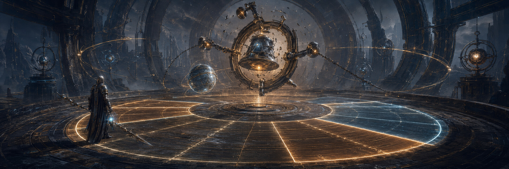

<!-- source_version: 2026.07.3; translation_status: unreviewed; language: zh-CN -->

# The Hollow Meridian：游戏说明指南

[English](THE_HOLLOW_MERIDIAN_GUIDE.md) | [简体中文](THE_HOLLOW_MERIDIAN_GUIDE.zh-CN.md) | [日本語](THE_HOLLOW_MERIDIAN_GUIDE.ja.md) | [한국어](THE_HOLLOW_MERIDIAN_GUIDE.ko.md)

*用于出版物说明的概念美术，并非游戏实机截图或实现证据。*

> **指南状态**
>
> 本文是 *The Hollow Meridian RPG Full Prompt v1.0* 的读者向配套指南，用于说明预期游戏体验、生产系统与现有局限。它不是可游玩的构建版本，不是完整 81 页 PDF 的中文译本，也不能证明目标体验已经实现。

## 本出版物是什么

*The Hollow Meridian* 既是一份紧凑的游戏设计契约，也是一份多智能体生产提示词。它规定使用 Three.js 为桌面浏览器制作一个第三人称黑暗奇幻动作 RPG 垂直切片。游戏中最终可见、可听的内容必须由仓库控制的代码、明确参数与具名种子生成。下载的成品模型、纹理、图像、字体、动画片段、预录音频和资产包均不在契约允许范围内。

本出版物在实现开始前锁定以下产品边界：

- 首次通关约需 10 至 14 分钟；
- 一个安全枢纽，以及一条穿过五个主要空间的经编排路线；
- 一个任务、一个空间谜题和三种敌人原型；
- 在三件遗物之间进行一次会产生实际影响的选择；
- 一个两阶段首领和两种结局结果；
- 一个本地存档槽，涵盖检查点、死亡、恢复、胜利与返回枢纽等行为。

目标是在一条范围有限的路线内实现足够深度。开放世界扩展、制作系统、商店、随机战利品、同伴、多人游戏、坐骑、角色创建及额外首领均被明确推迟。

## 世界与玩家幻想

故事发生在一座废弃天文台中。它曾保存消失城市的真名。建筑既承担世界观叙事，也承担导航功能。放射状肋架、同心圆环、子午线导轨、档案格室、索引臂、钟架、陶瓷面具与灰烬沟槽共同构成统一的视觉语法。

玩家操控 **Cartographer**，一名没有面孔的成年守卫者，身着由骨质陶瓷与失泽黄铜构成的层叠护甲。Cartographer 使用一柄分节长柄刃，并携带 Echo Lantern。这里的玩家幻想并非不受约束的力量，而是对方向与秩序的掌控：阅读空间、学习时机、找回名字，并决定天文台应该继续束缚还是释放其中封存之物。

主要材质族具有彼此不同的职责：

| 材质 | 预期视觉表现 |
|---|---|
| 深色玄武岩 | 大面积粗糙质感、强烈体量感，朝上的表面积有浅色积尘 |
| 失泽黄铜 | 建立结构节奏，局部带铜绿，频繁接触处形成抛光痕迹 |
| 骨质陶瓷 | 用于面具和护甲，裂纹由种子控制，暴露边缘呈暖色 |
| 余烬玻璃 | 在独立的自发光核心周围形成有边界的透明层 |
| Name-light | 由程序生成的线性字形与浅青白色引导光，不使用下载字体 |

稳定的 Name-light 为浅青白色。不稳定的钟体能量为琥珀白色。深红色仅用于伤害与严重警告。高饱和紫色不是默认的魔法视觉语言。

## 十个节拍的玩家旅程

即使几何体和材质由程序构建，路线本身仍是经过编排的。

| 节拍 | 空间与目的 | 玩家获得的结果 |
|---:|---|---|
| 1 | **抵达 Ash Court** | 学习移动、镜头、交互、Mnemonic Keeper，以及作为检查点的休息机制 |
| 2 | **接受任务** | 得知需要取得两枚方位印记，并开启前进路线 |
| 3 | **Orrery Bridge 教程** | 遭遇 Ashbound Skirmisher，学习锁定、闪避、防御、招架及第一种消耗品 |
| 4 | **Archive Nave** | 体验纵向空间揭示，应对 Lantern Wraith 的压力，并寻找可选背景信息 |
| 5 | **Meridian 对齐** | 解开一个确定性的三环空间谜题，取得 North Seal |
| 6 | **Bell Foundry** | 击破 Bell Sentinel 的防御，取得 Depth Seal |
| 7 | **神龛选择** | 从三件遗物中选择一件，使战斗模型发生改变 |
| 8 | **密室开启** | 触发一段简短、可跳过的生成式过场，并揭示首领 |
| 9 | **Unnamed Bell** | 完成一场两阶段战斗，应对可读的危险提示与不同的空间规则 |
| 10 | **束缚或释放** | 在两个结局中做出选择，保存其后果并返回枢纽 |

程序化系统可以生成建筑、材质、标识、粒子与有边界的变化，但不能决定戏剧路线、遭遇顺序、视觉焦点层级、揭示时机或空间的叙事目的。

## 每时每刻的玩法

核心循环如下：

1. 通过建筑结构与光线辨认方向；
2. 判断一次遭遇或交互；
3. 决定移动、防御或攻击；
4. 消耗或恢复耐力；
5. 通过有效行动积累 Resonance；
6. 使用 Echo Brand，或使用经遗物修改后的行动选项；
7. 收集印记、完成谜题或推进任务状态；
8. 抵达检查点并保存有意义的状态；
9. 在战斗条件或叙事条件发生变化后重新经过路线。

本规范拒绝点击即可造成伤害的战斗、仅作装饰的背包数值、不改变世界状态的任务、只是普通敌人放大版的首领，以及缺乏生成语法的程序化随机。

## 战斗模型

Cartographer 拥有一套数量有限且易于读取的行动：

- 相对于镜头方向的移动与战斗横移；
- 轻攻击连段；
- 蓄力重攻击；
- 具有明确动作承诺时间的闪避；
- 防御，以及限定时机窗口内的招架；
- 以耐力作为主要行动约束；
- 通过招架、造成伤害和已定义的遗物效果获得 Resonance；
- 以 Echo Brand 作为消耗 Resonance 的定向行动。

所有战斗数值都应放在集中管理的类型化数据中，并配有测试。攻击判定框与受击判定框必须在视觉上与程序化骨骼关节及武器分段保持一致。允许输入缓冲，但不允许违反动作条件的不可能取消。镜头碰撞、锁定、狭窄空间、多敌人场景和首领构图均需要诊断证据。

### 敌人的教学职责

每类敌人教授一条不同规则：

- **Ashbound Skirmisher：** 基础距离控制、可读的近战时机、闪避与招架。
- **Lantern Wraith：** 远程压力、识别蓄力、横向移动与受控的目标选择。
- **Bell Sentinel：** 防御压力、重攻击、架势，以及首领战前的准备。

遭遇控制器负责分配攻击机会，避免多名敌人同时施压而造成无法读取的局面。

## The Bell Without a Name

*用于出版物说明的概念美术，并非游戏实机截图或实现证据。*

该首领是一个独立系统，而不是体型更大的 Bell Sentinel。它约高 4.5 米，由不对称环形框架、悬挂的深色钟核、三条可动敲击臂、拖曳的索引链，以及会在阶段转换时裂开的空白陶瓷面甲组成。

第一阶段教授四种具有清晰预兆的攻击：大范围子午线横扫、垂直鸣钟打击及其随后扩张的地面环、窄幅锁链突刺，以及蓄力共振脉冲。部分攻击可以招架，稳定执行重攻击或招架能够击破架势。

首领生命值降至 55% 时，攻击选择会暂停并进入受保护的阶段转换。面甲裂开，钟核脱离并悬浮环绕，冰冷的 Name-light 转为不稳定的琥珀白色，旋转的子午线危险区域则引入清晰可见的安全扇区。第二阶段改变空间规则与战斗节奏，但不会丢弃玩家已经学会的战斗原则。

首领契约禁止无法避免的固定伤害、无法读取的攻击组合、隐藏的危险扇区，以及完全移除所有恢复机会的最终阶段。

## RPG 状态、遗物与后果

RPG 深度来自少量但会实际影响玩法的状态变化：

- 接受任务会开启路线；
- 每取回一枚印记都会改变推进状态；
- 三件遗物中选择的一件会改变真实的战斗决策；
- 消耗品具有明确且有限的用途；
- 检查点与死亡恢复会保留已声明的状态；
- 最终的束缚或释放选择会改变视觉与文本结果；
- 玩家返回枢纽后，完成状态仍会持续保存。

成长系统是一项有意义的遗物选择，而不是等级刷取。存档 schema 具有版本控制，保存任务状态、印记、已选遗物、消耗品、检查点标识、完成状态、结局选择、设置与重映射控制。临时粒子、敌人动画阶段及偶发战斗状态不会持久化，除非检查点设计明确要求。

## 源码生成的美术、动画与音频

禁止下载资产的规则适用于最终可见与可听的媒体，但不禁止经过审计的开发依赖、浏览器 API、构建工具、测试工具或性能分析器。

程序化生成被视为一种编译过程。生成器必须具备：

- 有边界的语法与参数范围；
- 具名种子，并在提出确定性声明时产生确定性输出；
- 针对重叠、路线阻塞、重复及无效碰撞的拒绝测试；
- 细节层级、剔除、批处理、对象池与成本控制；
- 溯源记录与诊断视图。

角色采用程序化骨骼、类型化关键帧、确定性姿态曲线或生成式动画片段。程序化运动必须服务于经编排的姿态和战斗时机，而不能以持续晃动取而代之。

音频使用 Web Audio 原语与空间音频节点合成。目标音色包括钟声分音、受控噪声、包络、滤波冲击声、路线环境声、战斗反馈、谜题解开反馈、首领阶段混音变化，以及彼此不同的结局状态。重要音频信息必须有等效的视觉提示。

## 界面、控制与无障碍

游戏契约包含键盘、鼠标和手柄支持。对话与菜单输入不得触发战斗动作。暂停时，权威模拟必须停止，但非权威的菜单呈现可以继续运行。

无障碍目标包括：

- 可重映射的键盘与手柄控制；
- 用于菜单与结局特效的减少动态效果选项；
- 高对比度的交互提示和路线标记；
- 不仅依赖颜色传达信息的可读攻击预兆；
- 独立音量滑块；
- 重要声音提示的视觉等效信息；
- 稳定的镜头行为，以及精准战斗期间降低镜头震动的选项。

这些是规范中的工程要求，不代表已经正式符合 WCAG。

## 生产图如何使用游戏契约

该提示词将工作分配给范围受控的角色，分别负责架构、玩法与战斗、程序化世界构建、AI 与首领行为、RPG 与 UI 系统、音频与特效、集成、QA 与性能、视觉评审及溯源审计。

构建者不能批准自己的输出。确定性代码控制图状态转移。只读评审者评估已捕获的产物。溯源审计员可以阻止发布。每个委派任务都会声明允许修改的文件、禁止修改的文件、不可变条件、验收命令、必需证据、预算、重试上限和回滚条件。

证据面包括：

- 固定时间步模拟与回放捕获；
- 周期性状态哈希与最终状态哈希；
- 稳定的诊断 URL 与镜头状态；
- 与同一提交绑定的截图和轨迹；
- 战斗、谜题、首领、存档、结局、无障碍与溯源证据；
- 帧时间分布与渲染器统计信息；
- 从干净检出状态复现，以及两轮干净回归测试。

不同 GPU 和浏览器上的视觉输出不被假定为逐比特一致。受控模拟状态可以使用精确比较，而光栅化证据需要预先声明的感知容差。

## 如何使用本出版物

1. 阅读部署声明、游戏契约、体验支柱、反粗制滥造契约与经编排路线。
2. 审阅权限图，以及委派前必须存在的仓库文档。
3. 阅读系统章节，理解战斗、RPG、世界、音频、界面与无障碍的最低契约。
4. 在分派专家任务前采用文档规定的 schema。
5. 将完整编排器提示词粘贴到具备仓库本地操作能力的编码智能体中。
6. 将专家任务卡存放在仓库的 agent 目录下。
7. 在增加内容量前，先实现验证、图状态、证据捕获与回滚。
8. 如果完整的 10 至 14 分钟路线超出现有证据或算力预算，应先从更小的验证切片开始。
9. 在发布谓词尚未针对某个已识别提交全部通过之前，不得宣布完成。

## 仍需构建的内容

本出版物描述目标与控制系统。目前仓库尚不包含：

- 可游玩的 Three.js 实现；
- 可执行的任务、缺陷、图状态与发布验证器；
- 确定性回放与捕获工具链；
- 生成的源码资产和运行时代码；
- 实测性能结果；
- 一个已通过验收的 `run-0001` 证据包；
- 一次有文档记录的修复与一次经过验证的回滚；
- 通过已声明关卡的候选发布版本。

准确的表述是：*The Hollow Meridian* 是一份源自 Evidence Graph 方法谱系的 RPG 应用规范。它不是成品游戏，也不能证明所提出的生产方法已经完成收敛。

## 语言与术语

PDF、命令、文件名、schema、标识符及游戏专有名称均以英文为规范版本。本地化指南使用简体中文、日文与韩文解释游戏，同时保留可追踪的规范术语。

如果本地化指南与英文出版物存在差异，请以英文版作为技术解释依据，并报告该差异。另请参阅[翻译政策](TRANSLATION_POLICY.md)与[多语言技术术语表](GLOSSARY.md)。

## 作者与许可证

- **出版署名：** Emily Paradox
- **创作者与版权所有者：** Iamemily2050（`@iamemily2050`）
- **GitHub：** [Emily2040](https://github.com/Emily2040)
- **网站：** [iamemily2050.com](https://iamemily2050.com)
- **X：** [`@iamemily2050`](https://x.com/iamemily2050)
- **Instagram：** [`@iamemily2050`](https://instagram.com/iamemily2050)

除非某个文件另有明确说明，本仓库采用 [MIT 许可证](../LICENSE) 发布。完整的身份与署名记录请参阅 [AUTHORS.md](../AUTHORS.md)。
